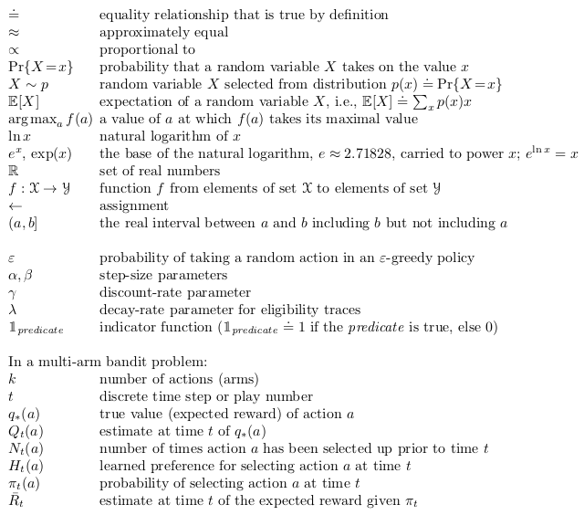
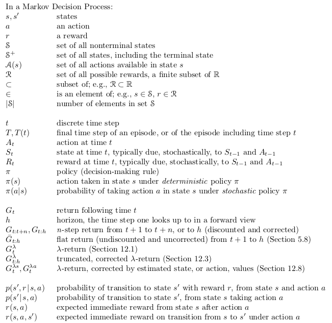
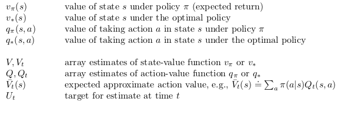
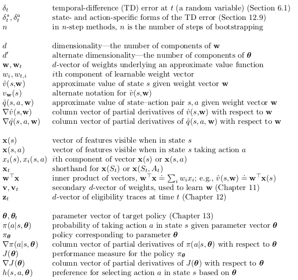
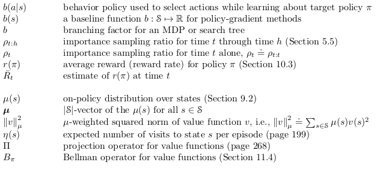

## Vectorizing

Vectorizing is the fact to use a capital letter (upper case) to represent a matrix as a vector.

- m is the number of samples in our set

| Example for all samples |
|-------------------------|
| $\sum_{i=1}^{m} x^{(i)} = X$ |

## Notation

<a href="../img/deep-learning-notation.pdf">deep-learning-notation</a>

| Function                       | Definition                                                                           |
| ------------------------------ | ------------------------------------------------------------------------------------ |
| $\lfloor \space \rfloor$       | It is the floor function. The floor function **rounds down** to the nearest integer. |
| $\lfloor z \rfloor = floor(z)$ |                                                                                      |
| $floor(3.8)=floor(3.2)=3$      |                                                                                      |

| General comment                                                     | Explanation                                                                                                                          |
| ------------------------------------------------------------------- | ------------------------------------------------------------------------------------------------------------------------------------ |
| $X^{\{t\}}, Y^{\{t\}}$                                              | t: Number of training examples treated in the mini-batch.                                                                            |
| Epoch                                                               | One epoch = one forward pass and one backward pass of all the training examples in all mini-batches                                  |
| $(X^{\{1\}}, Y^{\{1\}}) \cdots (X^{\{m\}}, Y^{\{m\}})$              |                                                                                                                                      |
| $Y^{(i)}$                                                           | Denote the $i^{th}$ training example.                                                                                                |
| $W^{[l]}$                                                           | Denote the $l^{th}$ layer.                                                                                                           |
| (x,y)                                                               | A single training example is represented by a pair                                                                                   |
| x                                                                   | an x-dimensional feature vector                                                                                                      |
| y                                                                   | the label, is either 0 or 1                                                                                                          |
| lower-case                                                          | training sets                                                                                                                        |
| m or $M = M_{train}$                                                | number of training examples. Sometimes to emphasize that this is the number of train examples, I might write this as $M = M_{train}$ |
| $\{(x^{(1)}, y^{(1)})(x^{(2)}, y^{(2)})\cdots (x^{(m)}, y^{(m)})\}$ | m training example                                                                                                                   |
| $(x^{(1)}, y^{(1)})$                                                | first training example                                                                                                               |
| $(x^{(m)}, y^{(m)})$                                                | last training example                                                                                                                |
| **Convolutional network**                                           | ----------------------------------------                                                                                             |
| $f^{[l]}$                                                           | filter size                                                                                                                          |
| $p^{[l]}$                                                           | padding size                                                                                                                         |
| $s^{[l]}$                                                           | stride                                                                                                                               |

| Example           | Explanation                                                                      |
| ----------------- | -------------------------------------------------------------------------------- |
| $a^{[3]\{8\}(7)}$ | 3rd layer’s activations when the input is the 7th example from the 8th minibatch |
| $x_{4}^{[3]}$     | 4th hidden unit from the 3rd layer                                               |

### Sizes

| Notation                                                  | Explanation                                                                                                                                         |
| --------------------------------------------------------- | --------------------------------------------------------------------------------------------------------------------------------------------------- |
| m                                                         | number of examples in the dataset                                                                                                                   |
| $n_{x}$                                                   | input size                                                                                                                                          |
| $n_{y}$                                                   | output size (or number of classes).                                                                                                                 |
| $n_{h}^{[l]}$                                             | number of hidden units of the $l^{th}$ layer. In a for loop, it is possible to denote $n_{x}=n_{h}^{[0]}$ and  $n_{y}=n_{h}^{[number of layers+1]}$ |  |
| L                                                         | number of layers in the network                                                                                                                     |
| **Convolutional network**                                 | ----------------------------------------                                                                                                            |
| $n_{H}^{[l-1]}\times{n_{W}^{[l-1]}}\times{n_{C}^{[l-1]}}$ | size of a volume                                                                                                                                    |
| $n_{H}$                                                   | Size of the height of a matrix                                                                                                                      |
| $n_{W}$                                                   | Size of the width of a matrix                                                                                                                       |
| $n_{C}$                                                   | Number of channels                                                                                                                                  |

### Objects

$$ X = 
 \begin{pmatrix}
  \vdots  & \vdots  & \vdots 
  X^{(1)} & X^{(2)} & X^{(n)}
  \vdots  & \vdots  & \vdots 
 \end{pmatrix}$$

| Notation                                                                                              | Explanation                                                                                                      |
| ----------------------------------------------------------------------------------------------------- | ---------------------------------------------------------------------------------------------------------------- |
| $X \in \mathbb{R}^{n_{x}\times m}$                                                                    | is the input matrix                                                                                              |
| $X^{(i)} \in \mathbb{R}^{n_{x}}$                                                                      | is the $i^{th}$ example represented as a column vector                                                           |
| $Y \in \mathbb{R}^{n_{y}\times m}$                                                                    | is the label matrix                                                                                              |
| $Y^{(i)} \in \mathbb{R}^{n_{y}}$                                                                      | is the output of the $i^{th}$ example                                                                            |
| $W^{[l]} \in \mathbb{R}^{number of units in next layer \times number of units in the previous layer}$ | is the weight matrix. Superscript [l] indicates the layer.                                                       |
| $b^{[l]} \in \mathbb{R}^{number of units in next layer}$                                              | is the bias vector in the $l^{th}$ layer                                                                         |
| $\hat{y} \in \mathbb{R}^{n_{y}}$                                                                      | is the predicted output vector. It can also be denoted $a^{[L]}$ where L is the number of layers in the network. |

### Common forward propagation equation examples

$a=g^{[l]}(W_{x}x^{(i)}+b_{1}) = g^{[l]}(z_{1})$ where $g^{[l]}$ denotes the $l^{th}$ layer activation function

$\hat{y}^{(i)} = softmax(W_{h}h+b_{2})$

General Activation Formula: $a_{j}^{[l]}=g^{[l]}(\sum_{k}w_{jk}^{[l]}a_{k}^{[l-1]}+b_{j}^{[l]})=g^{[l]}(z_{j}^{[l]})$

Examples of cost function:

$J_{CE}(\hat{y},y)=-\sum_{i=0}^{m}y^{(i)}\log{\hat{y}^{(i)}}$

$J_{1}(\hat{y},y)=\sum_{i=0}^{m}|y^{(i)}-\hat{y}^{(i)}|$

### Presentation

## Types of layers in a convolutional network 

| Types of layers in a convolutional network |                 |
| ------------------------------------------ | --------------- |
| CONV                                       | Convolutional   |
| POOL                                       | Pooling         |
| FC                                         | Fully connected |

## Gradient

| General comment   | Explanation                                    |
| ----------------- | ---------------------------------------------- |
| $\nabla C(x,y)$   | "Gradient", the direction of steepest increase |
| $- \nabla C(x,y)$ | "Gradient", the direction of steepest decrease |

## Maths from (Ian Goodfellow like notation)

### Sets and Graphs

| Sets and Graphs                                  | Definition                                                                                          |
| ------------------------------------------------ | --------------------------------------------------------------------------------------------------- |
| $\displaystyle \mathbb{A}$                       | A set                                                                                               |
| $\displaystyle \mathbb{R}$                       | The set of real numbers                                                                             |
| $\displaystyle \{0, 1\}$                         | The set containing 0 and 1                                                                          |
| $\displaystyle \{0, 1, \dots, n \}$              | The set of all integers between $0$ and $n$                                                         |
| $\displaystyle [a, b]$                           | The real interval including $a$ and $b$                                                             |
| $\displaystyle (a, b]$                           | The real interval excluding $a$ but including $b$                                                   |
| $\displaystyle \mathbb{A} \backslash \mathbb{B}$ | Set subtraction, i.e., the set containing the elements of $\mathbb{A}$ that are not in $\mathbb{B}$ |
| $\displaystyle \mathcal{G}$                      | A graph                                                                                             |
| $\displaystyle Pa_\mathcal{G}(x_i)$              | The parents of $x_i$ in $\mathcal{G}$                                                               |

### Indexing

| Indexing                                 | Definition                                                                        |
| ---------------------------------------- | --------------------------------------------------------------------------------- |
| $\displaystyle a_i$                      | Element $i$ of vector $\displaystyle \boldsymbol{a}$, with indexing starting at 1 |
| $\displaystyle a_{-i}$                   | All elements of vector $\boldsymbol{a}$ except for element $i$                    |
| $\displaystyle A_{i,j}$                  | Element $i, j$ of matrix $\boldsymbol{A}$                                         |
| $\displaystyle \boldsymbol{A}_{i, :}$    | Row $i$ of matrix $\boldsymbol{a}$                                                |
| $\displaystyle \boldsymbol{A}_{:, i}$    | Column $i$ of matrix $\boldsymbol{a}$                                             |
| $\displaystyle A_{i, j, k}$              | Element $(i, j, k)$ of a 3-D tensor $\boldsymbol{A}$                              |
| $\displaystyle \boldsymbol{A}_{:, :, i}$ | 2-D slice of a 3-D tensor                                                         |
| $\displaystyle a_i$                      | Element $i$ of the random vector $\mathbf{a}$                                     |

### Linear Algebra Operations

| Linear Algebra Operations                           | Definition                                                                                                |
| --------------------------------------------------- | --------------------------------------------------------------------------------------------------------- |
| $\displaystyle \boldsymbol{A}^\top$                 | Transpose of matrix $\boldsymbol{A}$                                                                      |
| $\displaystyle \boldsymbol{A}^+$                    | Moore-Penrose pseudoinverse of $\boldsymbol{A}$                                                           |
| $\displaystyle \boldsymbol{A} \odot \boldsymbol{B}$ | Element-wise (Hadamard) product of $\boldsymbol{A}$ and $\boldsymbol{B}$.                                 |
|                                                     | Wikipedia uses \circ for element-wise multiplication but this could be confused with function composition |
| $\displaystyle \mathrm{det}(\boldsymbol{A})$        | Determinant of $\boldsymbol{A}$                                                                           |

### Calculus

| Calculus                                                                                               | Definition                                                                                                |
| ------------------------------------------------------------------------------------------------------ | --------------------------------------------------------------------------------------------------------- |
| $\displaystyle\frac{d y} {d x}$                                                                        | Derivative of $y$ with respect to $x$\\ [2ex]                                                             |
| $\displaystyle \frac{\partial y} {\partial x}$                                                         | Partial derivative of $y$ with respect to $x$                                                             |
| $\displaystyle \nabla_\boldsymbol{x} y$                                                                | Gradient of $y$ with respect to $\boldsymbol{x}$                                                          |
| $\displaystyle \nabla_\boldsymbol{X} y$                                                                | Matrix derivatives of $y$ with respect to $\boldsymbol{X}$                                                |
| $\displaystyle \nabla_\boldsymbol{X} y$                                                                | Tensor containing derivatives of $y$ with respect to $\boldsymbol{X}$                                     |
| $\displaystyle \frac{\partial f}{\partial \boldsymbol{x}}$                                             | Jacobian matrix $\boldsymbol{J} \in \mathbb{R}^{m\times n}$ of $f: \mathbb{R}^n \rightarrow \mathbb{R}^m$ |
| $\displaystyle \nabla_\boldsymbol{x}^2 f(\boldsymbol{x})\text{ or }\boldsymbol{H}( f)(\boldsymbol{x})$ | The Hessian matrix of $f$ at input point $\boldsymbol{x}$                                                 |
| $\displaystyle \int f(\boldsymbol{x}) d\boldsymbol{x}$                                                 | Definite integral over the entire domain of $\boldsymbol{x}$                                              |
| $\displaystyle \int_\mathbb{S} f(\boldsymbol{x}) d\boldsymbol{x}$                                      | Definite integral with respect to $\boldsymbol{x}$ over the set $\mathbb{S}$                              |

### Probability and Information Theory

| Probability and Information Theory                                                     | Definition                                                                                                    |
| -------------------------------------------------------------------------------------- | ------------------------------------------------------------------------------------------------------------- |
| $\forall x \in X$                                                                      | For all x in X                                                                                                |
| $P(A,B)$                                                                               | Is the probability that both A and B happen                                                                   |
| $P(A \vert B)$                                                                         | Is the probability that A happens, knowing that B has already happened                                        |
| $\displaystyle a \bot b$                                                               | The random variables $a$ and $b$ are independent                                                              |
| $\displaystyle a \bot b \mid c$                                                        | They are conditionally independent given $c$                                                                  |
| $\displaystyle P(a)$                                                                   | A probability distribution over a discrete variable                                                           |
| $\displaystyle p(a)$                                                                   | A probability distribution over a continuous variable, or over a variable whose type has not been specified   |
| $\displaystyle a \sim P$                                                               | Random variable $a$ has distribution $P$                                                                      |
| $\displaystyle \mathbb{E}_{x\sim P} [ f(x) ]\text{ or } \mathbb{E} f(x)$               | Expectation of $f(x)$ with respect to $P(x)$                                                                  |
| $\displaystyle \mathrm{Var}(f(x))$                                                     | Variance of $f(x)$ under $P(x)$                                                                               |
| $\displaystyle \mathrm{Cov}(f(x),g(x))$                                                | Covariance of $f(x)$ and $g(x)$ under $P(x)$                                                                  |
| $\displaystyle H(x)$                                                                   | Shannon entropy of the random variable $x$                                                                    |
| $\displaystyle D_{\mathrm{KL}} ( P \Vert Q )$                                          | Kullback-Leibler divergence of P and Q                                                                        |
| $\displaystyle \mathcal{N} ( \boldsymbol{x} ; \boldsymbol{\mu} , \boldsymbol{\Sigma})$ | Gaussian distribution over $\boldsymbol{x}$ with mean $\boldsymbol{\mu}$ and covariance $\boldsymbol{\Sigma}$ |

### Functions

| Functions                                                 | Definition                                                                                                                                                                     |
| --------------------------------------------------------- | ------------------------------------------------------------------------------------------------------------------------------------------------------------------------------ |
| $\displaystyle f: \mathbb{A} \rightarrow \mathbb{B}$      | The function $f$ with domain $\mathbb{A}$ and range $\mathbb{B}$                                                                                                               |
| $\displaystyle f \circ g$                                 | Composition of the functions $f$ and $g$                                                                                                                                       |
| $\displaystyle f(\boldsymbol{x} ; \boldsymbol{\theta})$   | A function of $\boldsymbol{x}$ parametrized by $\boldsymbol{\theta}$. (Sometimes we write $f(\boldsymbol{x})$ and omit the argument $\boldsymbol{\theta}$ to lighten notation) |
| $\displaystyle \log x$                                    | Natural logarithm of $x$                                                                                                                                                       |
| $\displaystyle \sigma(x)$                                 | Logistic sigmoid, $\displaystyle \frac{1} {1 + \exp(-x)}$                                                                                                                      |
| $\displaystyle \zeta(x)$                                  | Softplus, $\log(1 + \exp(x))$                                                                                                                                                  |
| $\displaystyle \left\lVert \boldsymbol{x} \right\rVert_p$ | $L^p$ norm of $\boldsymbol{x}$                                                                                                                                                 |
| $\displaystyle \left\lVert \boldsymbol{x} \right\rVert$   | $L^2$ norm of $\boldsymbol{x}$                                                                                                                                                 |
| $\displaystyle x^+$                                       | Positive part of $x$, i.e., $\max(0,x)$                                                                                                                                        |
| $\displaystyle \boldsymbol{1}_\mathrm{condition}$         | Is 1 if the condition is true, 0 otherwise                                                                                                                                     |

### Datasets and Distributions

| Datasets and Distributions           | Definition                                                                                      |
| ------------------------------------ | ----------------------------------------------------------------------------------------------- |
| $\displaystyle p_{\rm{data}}$        | The data generating distribution                                                                |
| $\displaystyle \hat{p}_{\rm{data}}$  | The empirical distribution defined by the training set                                          |
| $\displaystyle \mathbb{X}$           | A set of training examples                                                                      |
| $\displaystyle \boldsymbol{x}^{(i)}$ | The $i$-th example (input) from a dataset                                                       |
| $\displaystyle y^{(i)}$              | The target associated with $\boldsymbol{x}^{(i)}$ for supervised learning                       |
| $\displaystyle \boldsymbol{X}$       | The $m \times n$ matrix with input example $\boldsymbol{x}^{(i)}$ in row $\boldsymbol{X}_{i,:}$ |

## Other math notation

- Capital letters are used for random variables
- Lower case letters are used for the values of random variables and for scalar functions.
- Quantities that are required to be real-valued vectors are written in bold and in lower case (even if random variables).
- Matrices are bold capitals.

