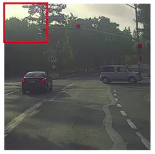

# Object Detection

We want to build a car detection software:

First what we can do is to create a labeled training set with closely cropped examples of cars (see above).

You can now create a ConvNet that input an image and tell you if there is a car or not.

## Sliding window detection algorithm

Step by step you take a window of your image.
Each window is entered in the convnet to make a prediction.

...

Then you repeat it with a larger window:

...

Again you repeat it with a larger window:

The hope is that if you do this, then so long as there's a car somewhere in the image:

- there will be a window where passed in the convnet will output there is a car.

### Sliding windows detection disadvantage

There's a huge disadvantage of Sliding Windows Detection, which is the **computational cost**.

Because you're cropping out so many different square regions in the image and running each of them independently through a convnet.

And if you use a very big stride then that will reduce the number of windows you need to pass through the convnet, but that courser granularity may hurt performance.

Whereas if you use a very fine granularity or a very small stride, then the huge number of all these little regions you're passing through the convnet means that there is a very high computational cost.

 It was not a bad method, but with convnet now running a single classification task is much more expensive and sliding windows this way is infeasible (too slow).
