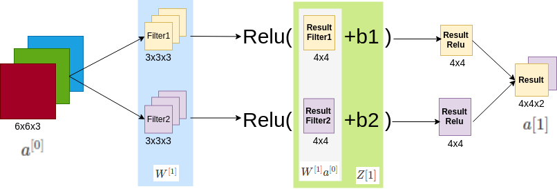

# One layer of Convolutional Network

xml file for [www.draw.io](http://www.draw.io): <a href="../img/one_layer_convolutional_nn.zip">one_layer_convolutional_nn.zip</a>

- b is $\mathbb{R}$
- Relu can be changed by any non-linearity function.

So to map this back to one layer of four propagation in the standard neural network, in a non-convolutional neural network, we have:

$Z{[1]}=W^{[1]}a^{[0]}+b^{[1]}$

$a{[1]}=g(Z{[1]})$

## Number of parameters in one layer

For the formulas see below.

If you have 10 filters that are 3x3x3 in one layer of a neural network, how many parameters does that layer have?

- $W^{[1]}$ has 3x3x3x10 parameters
- All b parameters are 1x10

So:

3x3x3x10+1x10=180 parameters

## Summary of notation

| Notation | Definition |
|----------|------------|
| $f^{[l]}$ | filter size |
| $p^{[l]}$ | padding |
| $s^{[l]}$ | stride |

| Notation                                                         | Definition                                                                           |
|------------------------------------------------------------------|--------------------------------------------------------------------------------------|
| $=n_{H}^{[l-1]}\times{n_{W}^{[l-1]}}\times{n_{C}^{[l-1]}}$       | **Input** shape                                                                      |
| $=n_{H}^{[l]}\times{n_{W}^{[l]}}\times{n_{C}^{[l]}}$             | **Output** shape                                                                     |
| $n_{H}^{[l]}$                                                    | Size of the height of a matrix                                                       |
| $n_{W}^{[l]}$                                                    | Size of the width of a matrix                                                        |
| $n_{C}^{[l-1]}$ | Can be understood as number of channels of the **Input** matrix                                                                       |
| $n_{C}^{[l]}$ | Can be understood as number of channels of the **Output** matrix. **Here it is the number of filters** ($n_{C}^{[l]}=numberOfFilters$). |
| $f^{[l]}\times f^{[l]} \times n_{C}^{[l-1]}$                     | Filter shape                                                                         |
| $a^{[l]}=n_{H}^{[l]}\times{n_{W}^{[l]}}\times{n_{C}^{[l]}}$      | Activations shape                                                                    |

| Number of parameters OR shape of the matrix | Formula |    |
|---------------------------------------------|---------|----|
| $W\_parameters$ = W.shape| $f^{[l]}\times{f^{[l]}}\times{n_{C}^{[l-1]}}\times{n_{C}^{[l]}}$ ||
| $b\_parameters$ = b.shape | $n_{C}^{[l]}$ OR $(1,1,1,n_{C}^{[l]})$ | The right version is for the code. |
| $total\_parameters$ | $(f^{[l]}\times{f^{[l]}}\times{n_{C}^{[l-1]}}+1)\times{n_{C}^{[l]}}$ ||

| If using a vectorized implementation or batch gradient descent or mini batch gradient descent |    |
|-----------------------------------------------------------------------------------------------|----|
| $A^{[l]}$ | $=m\times{n_{H}^{[l]}}\times{n_{W}^{[l]}}\times{n_{C}^{[l]}}$ |
| m | Number of examples |

|                 |   |                                                     |                     |
|-----------------|---|-----------------------------------------------------|---------------------|
|  | $n_{H}^{[l]}\times{n_{W}^{[l]}}\times{n_{C}^{[l]}}$ | There isn't a completely universal standard convention about the ordering of height, width, and channel. So If you look at  source code on GitHub or these open source implementations, you'll find that some authors use this order instead: $n_{C}^{[l]}\times{n_{H}^{[l]}}\times{n_{W}^{[l]}}$. |
|  || And in fact in multiple common frameworks, there's actually a variable or a parameter that let you choose if you want the channel first or last. |

| Size | Formula |
|------|---------|
| $n_{H}^{[l]}$ | $=\lfloor \frac{n_{H}^{[l-1]}+2p^{[l]}-f^{[l]}}{s^{[l]}}+1 \rfloor$ |
| Or similarly: |    |
| $n_{W}^{[l]}$ | $=\lfloor \frac{n_{W}^{[l-1]}+2p^{[l]}-f^{[l]}}{s^{[l]}}+1 \rfloor$ |

| Function | Definition |
|----------|------------|
| $\lfloor \space \rfloor$ | It is the floor function. The floor function **rounds down** to the nearest integer. |
| $\lfloor z \rfloor = floor(z)$ ||
| $floor(3.8)=floor(3.2)=3$ ||