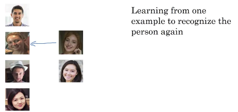
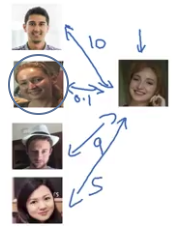

# One Shot Learning

In the one shot learning problem, you have to learn from just one example to recognize the person.

Indeed you need this for most face recognition systems because you might have only one picture of each of your employees in your employee database.

## You cannot use a softmax

 So one approach you could try is to input the image of the person, feed it to a ConvNet.

|                                                |
|------------------------------------------------|
| Picture input ⇒⇒⇒ ConvNet ⇒⇒⇒ Softmax 5 output |

5 output = 4 known persons in your database + neither answer

**But this really doesn't work well.**

| It is not a good approach |    |
|---------------------------|----|
| Reason 1 | Because if you have such a small training set it is really not enough to train a robust neural network for this task. |
| Reason 2 | But what happens if a new person join the team? You have to retrain the convnet again because you changed the softmax? Do you have to retrain the ConvNet every time? |

To make this work, what you're going to do instead is learn a similarity function.

## Learning a similarity function

You want a neural network to learn a function d which:

- Inputs two images
- And outputs the **degree of difference** between the two images.

so:

|                                                        |
|--------------------------------------------------------|
| $d(img1,img2)=degree\ of\ difference\ between\ images$ |

| Two images of the same person| Two images of two very different people |
|------------------------------|-----------------------------------------|
| $d(img1,img2) = Small\ number$ | $d(img1,img2) = Large\ number$ |

So during recognition time, if the degree of difference between them is less than some threshold called tau, which is a hyperparameter.

|                             |             |
|-----------------------------|-------------|
| If $d(img1,img2) \leq \tau$ | Same person |
| If $d(img1,img2) > \tau$ | Different person |

Here is an example of d with 2 images of the same person:

And in contrast, if someone not in your database shows up, hopefully d will output have a very large number for all four pairwise comparisons. 

