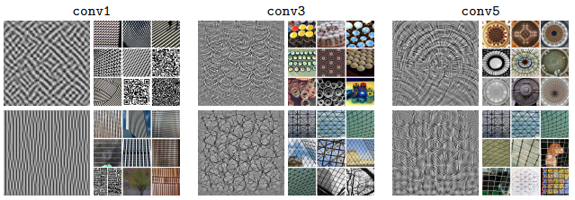

Filter visualization and top 9 activated images from a subset of 1 million
images from YFCC100M for target filters in the layers conv1, conv3 and conv5
of an AlexNet trained with DeepCluster on ImageNet. The filter visualization
is obtained by learning an input image that maximizes the response to a target
filter