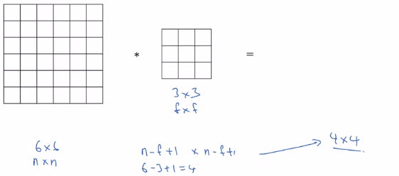
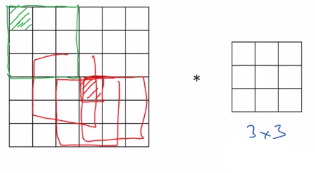
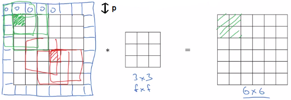

# Padding

## How to calculate the size of the end matrix

Shapes:

$originalMatrix = (n,n)$
$filterMatrix = (f,f)$

----

|                             |
|-----------------------------|
| $finalMatrix=(n-f+1,n-f+1)$ |

$finalMatrix=(6-3+1,6-3+1)=(4,4)$

----

| There is 2 downsides to convolution: |    |
|--------------------------------------|----|
| **Shrinking problem** | **Every time you apply a convolutional operator, your image shrinks.** Here you come from (6,6) down to (4,4). You can only do this a few times before your image starts getting really small, maybe it shrinks down to one by one or something. **So maybe, you don't want your image to shrink every time you detect edges.** |
| **Throw away information** | If you look the pixel at the corner or the edge **(green pixel), this little pixel is touched as used only in one of the outputs**, because this touches that 3 by 3 region. Whereas, if you take a pixel in the middle **(red pixel), then there are a lot of three by three regions that overlap that pixel**. So **the pixels on the corners or on the edges are use much less in the output. So you're throwing away a lot of the information near the edge of the image.** |

**So in order to fix both of these problems, what you can do is you can pad the image to preserve the original input size of 6 by 6**.

So you pad the image adding the blue pixels around the original input matrix. You fill these pixels with the 0 value to not impact convolution operation.

$originalInputMatrix=(6,6)$

If **p** is the number of layers you add around the image:

|                                                                             |
|-----------------------------------------------------------------------------|
| $paddingMatrix=(originalInputSize+2\times{p},originalInputSize+2\times{p})$ |

$paddingMatrix = (6+2\times{1},6+2\times{1})=(8,8)$

|                                                     |
|-----------------------------------------------------|
| $finalMatrix=(paddingMatrix-f+1,paddingMatrix-f+1)$ |

$finalMatrix=(8-3+1,8-3+1)=(6,6)$

So:

$finalMatrix=inputMatrix$

## Valid and same convolutions (how much to pad)

There are 2 common choices:

----

|                        |                              |
|------------------------|------------------------------|
| **Valid convolutions** | Basically means "no padding" |

You have a (n,n) image convolve a (f,f) filter which gives you a (n-f+1,n-f+1).

Example: (6,6) * (3,3) = (4,4)

----

- originalInputMatrix = (n,n)
- layersAroundOriginalMatrix= p
- filter = (f,f)

|                 |   |                                    |
|-----------------|---|------------------------------------|
|  | **f is usually odd by convention** |

|                       |                                                        |                                   |
|-----------------------|--------------------------------------------------------|-----------------------------------|
| **Same convolutions** | Pad so that output size is the same as the input size. | $finalMatrix=(n+2p-f+1,n+2p-f+1)$ |

Because we want: $n+2p-f+1=n$ then:

|                 |                   |
|-----------------|-------------------|
| **calculate p** | $p=\frac{f-1}{2}$ |

## Takeway

- originalInputMatrix = (n,n)
- layersAroundOriginalMatrix= p
- filter = (f,f)

|                 |   |                                    |
|-----------------|---|------------------------------------|
|  | **f is usually odd by convention** |

|                        |                              |                                                                                 | |
|------------------------|------------------------------|---------------------------------------------------------------------------------|-|
| **Valid convolutions** | Basically means "no padding" | You have a (n,n) image convolve a (f,f) filter which gives you a (n-f+1,n-f+1). | |
| **Same convolutions** | Pad so that output size is the same as the input size. | $finalMatrix=(n+2p-f+1,n+2p-f+1)$ | with $p=\frac{f-1}{2}$ |
