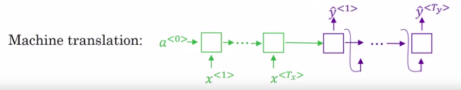

# Picking the most likely sentence

| Example to be translated from French to English |
|---------|
| Jane visite l'Afrique en septembre. |

There are some similarities between the sequence to sequence machine translation model and the language models but there are some significant differences as well.

So, you can think of machine translation as building a conditional language model.

## Language model

Here's what I mean:

What a language model does is:

- It allows you to estimate the probability of a sentence: $P(y^{<1>},...,y^{<T_{y}>})$
- And you can also use this to generate novel sentences.

## Machine translation model

- the coder network in green
- the decoder network in purple

Notice that the decoder network looks pretty much identical to the language model.

- Except that instead of always starting along with the vector of all zeros
- it has instead an encoder network that figures out some representation for the input sentence
- and it takes that input sentence and starts off the decoder network with representation of the input sentence rather than with the representation of all zeros.

$P(y^{<1>},...,y^{<T_{y}>}|x^{<1>},...,x^{<T_{x}>})$

We call it a **conditional** **language model** because:

- Instead of modeling the probability of any sentence.
- It is now modeling the probability of the output English translation **conditions on** some input French sentence.
- So in other words, you're trying to estimate the probability of an English translation.
- Like, what's the chance that the translation is "Jane is visiting Africa in September." but conditions on the input French censors like, "Jane visite I'Afrique en septembre."

## Do not sample outputs

$P(y^{<1>},...,y^{<T_{y}>}|x^{<1>},...,x^{<T_{x}>})$ now tells you what is the probability of different English translations of that French input.

What you do not want is to sample outputs at random.

If you sample words from this distribution, $P(y|x)$, maybe one time you get a pretty good translation but, maybe another time you get awkward translations or very translation.

| Instead, what you want is: |
|----|
| To find the English sentence, y, that maximizes that conditional probability. |
| You want to find the value of y that maximizes this term over here:  |

## Why not just use greedy search

Geedy search is an algorithm from computer science which says:

- to generate the first word just pick whatever is the most likely first word according to your conditional language model
- you then pick whatever is the second word that seems most likely, then pick the third word that seems most likely.
- etc.

Greedy approach is when you just pick the best first word, and then, after having picked the best first word, try to pick the best second word, and then, after that, try to pick the best third word etc.

**That approach doesn't really work.** To demonstrate that, let's consider the following two translations.

The first one is a better translation, so hopefully, in our machine translation model, it will say that P(Jane is is visiting Africa in September) > P(Jane is going to becisiting Africa in September)

The second one is not a bad translation, it's just more verbose, it has more unnecessary words.

But, if the algorithm has picked "Jane is" as the first two words because "going" is a more common English word linked to the English language structure.

So, it's quite possible that if you just pick the third word based on whatever maximizes the probability of just the first three words, you end up choosing option number two.

But, this ultimately ends up resulting in a less optimal sentence, in a less good sentece.
