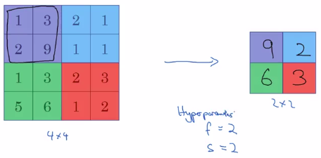
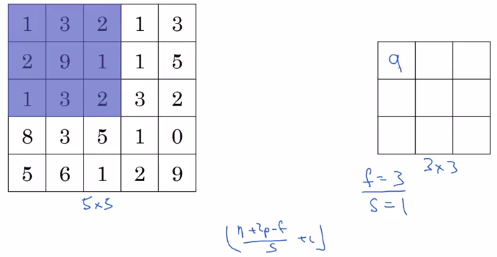
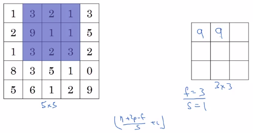
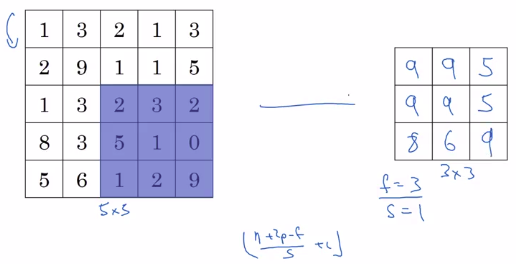
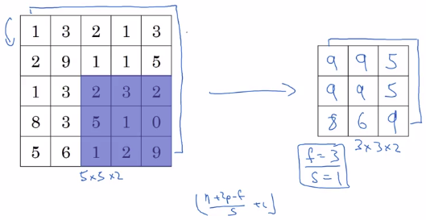
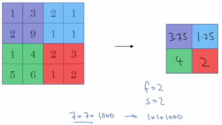

# Pooling layers

ConvNets often also use pooling layers to:

- Reduce the size of the representation.
- To speed the computation.
- Make some of the features that detects a bit more robust.

## Pooling layers: Max pooling

Max Pooling:

- Takes the maximum value of each colored square to put it in another matrix.

To compute the numbers on the right, we take the max over a 2 by 2 region. It is as if you applied a:

- Filter of size: 2
- Stride of 2

### Intuition behind what max pooling is doing

So here's the intuition behind what max pooling is doing.

If you think one of the 4 by 4 region as some set of features (edges etc.):

- A **large number** means that a **particular feature is detected**.

So, the upper left quadrant has this particular feature.  Whereas it doesn't really exist in the upper right-hand quadrant.

The features detected remains preserved in the output of max pooling.

I have to admit, I think the main reason people use max pooling is because it's been found in a lot of experiments to work well. I don't have anyone knows if that's the real underlying reason that max pooling works well in ConvNets.

One interesting property of max pooling is that it has:

- A set of hyperparameters 
- No parameters to learn.
- Once you fix f and s, it's just a fixed computation (no gradient descent).

## Bigger example

### Input: 1 channel

- padding: p
- stride: s
- inputMatrix: (n,n)
- filter: (f,f)

Then:

$(n,n) * (f,f) = (\lfloor \frac{n+2p-f}{s}+1 \rfloor,\lfloor \frac{n+2p-f}{s}+1 \rfloor)$

$=(\lfloor \frac{5+2\times{0}-3}{1}+1 \rfloor,\lfloor \frac{5+2\times{0}-3}{1}+1 \rfloor)=(3,3)$

$\vdots$

### Input: 2 channels

The channels are preserved.

| Input | Output |
|-------|--------|
| $5\times{5}\times{n_{c}}$ | $3\times{3}\times{n_{c}}$ |

## Average pooling

This one is the type of pooling that isn't used very often.

So these days, max pooling is used much more often than average pooling with one exception, which is sometimes very deep in a neural network. 

Indeed you might use average pooling to collapse your representation from say, 7x7x1000. An average over this and you get 1x1x1000.

## Summary of pooling

Hyperparameters:

- f: filter size
- s: stride

| Common choice of parameters |
|-----------------------------|
|  **f=2, s=2**   |
|  Sometimes (rare) f=3, s=2  |

You don't have to use p (padding). p is generally 0.

|              |                                   |
|--------------|-----------------------------------|
| Input volume | $n_{H}\times{n_{W}}\times{n_{c}}$ |
| Output volume | $\lfloor \frac{n_{H}+2p-f}{s}+1 \rfloor \times{\lfloor \frac{n_{W}+2p-f}{s}+1 \rfloor}\times{n_{c}}$ |
