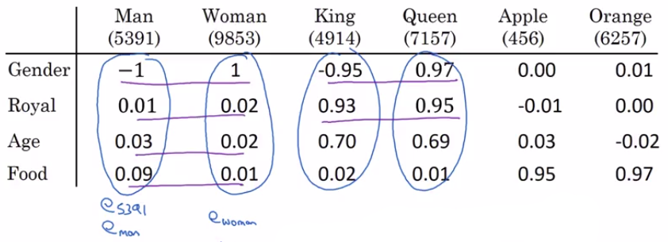
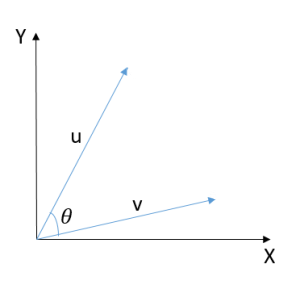

# Properties of word embeddings

## Analogy reasoning

One of the most fascinating properties of word embeddings is that they can also help with **analogy reasoning**.

Let's say I pose a question:

| Question                                    |
|---------------------------------------------|
| Man is to woman as king is to \_\_\_\_\_\_  |

Many of you will say:

- Man is to woman as king is to queen.
  
But is it possible to have an algorithm figure this out automatically?

Well, here's how you could do it:

- $e_{5391}=e_{man}$
- $e_{9853}=e_{woman}$
- $e_{4914}=e_{king}$
- $e_{7157}=e_{queen}$)

If you take:

$$e_{man} - e_{woman} \approx \begin{bmatrix}
1 \\
0.01 \\
0.03 \\
0.09 \\
\end{bmatrix}-\begin{bmatrix}
1 \\
0.02 \\
0.02 \\
0.01 \\
\end{bmatrix} \approx \begin{bmatrix}
-2 \\
0 \\
0 \\
0 \\
\end{bmatrix}$$

And similarly if you take $e_{king} - e_{queen}$ then that's approximately the same thing.

$$e_{king} - e_{queen} \approx \begin{bmatrix}
-0.95 \\
0.93 \\
0.7 \\
0.02 \\
\end{bmatrix}-\begin{bmatrix}
0.97 \\
0.95 \\
0.69 \\
0.01 \\
\end{bmatrix} \approx \begin{bmatrix}
-2 \\
0 \\
0 \\
0 \\
\end{bmatrix}$$

Then $e_{man} - e_{woman} \approx e_{king} - e_{queen}$

- It turns out that when queen is the word plugged in here, then the left hand side is close to the the right hand side.
- This would not be the case for anything else like $e_{apple}$ and $e_{orange}$.

So these ideas were first pointed out by Tomas Mikolov, Wen-tau Yih, and Geoffrey Zweig.

And it's been one of the most remarkable and surprisingly influential results about word embeddings.

## Analogies using word vectors algorithm

So let's formalize how you can turn this into an algorithm.

In pictures, the word embeddings live in maybe a 300 dimensional space.

And what we pointed out really previoulsy is that the vector difference between man and woman is very similar to the vector difference between king and queen.

And this arrow I just drew is really the vector that represents a difference in gender.

So:

| To answer the question |
|------------------------|
| Man is to woman is king is to **what?** |

We need to find the word $e_w$ that maximizes the similarity between $e_w$ compared to $e_{king} - e{man} + e_{woman}$:

| $e_w$ that maximizes the similarity |
|------------------------|
| $sim(e_w, e_{king} - e{man} + e_{woman})$ |

$sim(u,v)=\frac{u^{T_v}}{\left\lVert u \right\rVert_2 \left\lVert v \right\rVert_2}$

## Accuracy of this kind of task

Depending on the details of the task, but if you look at research papers, it's not uncommon for research papers to report anywhere from:

- **30% to 75% accuracy on analogy** using tasks like these.

## T-SNE algorithm

Previously, we talked about using algorithms like t-SNE to visualize words. What t-SNE does is, it takes 300-D data, and it maps it in a very non-linear way to a 2D space

And so the mapping that t-SNE learns is a very complicated and very non-linear mapping. So after the t-SNE mapping, you should not expect these types of parallelogram relationships to hold true:

**BUT THAT'S NOT THE CASE:**

| Warning    |           |
|------------|-----------|
|  | And it may hold true after a mapping through t-SNE, : **but in most cases**, because of t-SAE's non-linear mapping **you should not count on that!!!!!!!!!!**. |
|          |  And many of the parallelogram analogy relationships will be broken by t-SNE. Now, before moving on, let me just quickly describe the similarity function that is most commonly used. |

## Cosine similarity

So the most commonly used similarity function is called cosine similarity.

So this is the equation we had from the previous topic:

$sim(e_w, e_{king} - e{man} + e_{woman})$

In cosine similarity

$sim(u,v)=\frac{u^{T}v}{\left\lVert u \right\rVert_2 \left\lVert v \right\rVert_2}$

- u transpose v divided by the lengths by the Euclidean lengths.
- denominator is basically the inner product between u and v. **And so if u and v are very similar, their inner product will tend to be large.**

And this is called cosine similarity because this is actually:

- The cosine() of the angle between the vectors u and v.

So the angle $\theta$ is actually the cosine between them.

The cosine of $\theta$ looks like this:

 So:

- if the angle between them is 0, then the cosine similarity is equal to 1.
- if their angle is 90 degrees, the cosine similarity is 0.
- if they're 180 degrees, or pointing in completely opposite directions, it ends up being -1.

So that's where the term cosine similarity comes from, and it works quite well for these analogy reasoning tasks. 

If you want, you can also use square distance or Euclidian distance:

$\left\lVert u - v \right\rVert^2$

Technically, this would be a measure of dissimilarity rather than a measure of similarity. So we need to take the negative of this, and this will work okay as well.

**Although I see cosine similarity being used a bit more often.**

**And the main difference between these is how it normalizes the lengths of the vectors u and v.**

## To summarize

So one of the remarkable results about word embeddings is the generality of analogy relationships they can learn. 

So for example, it can learn:

| Question | Answer           |
|---------|---------------------|
| Man:Woman | as Boy:Girl       |
| Ottawa:Canada | Nairobi:Kenya |
| Big:Bigger | Tall:Taller      |
| Yen:Japan | Ruble:Russia      |

And all of these things can be learned just by running a word embedding learning algorithm on the large text corpus.