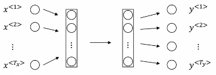
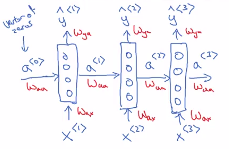
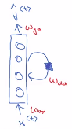
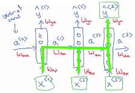
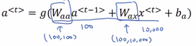
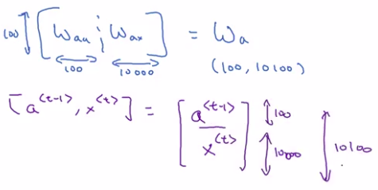

# Recurrent Neural Network Model

## Why not a standard network?

Problems:

- **Input, outputs can be different lengths in different examples.**
  - So, it's not as if every single example had the same input length $T_{x}$ or the same output length $T_{y}$ and maybe if every sentence has a maximum length. Maybe you could pad or zero-pad every inputs up to that maximum length but this still doesn't seem like a good representation.
- **Doesn't share features learned across different positions of text.**
  - In particular of the neural network has learned that maybe the word heavy appearing in position one gives a sign that that's part of a person's name, then wouldn't it be nice if it automatically figures out that heavy appearing in some other position x t also means that that might be a person's name. And this is maybe similar to what you saw in convolutional neural networks where you want things learned for one part of the image to generalize quickly to other parts of the image, and we like a similar effects for sequence data as well.

## What is a RecurrentNeural Network

What a recurrent neural network does is:

- When it then goes on to read the second word in the sentence, say $x^{<2>}$, instead of just predicting $y^{<2>}$ using only $x^{<2>}$, **it also gets to input some information from step one**.

Representation 1 (the one we will use)| Representation 2
-----------------|-----------------
  | 

So at each time step, the recurrent neural network passes some activation to the next time step.

Each step $x^{<t>}$ then inputs:

- $x^{<t>}$
- activations from $a^{<t-1>}$

The activation $a^{<0>}$ we pass to layer 1 is:

- usually a vector of zeros
- sometimes some researchers will initialized $a^{0}$ randomly.

Sometimes Recurrent Neural Networks are represented like this:

Set of parameters | Definition
------------------|-----------------
$W_{ax}$ | parameters used for every time step
$W_{aa}$ | horizontal parameters used for every time step
$W_{ya}$ | governs the output predictions

What this means is that when making the prediction for $y^{<3>}$:

- it gets the information not only from $x^{<3>}$
- but also the information from $x^{<1>}$ and $x^{<2>}$ because the information on $x^{<1>}$ can pass through the green line to help to prediction with $y^{<3>}$.

## Recurent neural network in more details

| notation | Definition |
|----------|------------|
| $W_{ax}$ | The fist subscript letter $a$ means that this matrix is used to compute $a^{<t>}$ output.  |
| $W_{ya}$ | The fist subscript letter $y$ means that this matrix is used to compute $\hat{y}^{<t>}$ output.  |

| Activation function $g()$ | Type of activation function usually used |
|----------|------------|
| $g()$ for $a^{<t>}$ computation    | tanh/ReLU |

| Activation function $g()$ | Type of output needed | Type of activation function usually used |
|----------|------------|------------|
| $g()$ for $\hat{y}^{<t>}$ computation | Binary classification problem (0 or 1). | Sigmoid |
| $g()$ for $\hat{y}^{<t>}$ computation | K-way classification problem | Softmax |

Softmax in case of a k-way classification problem.

g: an activation function (tanh/ReLU). Activation functions for $a$ and $\hat{y}$ can be different.

| Formula Definitions                                    |
|--------------------------------------------------------|
| $a^{<0>}=\vec{0}$                                      |
| $a^{<t>}=g(W_{aa} a^{<t-1>} + W_{ax} x^{<t>}+b_{a})$   |
| $\hat{y}^{<t>}=g(W_{ya} a^{<t>} + b_{y})$              |
| **Example:**              |
| $a^{<1>}=g(W_{aa} a^{<0>} + W_{ax} x^{<1>}+b_{a})$     |
| $\hat{y}^{<1>}=g(W_{ya} a^{<1>} + b_{y})$              |

## Simplified Recurrent NN notation

Let's take the definition above and simplify it a little bit.

| Formula Definitions                                    | Simplified formula         |
|--------------------------------------------------------|---------------------------------------------------------|
| $a^{<t>}=g(W_{aa} a^{<t-1>} + W_{ax} x^{<t>}+b_{a})$   | $a^{<t>}=g(W_{a} [a^{<t-1>}, x^{<t>}]+b_{a})$ |

$[a^{<t-1>}, x^{<t>}]$ : What this notation means, is to just take the two vectors and stack them together. Like this for example:

$$\begin{bmatrix}
a^{<t-1>}\\
x^{<t>}
\end{bmatrix}$$

We can also say that:

$$W_{a}=[W_{aa}, W_{ax}]$$

Then:

$[W_{aa}, W_{ax}] \begin{bmatrix}a^{<t-1>}\\ x^{<t>} \end{bmatrix}=W_{aa} a^{<t-1>}+W_{ax}x^{<t>}$

## Dimensions

If                      | Then                              |
------------------------|-----------------------------------|
If $a$ has shape (100) | Then $W_{aa}$ has shape (100, 100) |
If $x$ has shape (10 000) | Then $W_{ax}$ has shape (100, 10 000) |
If $W_{aa}$ has shape (100, 100) and $W_{ax}$ has shape (100, 10 000) | Then $[W_{aa}, W_{ax}]$ has shape (100, 10 100) |

As explained below:

In a similar way:

| Formula Definitions                                    | can be rewritten as the Simplified formula           |
|--------------------------------------------------------|------------------------------------------------------|
| $\hat{y}^{<t>}=g(W_{ya} a^{<t>} + b_{y})$             | $\hat{y}^{<t>}=g(W_{y} a^{<t>} + b_{y})$              |

