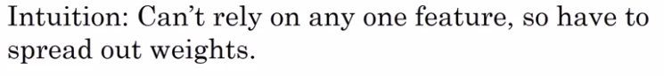
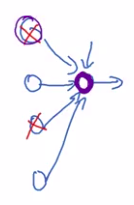
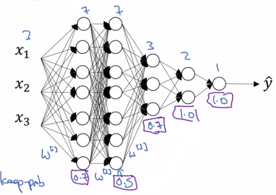

# Regularizing your neural network

Regularization


|          |            |
|----------|------------|
| $n_{x}$  | input size |
| m | number of examples in the dataset |
| w  | $w\in\mathbb{R}^{n_{x}}$  |
| b  | $b\in\mathbb{R}$  |
                                                                                                                                       
Lambda ($\lambda$) here is called the regularization, Parameter.

## L2 regularization 

### Logistic regression

Recall that in logistic regression we try to minimize the cost function $J(w,b)$.

Here is the definition of the cost function:

$J(w,b)=\frac{1}{m}\times{\sum_{i=1}^{m}{\mathcal{l}(\hat{y}^{(i)},y^{(i)})}}$

Remember that w and b are the parameters.

----

And so **to add regularization to the logistic regression**, what you do is add $\frac{\lambda}{2m}\lVert w \rVert^{2}_2$. 

Then:


$J(w,b)=\frac{1}{m}\times{\sum_{i=1}^{m}{\mathcal{l}(\hat{y}^{(i)},y^{(i)})}}+\frac{\lambda}{2m}\lVert w \rVert^{2}_2$


Note: $\lambda$ (lambda) is called the regularization parameter.


We could add $\frac{\lambda}{2m} b^{2}$ to J(w,b). In practice, you could do this, but Andrew NG usually just omit this. Because if you look at your parameters, w is usually a pretty high dimensional parameter vector, especially with a high variance problem. Maybe w just has a lot of parameters, so you aren't fitting all the parameters well, whereas b is just a single number.

|                   |                                                          |
|-------------------|----------------------------------------------------------|
| L2 regularization | $\lVert w \rVert^{2}_2=\sum_{j=1}^{n_{x}}w^{2}_j=w^{T}w$ |

L1 regularization: $\frac{\lambda}{m}\sum_{j=1}^{n_{x}}\lVert w_j \rVert=\frac{\lambda}{m}\lVert w \rVert_1$

If you use L1 regularization, then w will end up being sparse (clairsemé). And what that means is that the w vector will have a lot of zeros in it. And some people say that this can help with compressing the model, because the set of parameters are zero, and you need less memory to store the model. 

**Although, I find that, in practice, L1 regularization to make your model sparse (clairsemé), helps only a little bit. So I don't think it's used that much, at least not for the purpose of compressing your model.** 

And when people train your networks, L2 regularization is just used much much more often. 

In python **lambda** is a reserved keyword so we will use "lambd". 

### Neural network

W: $(n^{[l]},n^{[l-1]})$

$J(W^{[1]},b^{[1]} \cdots W^{[L]},b^{[L]}) = \frac{1}{m}\times{\sum_{i=1}^{m}{\mathcal{l}(\hat{y}^{(i)},y^{(i)})}}+\frac{\lambda}{2m}\sum_{l=1}^{L}\lVert W^{[l]} \rVert^{2}$

$\lVert W^{[l]} \rVert^{2}_{F}=\sum_{i=1}^{n^[l-1]} \sum_{j=1}^{n^[l]} ( W^{[l]}_{ij} )^2$

$\lVert W^{[l]} \rVert^{2}_{F}$ is called the Frobenius norm of a matrix. Its notation is with a F in the subscript.

It just means the sum of square of elements of a matrix. 
h
__Now, how do we compute gradient descent with this?__


----


Previously:

1: We Would complete dW using backprop and calculate the partial derivative of J With respect to W.

$dW^{[l]} = \frac{dJ}{dW^{[l]}}$

2: Then We could update $W^{[l]}$ as:

$W^{[l]}=W^{[l]}-\alpha dW^{[l]}$

----

Now:

1: dW using backprop: .

$dW^{[l]} = (from backprop) +\frac{\lambda}{m}W^{[l]}$

2: Then We could update $W^{[l]}$ as:

$W^{[l]}=W^{[l]}-\alpha dW^{[l]}=W^{[l]}-\frac{\alpha\lambda}{m}W^{[l]}-\alpha(from backprop)=(1-\frac{\alpha\lambda}{m})W^{[l]}-\alpha(from backprop)$


And it's for this reason that L2 regularization is sometimes also called weight decay.

### Why L2 regularization reduces overfitting?

$J(W^{[l]},b^{[l]})=\frac{1}{m}{\sum_{i=1}^{m}{\mathcal{l}(\hat{y}^{(i)},y^{(i)})}}+\frac{\lambda}{2m}\sum_{l=1}^{L}\lVert w^{[l]} \rVert_F^2$

One piece of intuition is that if you crank regularisation lambda to be really, really big, they'll be really incentivized to set the weight matrices W to be reasonably close to zero. So one piece of intuition is maybe it set the weight to be so close to zero for a lot of h.

$\frac{\lambda}{2m}\sum_{l=1}^{L}\lVert w^{[l]} \rVert_F^2$

If lambda was large then this term here would continue to stay relatively large and if we're multiplying that by this sum then that product may be relatively large depending on how large our weights are so then our model is incentivized to 
make these weights small so the value of the overall function stays relatively small in order to meet the objective of minimizing the loss.

Intuitively, if it sets the weight so close to zero, it can zero out or reduce the impact of some of our layers, making our model less complex which may in turn reduce variance and overfitting.


 So the intuition you might take away from this is that if lambda, the regularization parameter, is large, then you have that your parameters will be relatively small, because they are penalized being large into a cos function. And so if the blades W are small then because Z is equal to W and then technically is plus b, but if W tends to be very small, then Z will also be relatively small. And in particular, if Z ends up taking relatively small values, just in this whole range, then G of Z will be roughly linear. So it's as if every layer will be roughly linear. As if it is just linear regression. And we saw in course one that if every layer is linear then your whole network is just a linear network. And so even a very deep network, with a deep network with a linear activation function is at the end they are only able to compute a linear function. So it's not able to fit those very very complicated decision. 

So just to summarize, if the regularization becomes very large, the parameters W very small, so Z will be relatively small, kind of ignoring the effects of b for now, so Z will be relatively small or, really, I should say it takes on a small range of values. And so the activation function if is tanh, say, will be relatively linear.

## Dropout regularization

|                      |   |                                                                                                                                                                                                                                                                                                                                 |
|----------------------|---|---------------------------------------------------------------------------------------------------------------------------------------------------------------------------------------------------------------------------------------------------------------------------------------------------------------------------------|
|  | **Dropout is VERY USED in computer vision.** So in computer vision, the input size is so big, inputting all these pixels that you almost never have enough data. And so drop out is very frequently used by computer vision. And there's some computer vision researchers that pretty much always use it, almost as a default.  |


Let's say that for each of these layers, we're going to- for each node, toss a coin and have a 0.5 chance of keeping each node and 0.5 chance of removing each node.

So you end up with a much smaller, really much diminished network. And then you do back propagation training. There's one example on this much diminished network. And then on different examples, you would toss a set of coins again and keep a different set of nodes and then dropout or eliminate different than nodes. And so for each training example, you would train it using one of these neural based networks.

But you can imagine that because you're training a much smaller network on each example or maybe just give a sense for why you end up able to regularize the network

Let's illustrate with layer l=3
```python
# so there is 20% (0.2) chance of eliminating any hidden unit
keep_prob = 0.8 

d3= np.random.rand(a3.shape[0],a3.shape[1]) < keep_prob

# Or you can also write this as a3*=d3. 
# But what this does is for every element of d3 that's equal to zero.
# And there was a 20% chance of each of the elements being 
# zero, just multiply operation ends up zeroing out, the 
# corresponding element of d3. 
a3=np.multiply(a3,d3)

# Inverted dropout technique
a3/=keep_prob 
```

$z^{[4]}=W^{[4]}a^{[3]}+b^{[4]}$

$a^{[3]}$ has been reduced by 20%. Indeed 20% of the elements of a3 will be zeroed out.

So, in order to not reduce the expected value of z^4, what you do is you need to take this, and divide it by 0.8 because this will correct or just a bump that back up by roughly 20% that you need. So it's not changed the expected value of a3. And, so this line here (a3/=keep_prob) is what's called the inverted dropout technique. 


----

**Inverted dropout technique**: It ensures that the expected value of a3 remains the same. 

----

If you make multiple passes through the same training set, then on different pauses through the training set, you should randomly zero out different hidden units.

So, it's not that for one example, you should keep zeroing out the same hidden units is that, **on iteration one of grade and descent, you might zero out some hidden units**. **And on the second iteration of great descent where you go through the training set the second time, maybe you'll zero out a different pattern of hidden units**.

### Understanding dropout to reduce overfitting




So, what this means is that this unit, which I'm circling in purple, it can't rely on any one feature because any one feature could go away at random or any one of its own inputs could go away at random. Some particular would be reluctant to put all of its bets on, say, just this input, right? 

The weights, we're reluctant to put too much weight on any one input because it can go away. So this unit will be more motivated to spread out this way and give you a little bit of weight to each of the four inputs to this unit. And by spreading all the weights, this will tend to have an effect of shrinking the squared norm of the weights. 

And so, similar to what we saw with L2 regularization, the effect of implementing drop out is that it shrinks the weights and does some of those outer regularization that helps prevent over-fitting. 



| Layer  | Shape of W matrix  | keep\_prob we could use |
|--------|--------------------|-------------------------|
| 1 | $W^{[1]}=(3\times{7})$ | 0.7 (because this is a moderate matrix you have to worry about overfitting so keep\_prob is moderately low) |
| 2 | $W^{[2]}=(7\times{7})$ | 0.5 (because this is the biggest matrix you have to worry about overfitting so keep\_prob) |
| 3 | $W^{[3]}=(7\times{3})$ | 0.7 (because this is the biggest matrix you have to worry about overfitting so keep\_prob is moderately low) |
| 4 | $W^{[4]}=(3\times{2})$ | 1.0 |
| 5 | $W^{[5]}=(2\times{1})$ | 1.0 |

|                      |   |                                                                                                                                                                                                                                                                                                                                 |
|----------------------|---|---------------------------------------------------------------------------------------------------------------------------------------------------------------------------------------------------------------------------------------------------------------------------------------------------------------------------------|
|  | **Dropout is VERY USED in computer vision.** So in computer vision, the input size is so big, inputting all these pixels that you almost never have enough data. And so drop out is very frequently used by computer vision. And there's some computer vision researchers that pretty much always use it, almost as a default.  |

### Downside of dropout

One big downside of drop out is that the cost function J is no longer well-defined. 

On every iteration, you are randomly killing off a bunch of nodes. And so, if you are double checking the performance of gradient descent , it's actually harder to double check that you have a well defined cost function J that is going downhill on every iteration.

because the cost function J that you're optimizing is actually less well defined, or is certainly hard to calculate.

So what Andrew NG usually do is turn off drop out, you will set key prop equals one, and I run my code and make sure that it is monotonically decreasing J, and then turn on drop out.

## Few other regularization methods

### Data augmentation

You can augment your training set by:
  - Taking pictures from your training set.
  - Modify them (flipping, distortion, cut parts etc)
  - Adding the modified pictures to your training set


### Early stopping


So what you're going to do is as you run gradient descent you're going to plot your training error and you will also plot your dev set error.

Because as you trade, hopefully, you're trading around your cost function J should decrease.

Now what you find is that your dev set error will usually go down for a while, and then it will increase from there. 

So what early stopping does is, you will say well, it looks like your neural network was doing best around that iteration, so we just want to stop training on your neural network halfway and take whatever value achieved this dev set error.

----

So what early stopping does is by stopping halfway you have only a mid-size rate w.

And so similar to L2 regularization by picking a neural network with smaller norm for your parameters w, hopefully your neural network is over fitting less. And the term early stopping refers to the fact that you're just stopping the training of your neural network earlier. I sometimes use early stopping when training a neural network. 


But it does have one downside, by stopping gradient decent early, you're sort of breaking whatever you're doing to optimize cost function J, because now you're not doing a great job reducing the cost function J.

With this method reducing cost and overfitting is the same task, with other methods these 2 tasks are separated:
- gradient descent to reduce cost
- L2 regularization, dropout to reduce overfitting.
