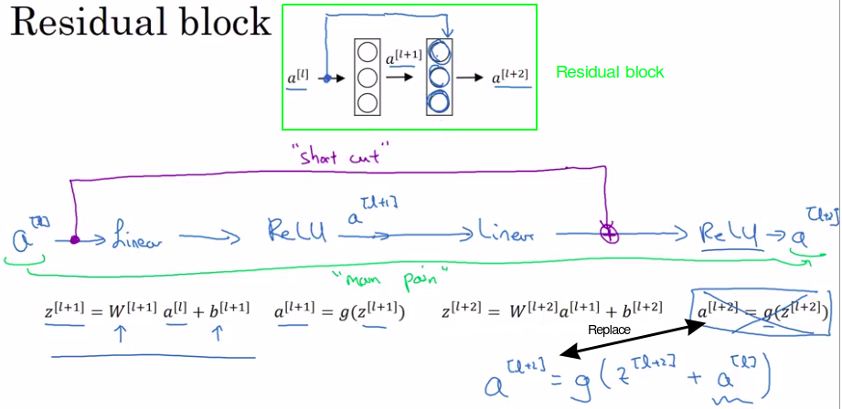
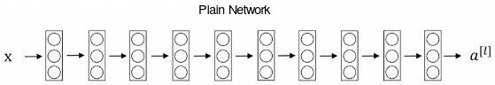
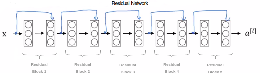
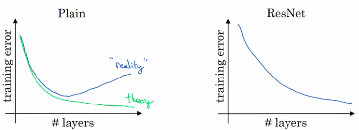

# Residual Networks (ResNets)

## Problem of deep NN

In general people have the experiment: deeper CNNs have better accuracy, but we cannot just simply throw in new layers and hope it works better automatically.

Besides the limitation of computation ability, too many parameters make the network easy to be overfit, vanishing gradient is another problem. Although we have some technique to solve these problem like weight decay and drop out for overfitting, careful initialization and batch normalization for vanishing gradient. But the performance of a very deep network is still worse than the one with an optimal depth.

To solve this problem completely we can assume the new added layers have identity mapping, which means it simply outputs its input, sounds stupid, but it will not harm the performance for sure. So we created a shortcut in ResNet, it has no parameter (using padding 0 if the dimensions of add operators are unmatched) and let the network decide which way to go, shortcut or the new layers. Assume the new added layers are not helpful for the system or even harm the performance, during minimizing cost, their weights will be decreased to almost zero.

ResNet still not support unlimited many layers like more than 1000, the author of ResNet didn't find the reason. But later in another paper the author of Inception v4 network pointed out scaling down the residual part before adding them with the shortcut could improve the train.

## Residual block

Vocabulary: Shortcut = Skip connection

In the second layer, rather than using the result of the second layer we will use the result of the first layer.

To summarize:

- We compute $z^{[l+1]}$ normally
- But to compute $a^{[l+2]}$, we ADD $a^{[l]}$ to $z^{[l+1]}$.

Indeed NOW:

|                                  |
|----------------------------------|
| $a^{[l+2]}=g(z^{[l+1]}+a^{[l]})$ |

So, the addition of this a[l] here, it makes this a **residual block**.

The inventors of ResNet what they found was that using residual blocks allows you to train much deeper neural networks

## Residual network

Here is a a plain network (as described in the resnet paper):

Here is a a **Residual Network**:

## Training error

### Plain network

Plain network will tend to decrease after a while but then they'll tend to go back up.

And in theory as you make a neural network deeper, it should only do better and better on the training set.

In theory:

- Having a deeper network should only help.

But in practice or in reality:

- Having a plain network that is very deep means that all your optimization algorithm just has a much harder time training. **Your training error gets worse if you pick a network that's too deep.**

### Resnet

With ResNet is that even as the number of layers gets deeper, you can have the performance of the training error kind of keep on going down. Even if we train a network with over a hundred layers. 

And then now some people experimenting with networks of over a thousand layers although I don't see that it used much in practice yet.

It really helps with the vanishing and exploding gradient problems and allows you to train much deeper neural networks without really appreciable loss in performance, and maybe at some point, this will plateau and will not help anymore.

## Taken from the coursera forum

When you have a shortcut path, there are two possible cases: 

1. The shortcut path and direct path produce results of the same size so they can be added. Call this shortcut path an "identity block".
2. The shortcut path and direct path do not match up. Call this the "convolutional block".

This is why you are asked to implement both (1) and (2)
