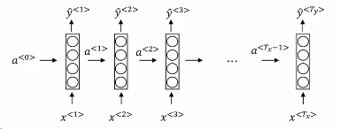
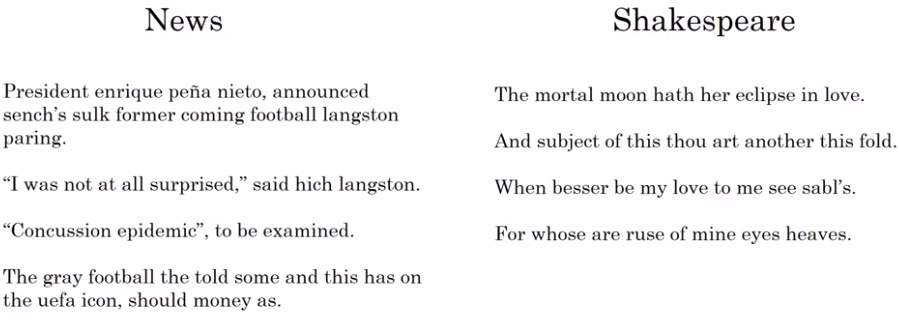

# Sampling novel sequences

So remember that a sequence model, models the chance of any particular sequence of words as follows, and so what we like to do is sample from this distribution to generate noble sequences of words.

We have trained our model using: 

## Sampling (Generate text from our model)

### First sample (the first word you want your model to generate)

| Warning |           |
|-----------|-----------|
|  | Remember that any $y^{<t>}$ is a softmax output. The softmax output is also a list of probabilities. |

**To generate a sample you input the usual $x^{<1>}=0$, $a^{<0>}=0$ and then:**

| $y^{<1>}$ |
|-----------|
| Take a random value from some of the max probability of the $y^{<1>}$ softmax output. |
| $\hat{y}^{<1>}=Randomly\ selected\ value$ You can use numpy.random.choice() to do that. |
| Inject $\hat{y}^{<1>}$ as an input for $a^{<2>}$ in the most probable outputs. |

| $y^{<2>}$ |
|-----------|
| Again you take a random value from some of the max probability of the $y^{<2>}$ softmax output. |
| $\hat{y}^{<2>}=Randomly\ selected\ value$ in the most probable outputs. |
| Inject $\hat{y}^{<2>}$ as an input for $a^{<3>}$ in the most probable outputs. |

**... You keep going until you get to the last time stamp.**

**Two solution here:**

1. You keep going until you generate an EOS.
2. Yo can also just decide to sample 20 words or 100 words or something, and then keep going until you've reached that number of time steps.  

| Warning |           |
|-----------|-----------|
|  | If you generate an UNK (unknown word token) token reject it and keep resampling. |

## Character-level language model

In a character-level language model:

- Your vocabulary is not made of words!
- Your vocabulary is made of individual characters.

Vocabulary=[a , b , c , ... , z ,   , . , ; , 0, ... , 9, A, ... , Z]

So in this case your vocabulary will just be the alphabets. Up to z, and as well as maybe space, punctuation if you wish, the digits 0 to 9. And if you want to distinguish the uppercase and lowercase.

"Cats average 15 hours of sleep a day" example:

$y^{<1>}=C$
$y^{<2>}=a$
$y^{<3>}=t$
$y^{<4>}=s$
$y^{<5>}= $
$y^{<6>}=a$
...

Using a character level language model has some pros and cons.

| Pros |    |
|------|----|
| You don't ever have to worry about unknown word tokens. | A character level language model is able to assign a sequence like 'Mau' (as seen before). Whereas if mau was not in your vocabulary for the word level language model, you just have to assign it the unknown word token (UNK). |

| Cons |    |
|------|----|
| The main disadvantage of the character level language model is that you end up with much longer sequences. | So many english sentences will have 10 to 20 words but may have many, many dozens of characters. And so character language models are not as good as word level language models at capturing long range dependencies between how the the earlier parts of the sentence also affect the later part of the sentence. |
| And character level models are also just more computationally expensive to train. | |

So the trend I've been seeing in natural language processing is that for the most part, word level language model are still used.

| Warning | Word level language model are still used but...  |
|-----------|-----------|
|  | But as computers gets faster there are more and more applications where people are, at least in some special cases, starting to look at more character level models. |
|  | Character-level tend to be much hardware, much more computationally expensive to train, so they are not in widespread use today.
|  | Except for maybe specialized applications where you might need to deal with unknown words or other vocabulary words a lot. Or they are also used in more specialized applications where you have a more specialized vocabulary. |

## Sequence generation examples

So here are some examples of text that were examples from a language model:

If the model was trained on **news articles**, then it generates texts like that shown on the left. And this looks vaguely like news text, not quite grammatical, but maybe sounds a little bit like things that could be appearing news, concussion epidemic to be examined.

And if it was trained on **Shakespearean text** and then it generates stuff that sounds like Shakespeare could have written it.