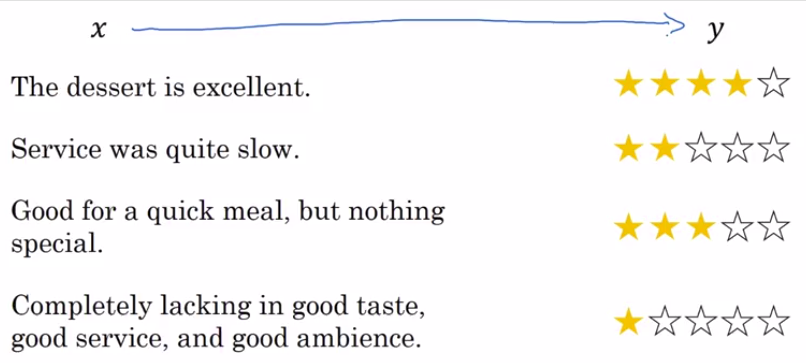

# Sentiment Classification

Sentiment classification is the task of looking at a piece of text and telling if:

- someone likes
- or dislikes the thing they're talking about.

It is one of the most important building blocks in NLP and is used in many applications.

| Challenges of Sentiment Classification |
|-------|
| One of the challenges of sentiment classification is you might not have a huge label training set for it. |
| But with word embeddings, you're able to build good sentiment classifiers even with only modest-size label training sets. |

## Example

So here's an example of a sentiment classification problem.

The input X is a piece of text and the output Y that you want to predict is what is the sentiment.

So if someone says:

- "The dessert is excellent" and they give it a four-star review.
- "Service was quite slow" two-star review.
- "Good for a quick meal but nothing special" three-star review.
- "Completely lacking in good taste, good service, and good ambiance.", that's a one-star review.

So if you can train a system to map from X or Y based on a label data set like this, then you could use it to monitor comments that people are saying about maybe a restaurant that you run.

So people might also post messages about your restaurant on social media, on Twitter, or Facebook, or Instagram, or other forms of social media.

And if you have a sentiment classifier, they can look just a piece of text and figure out how positive or negative is the sentiment of the poster toward your restaurant.

Then you can also be able to keep track of whether or not there are any problems or if your restaurant is getting better or worse over time.

So one of the challenges of sentiment classification is you might not have a huge label data se:

- So for sentimental classification task, training sets with maybe anywhere from 10,000 to maybe 100,000 words would not be uncommon.
- Sometimes even smaller than 10,000 words and word embeddings that you can take can help you to much better understand especially when you have a small training set.

## How to build it

Here's a simple sentiment classification model. You can take a sentence like "dessert is excellent" and look up those words in your dictionary. 

We use:

- 10,000-word dictionary as usual.
- E:  Embedding matrix which you can learn from a much larger text corpus.  It can learn in embedding from, say, a billion words or a hundred billion words, and use that to extract out the embedding vector for the word "the", and then do the same for "dessert", do the same for "is" and do the same for "excellent". And if this was trained on a very large data set, like a hundred billion words, then this allows you to take a lot of knowledge even from infrequent words and apply them to your problem, even words that weren't in your labeled training set.
- $e_w$: one-hot vector for each word.

And let's build a classifier to map it to the output Y that this was four stars.

Now here's one way to build a classifier, which is that you can take these vectors, let's say these are 300-dimensional vectors, and you could then just sum or average them.

And this gives you a 300-dimensional feature vector that you then pass to a soft-max classifier which then outputs $\hat{Y}$. And so the softmax can output what are the probabilities of the five possible outcomes from one-star up to five-star.

So notice that by using the average operation here:

- This particular algorithm works for reviews that are short or long because even if a review is 100 words long, you can just sum or average all the feature vectors for all the 100 words.
- And so that gives you a representation, a 300-dimensional feature representation, that you can then pass into your sentiment classifier.

So this average will work decently wel:

- It averages the meanings of all the words or sums the meaning of all the words in your example. And this will work to [inaudible]. So one of the problems with this algorithm is it ignores word order. In particular, this is a very negative review, "Completely lacking in good taste, good service, and good ambiance". But the word good appears a lot. This is a lot. Good, good, good. So if you use an algorithm like this that ignores word order and just sums or averages all of the embeddings for the different words, then you end up having a lot of the representation of good in your final feature vector and your classifier will probably think this is a good review even though this is actually very harsh. This is a one-star review.

## More sophisticated model: RNN for sentiment classification

Take that review, "Completely lacking in good taste, good service, and good ambiance", and find for each of them, the one-hot vector.

And so I'm going to just skip the one-hot vector representation:

- but take the one-hot vectors.
- multiply it by the embedding matrix E as usual to have embedding vectors.
- and then we feed these into an RNN.
- to end the job of the RNN is to then compute the representation at the last time step that allows you to predict $\hat{y}$.

So **this is an example of a many-to-one RNN architecture** which we saw in the previous week.

And with an algorithm like this, it will be much better at taking word sequence into account and realize that:

- "things are lacking in good taste" is a negative review
- "not good" a negative review unlike the previous algorithm
  - which just sums everything together into a big-word vector mush
  - and doesn't realize that "not good" has a very different meaning than the words "good" or "lacking in good taste" and so on.

Because your word embeddings can be trained from a much larger data set, this will do a better job generalizing to maybe even new words now that you'll see in your training set, such as if someone else says: "Completely absent of good taste, good service, and good ambiance"

- then even if the word "absent" is not in your label training set,
- if it was in your 1 billion or 100 billion word corpus used to train the word embeddings
- it might still get this right and generalize much better even to words that were in the training set used to train the word embeddings 
- but not necessarily in the label training set that you had for specifically the sentiment classification problem.
