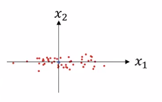

# Setting up your optimization problem

## Normalizing input

|       |                   |
|-------|-------------------|
|  | For whole normalization (with activation layers) go to: [normalizing_activations_in_a_network](./normalizing_activations_in_a_network.md) |

### Normalizing input summarized in 4 steps

So here it is in 4 steps:

|   |                   |                                  |
|---|-------------------|----------------------------------|
| 1 | Compute the means | $\mu=\frac{1}{m} \sum_{}X^{(i)}$ |
| 2 | Subtract the means from your training sets | $Xnew=X-\mu$ |
| 3 | Calculate the variance | $\sigma^{2} = \frac{1}{m}\sum_{i=1}^{m}(Xnew^{(i)})^{2}$ (element wise squaring) |
| 4 | Normalize the dataset according to the variances | $Xnorm=Xnew/\sigma^{2}$ |

### Explanation of the process with graphs

Normalizing your inputs corresponds to two steps:

  - The first is to subtract out or to zero out the mean. So you set: $\mu = \frac{1}{M}\sum_{i=1}^{m}X^{(i)}$. So this is a vector, and then X gets set as $X-\mu$ for every training example, so this means you just move the training set until it has 0 mean.

  - And then the second step is to normalize the variances. So notice here that the feature x1 has a much larger variance than the feature x2 here.

So what we do is set:

|                                                     |                                                                   |
|-----------------------------------------------------|-------------------------------------------------------------------|
| $\sigma^{2} = \frac{1}{m}\sum_{i=1}^{m}X^{(i)}**2$  | $\sigma^{2} = \frac{1}{m}\sum_{i=1}^{m}X^{(i)2}$ (element wise).  |

And so now sigma squared is a vector with the variances of each of the features. Notice we've already subtracted out the mean, so Xi squared is just the variances. And you take each example and divide it by this vector sigma squared.

|                 |
|-----------------|
| $X/=\sigma^{2}$ |

And so in pictures, you end up with this. Now the variance of X1 and X2 are both equal to one.

|                   |   |                                                                                                                       |
|-------------------|---|-----------------------------------------------------------------------------------------------------------------------|
|  | If you use this to scale your training data, then **use the same** $\mu$ and $\sigma^{2}$ to normalize your test set. |

### Why do we normalize

Remember the cost function: $J(w,b) = \frac{1}{m}\sum_{i=1}^{m}\mathcal{l}(\hat{y}^{(i)},y^{(i)})$

If:

* X1 range from 1 to 1000.
* X2 range from 0 to 1.

Then it turns out that the ratio or the range of values for the parameters w1 and w2 will end up taking on very different values.

The best ranges are when they are similar. For example:

* X1 is from 0 to 1
* X1 is from -1 to 1
* X1 is from 1 to 2

I'll plot w and b, then your cost function can be a very elongated bowl like that. 

Whereas if you normalize the features, then your cost function will on average look more symmetric. If you're running gradient descent on the cost function like the one on the top, then you might have to use a very small learning rate because if you're here that gradient descent might need a lot of steps to oscillate back and forth before it finally finds its way to the minimum.

Normalized  

Whereas if you have a more spherical contours, then wherever you start gradient descent can pretty much go straight to the minimum. You can take much larger steps with gradient descent rather than needing to oscillate around like like the picture on the left.

## Vanishing / Exploding gradients

When you're training a very deep network **your derivatives or your slopes** can sometimes get either:

*  Very, very big.
*  Very, very small, maybe even exponentially small, and this makes training difficult.

Let's just forget b for a moment: b=0

$\hat{y}=W^{[L]}W^{[L-1]}W^{[L-2]}\cdots W^{[3]}W^{[2]}W^{[1]}X$ 

Let's say that each of your weight matrices $w^{[l]}$ is just a little bit larger than one times the identity.

Remember the activation is $a^{(i)}=g(z^{(i)})$ and $z^{(i)}=w^{(i)}X$

$$w^{[l]} = \begin{bmatrix}
       1.5 & 0 \\[0.3em]
       0 & 1.5
     \end{bmatrix}$$
     
So:

$$\hat{y}=W^{[L]}\begin{bmatrix}
1.5 & 0 \\[0.3em]
0 & 1.5
\end{bmatrix}^{[L-1]} X$$

|               |                                                                                                                                             |
|---------------|---------------------------------------------------------------------------------------------------------------------------------------------|
| $1.5^{[L-1]}$ | If you have a very deep NN this value will explode. **So in the very deep network, the activation values end up increasing exponentially.** |
| $0.5^{[L-1]}$ | If you have a very deep NN this value will vanish. **So in the very deep network, the activation values end up decreasing exponentially.** |

### Weight Initialization for Deep Networks

#### Single neuron example

The larger n is, the smaller you want $W_{i}$ to be because z is the sum of the $W_{i}X_{i}$ and so if you're adding up a lot of these terms you want each of these terms to be smaller. 

What we could do is to set the variance:

| Activation fonction  | Variance                       |
|----------------------|--------------------------------|
| Tanh | $Var(W_i)=\frac{1}{n}$         |
| ReLU | $Var(W_i)=\frac{2}{n}$         |

------------

In practice what we can do is:

| Activation fonction | Weight initialization |
|---------------------|-----------------------|
|  Tanh, Not ReLU  |  $W^{[l]}$=np.random.randn(shapeOfTheMatrix)\*np.sqrt($\frac{1}{n^{[l-1]}}$)  |
| Tanh | Xavier Initialization: $W^{[l]}$=np.random.randn(shapeOfTheMatrix)\*np.sqrt($\frac{2}{n^{[l-1]}+n^{[l]}}$)  |
|  ReLU  |  $W^{[l]}$= np.random.randn(shapeOfTheMatrix)\*np.sqrt($\frac{2}{n^{[l-1]}}$)  |

$n^{[l-1]}$ : number of features (X1,X2,Xn) from the previous layer.

## Numerical approximation of Gradient

Sometimes you write all these equations and you're just not 100% sure if you've got all the details right and internal back propagation. 

Imagine we have a function $f(\theta)=\theta^{3}$

The slope approximation is then:

|                                                                           |
|---------------------------------------------------------------------------|
| $g(\theta)\approx\frac{f(\theta+\epsilon)-f(\theta-\epsilon)}{2\epsilon}$ |

Let's try with values around $\theta=1$ and $\epsilon=0.01$ :

$g(\theta)\approx\frac{f(1.01)-f(0.99)}{2\times{0.1}}\approx{3.0001}$

----

By derivative:
$f(\theta)=\theta^{3}$
$f'(\theta)=3\theta^{2}$

If $\theta=1$ then $f'(\theta=1)=3$

Then the approximation is correct.

### Gradient checking

----

for each i:
{

$d\theta{Approx[i]}=\frac{J(\theta_{1},\theta_{2},\cdots,\theta_{i}+\epsilon,\cdots)-J(\theta_{1},\theta_{2},\cdots,\theta_{i}-\epsilon,\cdots)}{2\epsilon}\approx d\theta_{[i]} = \frac{dJ}{d\theta_{i}}$

}

----

At the end, you now end up with two vectors. You end up with this:

* $d\theta{Approx}$
* $d\theta$ (original algorithm with derivatives)

Ok can I check that $d\theta{Approx}\approx d\theta$ ?

You can use this:

$\frac{\lVert d\theta{Approx} - d\theta \rVert_{2}}{\lVert d\theta{Approx} \rVert_{2} + \lVert d\theta \rVert_{2}}$

I would compute the distance between these two vectors (, d theta approx minus d theta, so just the o2 norm of this. Notice there's no square on top, so this is the sum of squares of elements of the differences, and then you take a square root, as you get the Euclidean distance. And then just to normalize by the lengths of these vectors, divide by d theta approx plus d theta. Just take the Euclidean lengths of these vectors.

----

|                                             |
|---------------------------------------------|
| Andrew Ng usually use: $\epsilon = 10^{-7}$ |

And with this range of epsilon, if you find that this formula ($\frac{\lVert d\theta{Approx} - d\theta \rVert_{2}}{\lVert d\theta{Approx} \rVert_{2} + \lVert d\theta \rVert_{2}}$
) gives you a value like $10^{-7}$ or smaller, then that's great. It means that your derivative approximation is very likely correct. This is just a very small value. 

If it's maybe on the range of $10^{-5}$, I would take a careful look. Maybe this is okay. But I might double-check the components of this vector, and make sure that none of the components are too large. And if some of the components of this difference are very large, then maybe you have a bug somewhere.

And if this formula on the left is on the other is $10^{-3}$, then I would wherever you have would be much more concerned that maybe there's a bug somewhere. 

### How to implement gradient checking

|   |                                                                 |                     |
|---|-----------------------------------------------------------------|---------------------|
| 1 | Don't use Gradient Checking in training (use it only to debug). | Gradient checking slows everything. |
| 2 | If algorithm fails Gradient Checking, look at components to try to identify bug. | For example if you find that the valuesof $d\theta^{[i]}$ are very far off, remember that the bug can be in the way you compute $db^{[l]}$ or if this not the case it might be $dw^{[l]}$.  |
| 3 | Remember regularization. | If the cost function is: $J(\theta)= \frac{1}{m}\times{\sum_{i=1}^{m}{\mathcal{l}(\hat{y}^{(i)},y^{(i)})}}+\frac{\lambda}{2m}\sum_{l=1}^{L}\lVert W^{[l]} \rVert^{2}_{F}$ then $d\theta$ is gradient of J with respect to $\theta$ __including the regularization term__.  So don't forget to include the term $\frac{\lambda}{2m}\sum_{l=1}^{L}\lVert W^{[l]} \rVert^{2}_{F}$. | 
| 4 | Gradient descent doesn't work with dropout | So what Andrew NG usually do is implement grad check without dropout. So if you want, you can set $keep\_prob=1.0$ and dropout to be equal to 1.0. And after gradient checking is verified then turn on dropout and hope that the implementation of dropout is  correct. |
| 5 | Run at random initialization; perhaps again after some training. It is not impossible, rarely happens, but it's not impossible that your implementation of gradient descent is correct when w and b are close to 0, so at random initialization. But that as you run gradient descent and w and b become bigger, maybe your implementation of backprop is correct only when w and b is close to 0, but it gets more inaccurate when w and b become large. | So one thing you could do, Andrew NG doesn't do this very often, but one thing you could do is run grad check at random initialization and then train the network for a while so that w and b have some time to wander away from 0, from your small random initial values. And then run grad check again after you've trained for some number of iterations. |

