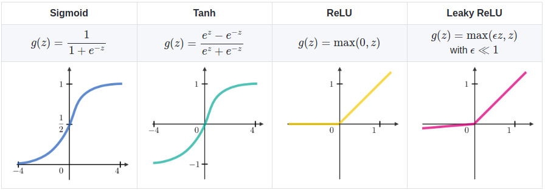
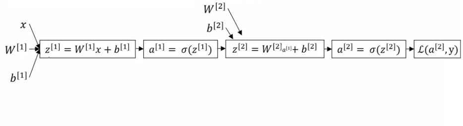
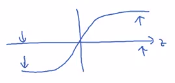

# Shallow neural networks

Shallow = Superficiel

## Overview

Notation:

* $^{[]}$ is for layer number.
* $^{()}$ is for training example.

| Notation | Explanation |
|----------|-------------|
| $Y^{(i)} \in \mathbb{R}^{n_{y}}$ | is the output of the $i^{th}$ example |
| $W^{[l]} \in \mathbb{R}^{number of units in next layer \times number of units in the previous layer}$ | is the weight matrix. Superscript [l] indicates the layer. |
| $b^{[l]} \in \mathbb{R}^{number of units in next layer}$ | is the bias vector in the $l^{th}$ layer |

## Neural network representation

 We don't count layer 0 which are inputs. So this is a 2 layers neural network:

## Vectorizing across multiple example

$$A^{[i]}=\begin{bmatrix}
    \vdots & \vdots & \vdots & \vdots \\
    a^{[i](1)} & a^{[i](2)} & a^{[i](3)} & a^{[i](4)} \\
    \vdots & \vdots & \vdots & \vdots \\
\end{bmatrix}$$

Imagine b=0 :

Imagine b is not 0 now. You would have to add b to all $Z^{[i]}$.

## Activation functions

### Why do you need non-linear activation functions?

The take-home is that a linear (without sigmoid, tanh, ReLU etc?) hidden layer is more or less useless. The composition of two linear functions is itself a linear function so unless you throw a non-linearity in there then you're not computing more interesting functions even as you go deeper in the network.

There is just one place where you might use a linear activation function that's if you are doing machine learning on a regression problem so if $\hat{Y}$ is also a real number (for example the price of a house).

In this case you could use tanh for hidden layers and linear function for output layer (directly Wx+b for example).

### Activation function with tanh

Let's replace the sigmoid by the tanh function that works better:

$a=tanh(z)=\frac{e^{z}-e^{-z}}{e^{z}+e^{-z}}$

It turns out for hidden units, if you let the function g of z be equal to tanh(z), this almost always works better than the sigmoid function because the values between plus 1 and minus 1, the mean of the activations that come out of your head, and they are closer to having a 0 mean. 

And so just as sometimes when you train a learning algorithm, you might center the data and have your data have 0 mean using a tanh instead of a sigmoid function. It kind of has the effect of centering your data so that the mean of your data is closer to 0 rather than, maybe 0.5. And this actually makes learning for the next layer a little bit easier.

The tanh function is almost always strictly superior. **The one exception is for the output layer because if y is either 0 or 1, then it makes sense for y hat to be a number, the one to output that's between 0 and 1 rather than between -1 and 1.** 

### Activation function with ReLU (Rectified Linear Unit)

$a=MAX(0,Z)$

### Pros and cons of activation functions

* Sigmoid, almost never use it because the tanh is pretty much superior. Sigmoid: The one exception is for the output layer.
* And then the default, **the most commonly used activation function is the ReLU**.

For your application, with your application's idiosyncrasies, it's actually very difficult to know in advance exactly what will work best. So a common piece of advice would be, if you're not sure which one of these activation functions work best, try them all, and evaluate on a holdout validation set, or a development set, which we'll talk about later, and see which one works better, and then go with that.

### Derivatives of activation functions

* [Simple tutorial about how to calculate derivatives of Sigmoid](./simple_tutorial_about_how_to_calculate_derivatives_of_sigmoid.md)

| Function name | Function | Derivative |
|---------------|----------|------------|
| Sigmoid | $g(z)=\frac{1}{1+e^{-z}}$ | $g'(z)=\frac{d}{dz}g(z)=a(1-a)$ |
| Tanh | $g(z)=\frac{e^{z}-e^{-z}}{e^{z}+e^{-z}}$ | $g'(z)=\frac{d}{dz}g(z)=1-(tanh(z))^2$ |
| ReLU | $g(z)=\max{(0,z)}$ | $g'(z)=$0 if z<0, and 1 if z>=0 |
| Leaky ReLU | $g(z)=\max{(0.01\times{z},z)}$ | $g'(z)=$0.01 if z<0, and 1 if z>=0  |

### Gradient descent

Parameters:

| Parameter  | Size of the matrix  |
|------------|---------------------|
| $W^{[1]}$ | $(n^{[1]},n^{[0]})$  |
| $b^{[1]}$ | $(n^{[1]},1)$ |
| $W^{[2]}$ | $(n^{[2]},n^{[1]})$ |
| $b^{[2]}$ | $(n^{[2]},1)$ |

$J(W^{[1]},b^{[1]},W^{[2]},b^{[2]})=\frac{1}{m}\times{\sum_{i=1}^{m}{\mathcal{l}(\hat{y}^{(i)},y^{(i)})}}$

> Repeat{
>
> 
> /* Compute prediction */
> 
> ComputePrediction($\hat{y}^{(i)})$
> 
> 
>  
> /* Compute derivative */
>
> $dW^{[1]}=\frac{dJ}{dw^{[1]}},\frac{dJ}{db^{[1]}}\cdots$ 
> 
> 
> /* Update values */
> 
> $W^{[1]}=W^{[1]}-\alpha{dW^{[1]}}$
> 
> $b^{[1]}=b^{[1]}-\alpha{db^{[1]}}$
>
> 
> }

| Forward propagation                                        | Backward propagation (* is for element wise product                               )  |
|------------------------------------------------------------|--------------------------------------------------------------------------------------|
| $Z^{[1]}=W^{[1]}X+b^{[1]}$                                 |  $dZ^{[2]}=A^{[2]}-Y$                                                                |
| $A^{[1]}=g^{[1]}(Z^{[1]})$                                 | $dW^{[2]}= \frac{1}{m}dZ^{[2]}A^{[1]T}$                                              |
| $Z^{[2]}=W^{[2]}A^{[1]}+b^{[2]}$                           | $db^{[2]}= \frac{1}{m}np.sum(dZ^{[2]},axis=1,keepdims=True)$                         |
| $A^{[2]}=g^{[2]}(Z^{[2]})$ if a sigmoid $g^{[2]}= \sigma$  | $dZ^{[1]}=W^{[2]T}dZ^{[2]}*g^{[1]'}(Z^{[1]})$                                        |
|                                                            | $dW^{[1]}=\frac{1}{m}dZ^{[1]}X^{T}$                                                  |
|                                                            | $db^{[1]}= \frac{1}{m}np.sum(dZ^{[1]},axis=1,keepdims=True)$                         |

## Random Initialization

If you initialize $W^{[1]}$ and $b^{[1]}$ matrices to zero, you tend to have:

* $a^{[1]}_{1}=a^{[1]}_{2}$
* and $dZ^{[1]}_{1}=dZ^{[1]}_{2}$

So it's possible to construct a proof by induction that if you initialize all the ways, all the values of w to 0, then because **both hidden units start off computing the same function**. 

And both hidden units have the same influence on the output unit, then after one iteration, that same statement is still true, the two hidden units are still symmetric. 

And so in this case, there's really no point to having more than one hidden unit. **Because they are all computing the same thing**.

The solution to this is to initialize your parameters randomly.

### Random initialization

$W^{[1]}=np.random.randn(2,2)*0.01$

$b^{[1]}=np.zeros((2,2))$

$W^{[2]}=np.random.randn(1,2)*0.01$

$b^{[2]}=0$

----

So you might be wondering, where did this constant come from and why is it 0.01? Why not put the number 100 or 1000?

Turns out that we usually prefer to initialize the weights to very small random values. Because if you are using a tanh or sigmoid activation function, or the other sigmoid, even just at the output layer.

Rmember that z[1]=w1 x + b. And then a1 is the activation function applied to z1. So if w is very big, z will be very, or at least some values of z will be either very large or very small. 

tanh

And so in that case, you're more likely to end up at these fat parts of the tanh function or the sigmoid function, where the slope or the gradient is very small. **Meaning that gradient descent will be very slow.**

## Quizz

