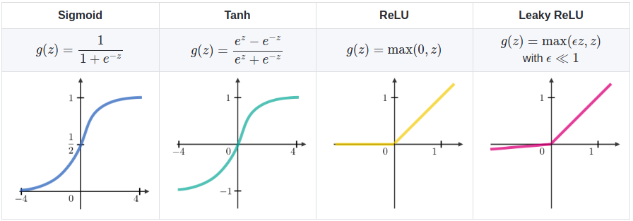
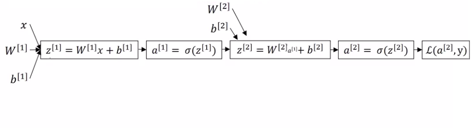
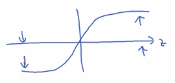

# Shallow neural networks summarized

<a href="../img/dimensions_explained.zip">dimensions_explained.zip</a>
<a href="../img/1_layer_multiple_units_1_output_layer.zip">1_layer_multiple_units_1_output_layer.zip</a>


----

## Neural network representation


 We don't count layer 0 which are inputs. So this is a 2 layers neural network:


|                            |
|----------------------------|
| $z^{[1]}=W^{[1]}x+b^{[1]}$ |
| $a^{[1]}=\sigma (z^{[1]})$ |
| $z^{[2]}=W^{[2]}a^{[1]}+b^{[2]}$ |
| $a^{[2]}=\sigma (z^{[2]})$ |

In the representation of matrices we have:


## Why do you need non-linear activation functions?

The take-home is that a linear (without sigmoid, tanh, ReLU etc?) hidden layer is more or less useless. The composition of two linear functions is itself a linear function so unless you throw a non-linearity in there then you're not computing more interesting functions even as you go deeper in the network.

There is just one place where you might use a linear activation function that's if you are doing machine learning on a regression problem so if $\hat{Y}$ is also a real number (for example the price of a house).

In this case you could use tanh for hidden layers and linear function for output layer (directly Wx+b for example).

## Activation functions



| Function name | Function | Derivative |
|---------------|----------|------------|
| Sigmoid | $g(z)=\frac{1}{1+e^{-z}}$ | $g'(z)=\frac{d}{dz}g(z)=a(1-a)$ |
| Tanh | $g(z)=\frac{e^{z}-e^{-z}}{e^{z}+e^{-z}}$ | $g'(z)=\frac{d}{dz}g(z)=1-(tanh(z))^2$ |
| ReLU | $g(z)=\max{(0,z)}$ | $g'(z)=$0 if z<0, and 1 if z>=0 |
| Leaky ReLU | $g(z)=\max{(0.01\times{z},z)}$ | $g'(z)=$0.01 if z<0, and 1 if z>=0  |

|         |                                                                                                                                                                     |
|---------|---------------------------------------------------------------------------------------------------------------------------------------------------------------------|
| Sigmoid | Almost never use it because the tanh is pretty much superior. The one exception is for the **output layer, especially if you need an answer True (1) or False (0)** |
| Tanh | Because Tanh is centered on 0, it helps the NN to learn. |
| ReLu | **The most commonly used activation function** |


It's actually very difficult to know in advance exactly what will work best. So a common piece of advice would be, if you're not sure which one of these activation functions work best, try them all.

### Derivatives of activation functions

| Function | Forward propagation | Derivative (Backward propagation) |
|----------|---------------------|-----------------------------------|
| Sigmoid | ```g(z) = 1 / (1 + np.exp(-z))``` | ```g'(z) = g(z) * (1 - g(z)) = (1 / (1 + np.exp(-z))) * (1 - (1 / (1 + np.exp(-z))))``` |
| Tanh | ```g(z)  = (e^z - e^-z) / (e^z + e^-z)``` | ```g'(z) = 1 - np.tanh(z)^2 = 1 - g(z)^2``` |
| RELU | ```g(z)  = np.maximum(0,z)``` | ```g'(z) = { 0  if z < 0  OR  1  if z >= 0  }``` |
| Leaky RELU | ```g(z)  = np.maximum(0.01 * z, z)``` | ```g'(z) = { 0.01 if z < 0  OR  1 if z >= 0 }``` |

## Size of parameters and grandient





| Forward propagation                                        | Backward propagation (* is for element wise product)          |
|------------------------------------------------------------|---------------------------------------------------------------|
| $Z^{[1]}=W^{[1]}X+b^{[1]}$                                 | $dZ^{[2]}=A^{[2]}-Y$                                          |
| $A^{[1]}=g^{[1]}(Z^{[1]})$                                 | $dW^{[2]}= \frac{1}{m}dZ^{[2]}A^{[1]T}$                       |
| $Z^{[2]}=W^{[2]}A^{[1]}+b^{[2]}$                           | $db^{[2]}= \frac{1}{m}np.sum(dZ^{[2]},axis=1,keepdims=True)$  |
| $A^{[2]}=g^{[2]}(Z^{[2]})$ if a sigmoid $g^{[2]}= \sigma$  | $dZ^{[1]}=W^{[2]T}dZ^{[2]}*g^{[1]'}(Z^{[1]})$                 |
|                                                            | $dW^{[1]}=\frac{1}{m}dZ^{[1]}X^{T}$                           |
|                                                            | $db^{[1]}= \frac{1}{m}np.sum(dZ^{[1]},axis=1,keepdims=True)$  |


## Random Initialization

If you initialize $W^{[1]}$ and $b^{[1]}$ matrices to zero, you tend to have:
  * $a^{[1]}_{1}=a^{[1]}_{2}$
  * and $dZ^{[1]}_{1}=dZ^{[1]}_{2}$

So it's possible to construct a proof by induction that if you initialize all the weights to 0, then because **all hidden units start off computing the same function**. 

And so in this case, there's really no point to having more than one hidden unit. **Because they are all computing the same thing**.

The solution to this is to initialize your parameters randomly.

|                                     |
|-------------------------------------|
| $W^{[1]}=np.random.randn(2,2)*0.01$ |
| $b^{[1]}=np.zeros((2,2))$ |
| $W^{[2]}=np.random.randn(1,2)*0.01$ |
| $b^{[2]}=0$ |

**Why we have a 0.01 constant?**

Remember that $Z^{[1]}=W^{[1]}X+b^{[1]}$. And then a1 is the activation function applied to z1. So if w is very big, z will be very, or at least some values of z will be either very large or very small. 



And so in that case, you're more likely to end up at these fat parts of the tanh function or the sigmoid function, where the slope or the gradient is very small. Meaning that gradient descent will be very slow.
