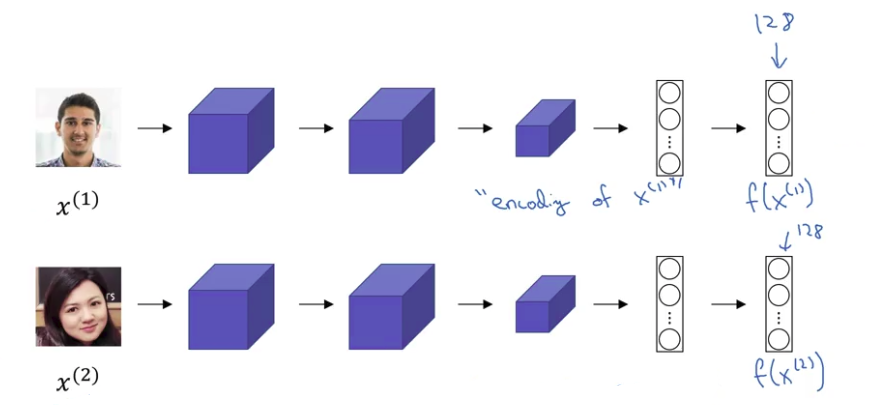

# Siamese Network

Paper due to Yaniv Taigman, Ming Yang, Marc'Aurelio Ranzato, and Lior Wolf in a system that they developed called DeepFace.

The job of the function d is to input two faces and tell you how different they are.

Input image 1: $x^{(1)}$
Input image 2: $x^{(2)}$

**We DON'T use a softmax final layer.**

Through a sequence of convolutional and pooling and fully connected layers, we end up with a feature vector (128 numbers computed by some fully connected layer).

I'm going to call this f of $x^{(1)}$, and you should think of $f(x^{(1)})$ as an encoding of the input image $x^{(1)}$.

The way you can build a face recognition system is then that if you want to compare two pictures:

- What you can do is **feed this second picture to the same neural network with the same parameters**.
- And **get a second vector** of 128 numbers which encodes this second picture.
-  Finally, if you believe that the encodings are a good representation of these two images, what you can do is then define:

|                                                                         |                                                                                                                        |
|-------------------------------------------------------------------------|------------------------------------------------------------------------------------------------------------------------|
| $d(x^{(1)},x^{(2)})=\left\lVert f(x^{(1)})-f(x^{(2)}) \right\rVert_2^2$ | d of distance between $x^{(1)}$ and $x^{(2)}$ as the norm of the difference between the encodings of these two images. |

|                                 |                                                          |                                                   |
|---------------------------------|----------------------------------------------------------|---------------------------------------------------|
| Just for the notation it seems: | $\lVert w \rVert^{2}_2=\sum_{j=1}^{n_{x}}w^{2}_j=w^{T}w$ | (Taken from [Regularizing your neural network](./regularizing_your_neural_network.md)) |

This idea of running two identical convolutional neural networks on two different inputs and then comparing them:

- that's called a Siamese neural network architecture.

|                                                                                   |
|-----------------------------------------------------------------------------------|
| **Siamese networks are 2 NN that share the same parameters. They are identical.** |

Paper due to Yaniv Taigman, Ming Yang, Marc'Aurelio Ranzato, and Lior Wolf in a system that they developed called DeepFace.

## How do you train this Siamese neural network

Remember that these two neural networks have **the same parameters**.

