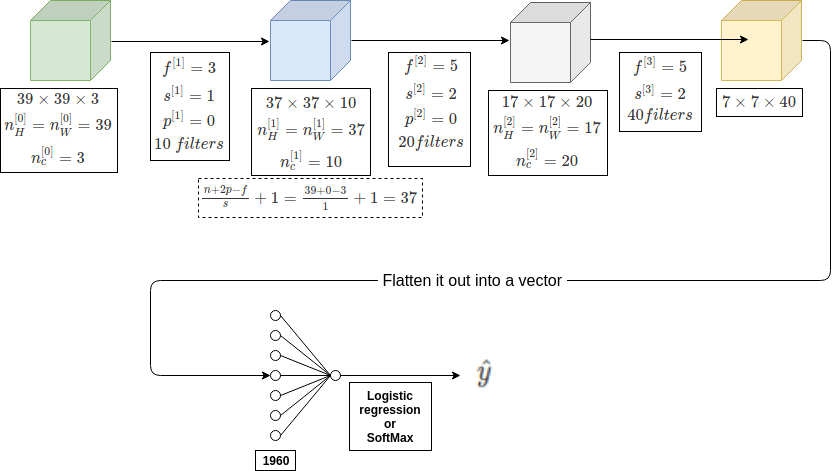

# Simple Convolutional Network Example

<a href="../img/convnet_example.xml.zip">convnet_example.xml.zip</a>

## Types of layers in a convolutional network

| Types of layers in a convolutional network |    |
|--------------------------------------------|----|
| CONV | Convolutional |
| POOL | Pooling |
| FC | Fully connected |

