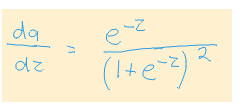

# Derivative of the Sigmoid function - a worked example

Summary
Although I have practical experience with machine learning, I do have gaps in my knowledge regarding the mathematics behind deep learning. So today I worked on calculating the derivative of a sigmoid function, which is something that had perplexed me previously.

This post is mostly for my own reference so I can find my notes on this issue easily. But hopefully it will be of value to other people too.

## Sigmoid Function

The sigmoid function is one of many possible functions that are used as a nonlinear activation function between layers of a neural network. One of the properties that makes it appealing is that for any input value, it maps it to an output value between 0 and 1, which makes it useful if you want to perform binary classification.


The formula that specifies this curve is:


## Derivative of Sigmoid Function

The reason why calculating the derivative of this function is important, is because the learning process for neural networks involves making small changes to parameters, proportional to the partial derivatives of those parameter values, and relative to the loss function. This requires stepping backwards through the layers, applying the chain rule along each step. So, one of those components that require calculation, is the derivative of the activation function.

One of the interesting properties of the Sigmoid function is that the derivative can be expresed in terms of the function itself. The reason this is appealing is because it can save computation time, as we can just reuse the same calculated values for the forward pass, and for the gradient.

The derivative is commonly expressed as follows (where a represents the original sigmoid function):


## Calculating the Derivative

Below, I will go step by step showing how the derivative is calculated.

Firstly, it is useful if we represent the fraction as a power.


This representation is really just a personal preference, since it means I only ever have to remember the chain rule in calculus, and not worry about remembering the quotient rule. We can therefore think of the formula as being composed of as a function of a function, as follows:


We can now continue on with the chain rule to calculate the rest as follows:


When we substitute g back in we get:



This doesn't look anything like the derivative that was shown previously. You can rest assured that it is actually representing the same thing. And technically it is the correct answer. But, we would like to make use of the property of specifying the derivative in terms of the function itself, and we want to know how to get to there. So lets continue to do some algebra.

We can do an algebraic operation that seems pointless at first, but which will help us later. We can add a +1 -1 to the numerator. This does not affect the value, since the two values cancel themselves out.


We can now perform a little bit more algebra as follows:


Which can easily be represented as:


And.. voila! We are done!

## What the derivative looks like

We can create a plot that shows the relationship between the sigmoid function and its derivative as follows:

```python
import matplotlib.pyplot as plt
import numpy as np

def sigmoid(x):
    return 1./(1+np.e**(-x))

# Calculate plot points
x = np.arange(-6., 6., 0.01)
y = sigmoid(x)
dx = y*(1-y)

# Setup centered axes
fig, ax = plt.subplots(figsize=(9, 5))
ax.spines['left'].set_position('center')
ax.spines['right'].set_color('none')
ax.spines['top'].set_color('none')
ax.xaxis.set_ticks_position('bottom')
ax.yaxis.set_ticks_position('left')

# Create and show plot
ax.plot(x,y, color="#307EC7", linewidth=3, label="sigmoid")
ax.plot(x,dx, color="#9621E2", linewidth=3, label="derivative")
ax.legend(loc="upper right", frameon=False)
fig.show()
```
