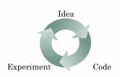

# Single number evaluation metric (harmonic mean, average)

## Using a single number evaluation metric

### F1 score (Harmonic mean)

| Classifier  | Precision (Of examples recognized as cats, what % actually are cats?)  | Recall (What % of actual cats are correctly recognized?)  | F1 Score (Final evaluation metric. Harmonic mean of Precision and Recall) (Formula below)|
|-------------|------------------------------------------------------------------------|-----------------------------------------------------------|------------------------------------------------------------------------------------------|
| A (A classifier you have built)          | 95%           | 90%   | **92.4%** |                             
| B (You have changed A. Hyperparameters and the training sets or some other thing, you've now trained a new classifier, B)          | 98%           | 85%   | **91.0%** |

Harmonic mean: In mathematics, the harmonic mean is one of several kinds of average. Typically, it is appropriate for situations when the average of rates is desired.

|                                                                                  |
|----------------------------------------------------------------------------------|
| F1 Score = Average of Precision and Recall = $\frac{2}{\frac{1}{P}+\frac{1}{R}}$ |

Use F1 score to know which classifier works better

## Average

You'e building a cat app for users in 4 major geographies.

You have multiple classifiers and they achieve different errors according to the country of the user submitting their cat picture. 

By tracking multiple numbers it is difficult to decide which algorithm is superior.

**The solution: Use average** to decide.

