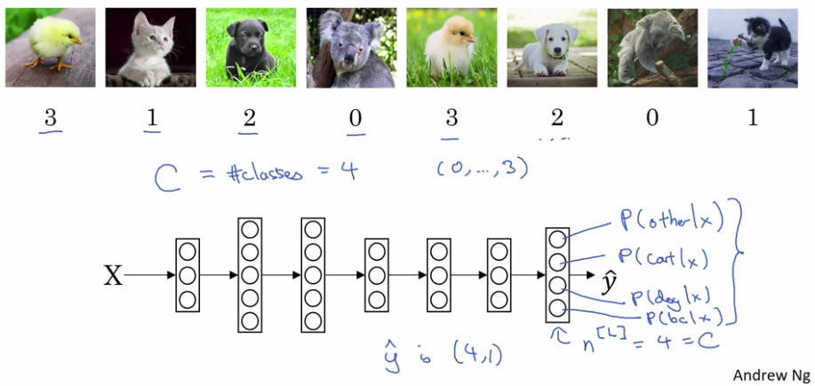
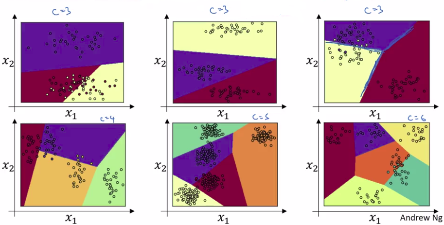

# Softmax regression

## Recognizing cats, dogs, baby chicks and others

- Cost function result = 3 this is a baby chick
- Cost function result = 2 this is a dog
- Cost function result = 1 this is a cat
- Cost function result = 0 this is "other"

|   |                   |     |
|---|-------------------|-----|
| C | Number of classes | C=4 |

So in the last layer we have:

- P(other|X): probability of "other" class given X
- P(cat|X): probability of "cat" class given X
- P(dog|X): probability of "dog" class given X
- P(chick|X): probability of "chick" class given X

The output of $\hat{y}$ will be (4,1) vector.

The standard model for getting your network to do this uses what's called a Softmax layer.

## Softmax formulas

| Formulas for Softmax | Example |
|----------------------|---------|
| $Z^{[L]}=W^{[L]}a^{[L-1]}+b^{[L]}$ | $\begin{bmatrix} 5  \\2  \\-1 \\3 \end{bmatrix}$ |

Activation function:

|                      |         |
|----------------------|---------|
| $t=e^{Z^{[L]}}$ | $t=\begin{bmatrix} e^{5}  \\e^{2}  \\e^{-1} \\e^{3} \end{bmatrix} = \begin{bmatrix}148.4  \\7.4  \\0.4 \\20.1 \end{bmatrix}$ |
| $a^{[L]}=\frac{e^{Z^{[L]}}}{\sum_{j=1}^C{t_{i}}},a_{i}^{[L]}=\frac{t_{i}}{\sum_{j=1}^C{t_{i}}}$ | $\sum_{j=1}^C{t_{i}}=148.4+7.4+0.4+20.1=176.3 \\ a^{[L]}=\begin{bmatrix}\frac{e^{5}}{176.3}  \\  \frac{e^{2}}{176.3}  \\  \frac{e^{-1}}{176.3} \\  \frac{e^{3}}{176.3} \end{bmatrix}=\begin{bmatrix}  0.842  \\ 0.042  \\ 0.002 \\ 0.114 \end{bmatrix}$ |
| Result: Probability | $P(0)=0.842 \\P(1)=0.042 \\P(2)=0.002 \\P(3)=0.114$ |

## Examples

Image top-right: One intuition is that the decision boundary between any two classes would be more linear. It's seems easy to separate them by their boundary. 
