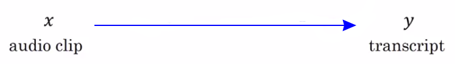
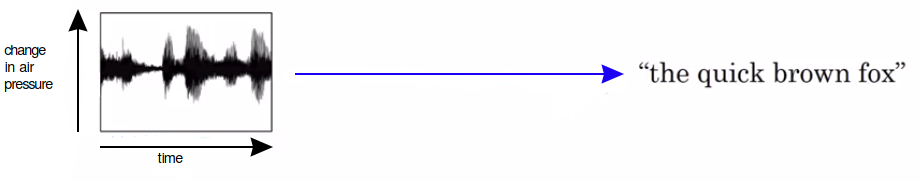
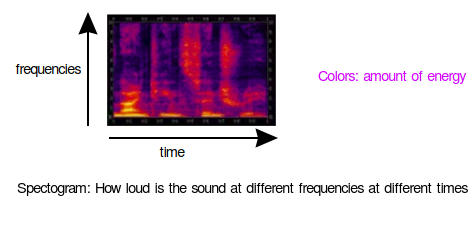
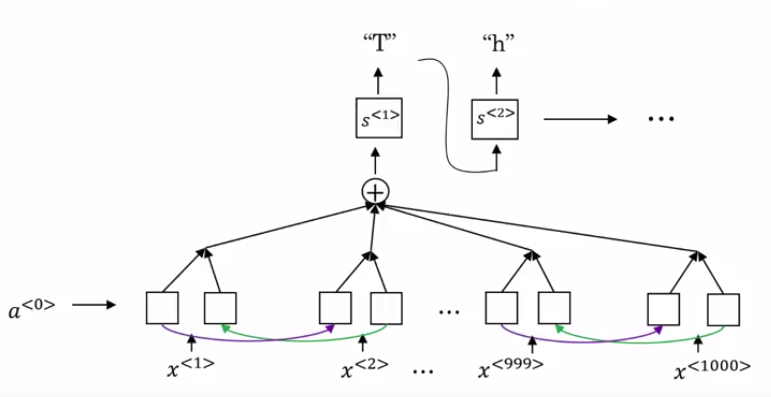
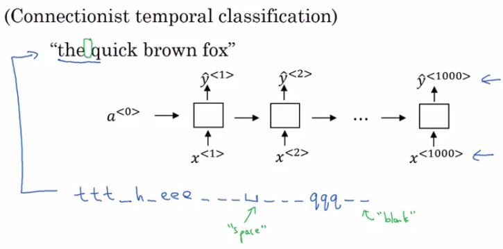
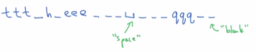

# Speech recognition

One of the most exciting developments were sequence-to-sequence models has been the rise of very accurate speech recognition.

So, what is the speech recognition problem?

You're given an audio clip x, and your job is to automatically find a text transcript, y.

So, an audio clip, if you plot it looks like this, the horizontal axis here is time, and what a microphone does is it really measures minuscule changes in air pressure, and the way you're hearing my voice right now is that your ear is detecting little changes in air pressure, probably generated either by your speakers or by a headset.

And some audio clips like this plots with the air pressure against time. And, if this audio clip is of me saying, "the quick brown fox", then hopefully, a speech recognition algorithm can input that audio clip and output that transcript.

And because even the human ear doesn't process raw wave forms, but the human ear has physical structures that measures the amounts of intensity of different frequencies, then there is a **common pre-processing step for audio data that is to run your raw audio clip and generate a spectrogram.**

And so, these types of spectrograms, is often commonly useed as pre-processing step before audio is pass into in the running algorithm.

The human ear does a computation pretty similar to this pre-processing step.

## From phonemes to bigger datasets

One of the most exciting trends in speech recognition is that:

- Once upon a time, speech recognition systems used to be built using phonemes and this where, I want to say hand-engineered basic units of cells.

Let's say, "The" has a "de" and "e" sound and Quick, has a "ku" and "wu", "ik", "k" sound, and linguist used to write off these basic units of sound, and try the Greek language down to these basic units of sound.

Linguists use to hypothesize that writing down audio in terms of these basic units of sound called phonemes would be the best way to do speech recognition.

But with end-to-end deep learning, we're finding that phonemes representations are no longer necessary.

One of the things that made this possible was going to much larger data sets.

| Datatsets on speech recognition | Size                                                                                                                                                                             |
| ------------------------------- | -------------------------------------------------------------------------------------------------------------------------------------------------------------------------------- |
| Academic data                   | Might be 3000 hour data sets of transcribed audio would be considered reasonable size (a lot of research papers that are written on data sets there are several thousand voice). |
| The best commercial systems     | trained on over 10,000 hours and sometimes over a 100,000 hours of audio.                                                                                                        |

## How do you build a speech recognition system

### Method 1: attention model

You could do is actually build an attention model, where on the horizontal axis:

- You take in **different time frames of the audio input.**
- Then you have an **attention model try to output the transcript.**

### Method 2: CTC cost for speech recognition

CTC stands for: [Connectionist Temporal Classification and is due to Alex Graves, Santiago Fernandes, Faustino Gomez, and Jürgen Schmidhuber](http://www.cs.toronto.edu/~graves/icml_2006.pdf)

Let's say the audio clip was someone saying, "the quick brown fox".

We're going to use a new network structured like this with an equal number of input x's and output y's.

The drawing is a simple uni-directional RNN for this:

- but in practice, this will usually be a bidirectional LSP and bidirectional GIU and usually, a deeper model.

Notice that the number of time steps here is very large:

- **In speech recognition, usually the number of input time steps is much bigger than the number of output time steps.**

| Example of 10 seconds of audio |
|----------------------------------------------------------------|
| If you have 10 seconds of audio and your features come at a 100 hertz so 100 samples per second, then a **10 second audio clip would end up with a thousand inputs**. |

**But your output might not have a thousand alphabets, might not have a thousand characters.**

So, what do you do?

The CTC cost function allows the RNN to generate an output like this:

- there's a special character called the **blank character** (written underscore here)
- and there is space.

The basic rule for the CTC cost function is to collapse repeated characters not separated by "blank".

| Original Output                       | Collapsed repeated characters not separated by blank |
| ------------------------------------- | ---------------------------------------------------- |
|  | "the q"                                              |

This allows your network to have a thousand outputs by repeating characters all the times.

So, even by inserting a bunch of blank characters it still ends up with a much shorter output text transcript.

|  "the quick brown fox" has 19 characters (including spaces)|
|--------------------------------------------------------------------------------------------|
| Even if the NN of output thousand characters by allowing the network to insert blanks and repeated characters. |
| It can still represent this 19 character. |

So, this paper by Alex Grace, as well as by those deep speech recognition system, which Andrew Ng was involved in, used this idea to build effective Speech recognition systems.

## Conclusion

Attention like models work and CTC models work and present two different options of how to go about building these systems.

Now, today, building effective where production skills speech recognition system is a pretty significant effort and requires a very large data set.

In the next less you will learn how you can build a trigger word detection system which is actually much easier and can be done with even a smaller or more reasonable amount of data.
