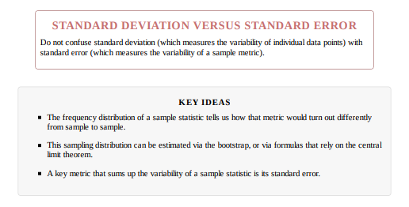
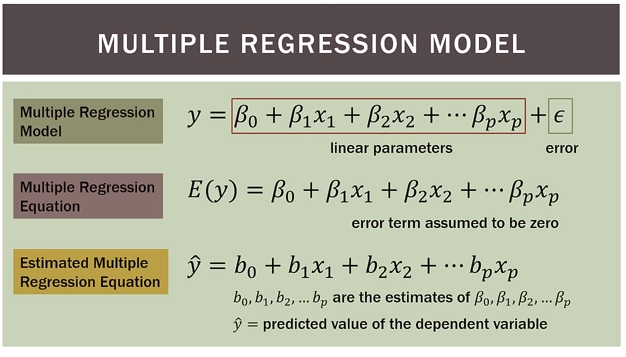

  * [Statistics books and sites](./statistics_books_and_sites.md)
  * [Notation for this course](./notation_for_this_course.md)

  * <a href="../img/practical_statistics_for_data_scientists.pdf">practical_statistics_for_data_scientists</a> This is the best summary book!!!!

# Key statistics terms for data types

  * Continuous: Data that can take on any value in an interval. Synonyms: interval, float, numeric
  * Discrete: Data that can take on only integer values, such as counts. Synonyms: integer, count
  * Categorical: Data that can take on only a specific set of values representing a set of possible categories. Synonyms: enums, enumerated, factors, nominal, polychotomous
  * Binary: A special case of categorical data with just two categories of values (0/1, true/false). Synonyms: dichotomous, logical, indicator, boolean
  * Ordinal: Categorical data that has an explicit ordering: Synonyms: ordered factor

# Definition

## Descriptive statistics

### Mean

Sample mean = $\overline{x} = \frac{\sum_{i=1}^n x_{i}}{n}$

### Median value

1. Order the numbers from smallest to largest.
2. If the data set contains an odd number of numbers, choose the one that is
exactly in the middle. You’ve found the median.
3. If the data set contains an even number of numbers, take the two
numbers that appear in the middle and average them to find the median

### Standard deviation

Standard deviation

It is often represented by:

  * ${\displaystyle \sigma}$ (for the whole population)
  * s (for a sample)
  * SD

**It is stated in the original units from which it is derived.**

SD is the average amount of variability in a set of values.

The standard deviation of a population is defined by the following formula:

${\displaystyle \sigma} = \sqrt{\frac{\sum_{i=1}^N (X_i - \overline{X})^2}{N}}$

The standard deviation of a sample is defined by a slightly different formula:

$s = \sqrt{\frac{\sum_{i=1}^n (x_i - \overline{x})^2}{n-1}}$

Why n-1, what's wrong with n?
By subtracting 1 from the denominator we artificially force the standard deviation to be larger than it would be otherwise. Good scientists are conservatives: If they have to err we will do so on the side of overestimating the standard deviation of the population.

**Example:**

Let's say that a production line of workers assembling circuit board produce:

  * 8.6 boards per hour.
  * the standard deviation SD is 1.59
  * **It means that the average number of boards assembled per hour is about 1.59 circuit boards from the mean.**

### Standar error of the mean

The standard error of the mean (SEM) can be expressed as:

$SE or SEM=\frac{SD}{\sqrt{n}}= \frac{\sigma}{\sqrt{n}}$

where:

$\sigma$ or SD is the standard deviation of the population.

n is the size (number of observations) of the sample.

### Variance

It is often represented by: 
  * ${\displaystyle \sigma ^{2}}$ (for the whole population)
  * ${\displaystyle s^{2}}$  (for a sample)
  * ${\displaystyle \operatorname {Var} (X)}$

**It is __NOT__ stated in the original units from which it is derived. But it is stated in units that are squared.**

The variance of a population is defined by the following formula:

${\sigma ^{2}} = \frac{\sum_{i=1}^N (X_i - \overline{X})^2}{N}$

The variance of a sample is defined by a slightly different formula:

$s^{2} = \frac{\sum_{i=1}^n (x_i - \overline{x})^2}{n-1}$

The variance is a numerical value used to indicate how widely individuals in a group vary. If individual observations vary greatly from the group mean, the variance is big; and vice versa.

In probability theory and statistics, variance is the expectation of the squared deviation of a random variable from its mean. Informally, it measures how far a set of (random) numbers are spread out from their average value. 

**Example:**
Let's say that a production line of workers assembling circuit board produce:

  * 8.6 boards per hour.
  * the standard deviation SD is 1.59 and the variance $SD^{2} = {\displaystyle \sigma ^{2}} = 1.59^{2} = 2.53$
  * **It means that the average difference between workers is about 2.53 circuit boards SQUARED from the mean.**

Example of samples from two populations with the same mean but different variances

  * The red population has mean 100 and variance 100 (SquaredStandardDeviation=10).
  * The blue population has mean 100 and variance 2500 (SquaredStandardDeviation=50).

## Correlations

With correlations we are interested in the relationship between variables.

How the value of one variable changes WHEN the value of another variable changes.

If X increases... does Y increases or decreases? Is is positive or negative? What is the range for Y?

$r_{XY}$ is the correlation between variable X and variable Y

Example: We can expect that an individual's height to be correlated with an individual weight.

# How do we estimate f?

n=30 points
Let $x_{ij}$ represent the value of the *j*th predictor or input where:

  * i = 1,2 ... n
  * j = 1,2 ... p

Correspondingly let $y_{i}$ represent the response variable for the *i*th observation.

Then our training data consist of: {($x_{1}$,$y_{1}$),($x_{2}$,$y_{2}$)...($x_{n}$,$y_{n}$)} 

where

$x_{i}=(x_{i1},x_{i2},\cdots,x_{ip})^T$

Our goal is to find a function $\hat{f}$ such that $Y\approx\hat{f}(x)$

## Parametric methods

  - We make an assumption about the function form or shape of f. For example we assume f is linear: 

$f(x)=\beta_{0}+\beta_{1}X_{1}+\cdots+\beta_{p}X_{p}$

  - After the model is selected, we need a procedure to train the model. In the case of linear we need to estimate the parameters β0, β1,...,βp.

## Non-Parametric methods

Non-parametric methods do not make explicit assumptions about the functional form of f. 

Instead they seek an estimate of f that gets as close to the
data points as possible without being too rough or wiggly.

By avoiding the assumption of a particular functional form for f, they have the potential to accurately fit a wider range of possible shapes for f.

But non-parametric approaches do suffer from a major disadvantage: since they do not reduce the problem of estimating f to a small number of parameters, **a very large number of observations (far more than is typically needed for a parametric approach) is required in order to obtain an accurate estimate for f**.

## Supervised Versus Unsupervised Learning

Most statistical learning problems fall into one of two categories: supervised or unsupervised.

## Tradeoff intepretability/flexibility

# Simple linear regression

Simple linear regression assumes that there is approximately a linear relationship between X and Y .
Mathematically, we can write this linear relationship as

$Y=\beta_{0}+\beta_{1}X$

With:
$\beta_{0}$: value of Y when X = 0. $\beta_{0}$ is called intercept.

$\beta_{1}$: slope.

For example: $sales\approx\beta_{0}+\beta_{1}\times TV$

$\approx$ must be read as “is approximately modeled as”

----

$\hat{y}=\hat{\beta_{0}}+\hat{\beta_{1}}x$

Where $\hat{y}$ indicates a prediction of Y on the basis of X = x.
Here we use a hat symbol, ˆ , to denote the estimated value for an unknown parameter or coefficient, or to denote the predicted value of the response.

## Estimating coefficients

### Residual sum of squares (RSS)

Residual sum of squares (RSS): This is the difference between the $i^{th}$ observed response value and the $i^{th}$ response value that is predicted by our linear model:

$RSS = e_{1}^{2}+e_{2}^{2}+\cdots+e_{n}^{2}$

$RSS = (y_{1}-\hat{\beta}_{0}-\hat{\beta}_{1}x_{1})^{2}+(y_{2}-\hat{\beta}_{0}-\hat{\beta}_{1}x_{2})^{2}+\cdots+(y_{n}-\hat{\beta}_{0}-\hat{\beta}_{1}x_{n})^{2}$

### Mean squared error

|                                                                            |
|----------------------------------------------------------------------------|
| The mean squared error is the average of the Residual sum of squares (RSS) |

$\hat{f}(x_{i})$ is the prediction that $\hat{f}$ gives for the $i^{th}$ observation

$MSE=\frac{1}{n}\sum_{i=1}^{n} (y_{i}-\hat{f}(x_{i}))^2$ 

OR 

$MSE = \frac{1}{n}\displaystyle\sum_{i=1}^{n} (y_{i}-\hat{y_i})^2$

  * The MSE will be small if the predicted responses are very close to the true responses,
  * And will be large if for some of the observations, the predicted and true responses differ substantially.

### Least squares on Simple linear regression

Simple Linear Regression. Simple linear regression predicts a quantitative response Y on the basis of a single predictor variable X. It assumes an approximately linear relationship between X and Y.

Least squares approach is to minimize the Residual sum of squares (RSS).

Using some calculus, one can show that the minimizers are:

$\hat{\beta}_{1}=\frac{\sum_{i=1}^n(x_{i}-\overline{x})(y_{i}-\overline{y})}{\sum_{i=1}^n(x_{i}-\overline{x})^{2}}$

$\hat{\beta}_{0}=\overline{y}-\hat{\beta}_{1}\overline{x}$

[code_minimizers](./code_minimizers.md)

[better code python minimizers](./better_code_python_minimizers.md)

## Measuring the quality of the estimated function

*  To evaluate the performance of a statistical learning method on a given data set (measure how well its predictions
actually match the observed data). (We need to quantify the extent to which the predicted response value for a given observation is close to the true response value for that observation.

The most commonly-used measure is **the mean squared error** (MSE).

# Multiple linear regression

## Be careful with adding variables

  * Adding more independent variables to a multiple regression procedures does not mean the regression bill be "better" or offer better predictions; in fact it can make things worse. This is called OVERFITTING.
  * The addition of more independent variables creates more relationship among them. So not only are the independent variables potentially related to the dependent variable, they are also potentially related to each other. When this happens, it is called MULTICOLLINERARITY.

----

The ideal is for all of the independent variables to be correlated with the dependent variable but NOT with each other. 

## Step 1 Check if your variables are correlated

https://www.youtube.com/watch?v=2I_AYIECCOQ
https://www.youtube.com/watch?v=wPJ1_Z8b0wk7
https://www.youtube.com/watch?v=px72eCYPuvc

You have to check your variables are correlated to avoid MULTIICOLLINEARITY:

### Pearson correlation coefficient

**IMPORTANT:** The Pearson correlation coefficient examines the relationship between two variables, **when both of those 
 variables are continuous** in nature.
In other words, they are variables that can assume any value along some underlying continuum, such as height, age, test score, or income. 

$\rho_{X,Y}=\frac{n\operatorname{E}XY-\operatorname{E}X\operatorname{E}Y}{\sqrt{[n\operatorname{E}X^2-(\operatorname{E}X)^2)][n\operatorname{E}Y^2-(\operatorname{E}Y)^2)]}}$

$\rho_{X,Y}$is the correlation coefficient between X and Y.

n is the size of the sample

X is the individual's score on the X variable

Y is the individual's score on the X variable

XY is the product of eache X score times its corresponding Y score

## Definition

<a href="../img/401-multreg.pdf">401-multreg.pdf</a>

In a simple linear regression model, a single response measurement Y is related to a single
predictor (covariate, regressor) X for each observation.

The critical assumption of the model
is that the conditional mean function is linear: $\sum{(Y|X)=\beta_{0}+\beta{1}X}$

In most problems, more than one predictor variable will be available. This leads to the
following “multiple regression” mean function:

| Formula                                | Definition      |
|----------------------------------------|-----------------|
| $y_{i}=\beta_{0}+\beta_{1}x_{i,1}+\beta_{2}x_{i,2}+\ldots+\beta_{p-1}x_{i,p-1}+\epsilon_{i}$               | More precise definition. $\beta_{0}$ is called the **intercept** and the $\beta_{j}$ is called **slopes** or **coefficients**.  |
| $\hat{Y}_{i}=\hat{\beta}_{0}+\hat{\beta}_{1}X_{1,i}+\hat{\beta}_{2}X_{2,i}+\ldots+\hat{\beta}_{p}X_{p,i}$  | More precise definition. $\beta_{0}$ is called the **intercept** and the $\beta_{j}$ is called **slopes** or **coefficients**.  |

---

Let's better use the matrix notation

$Y=X\beta+\epsilon$ where $X\beta$ is the matrix-vector product.

## Assessing the model

### Root mean squared error RMSE

The square root of the average squared error of the regression (this is the most widely used metric
to compare regression models).

$\hat{y}_{i}= \sqrt{\frac{\sum_{i=1}^{n}{(y_{i}-\hat{y}_{i})^2}}{n}}$

### Residual standard error RSE

The same as the root mean squared error, but adjusted for degrees of freedom.

$RSE = \sqrt{\frac{\sum_{i=1}^{n}{(y_{i}-\hat{y}_{i})^2}}{n-p-1}}$

The only difference is that the denominator is the degrees of freedom, as opposed to number of records (see “Degrees of Freedom”). In practice, for linear regression, the difference between RMSE and RSE is very small, particularly for big data applications.

## Normalization and standardization

### Normalize

**Normalization put all your data in a scale from 0 to 1.** This is usually called feature scaling.

You have a list of values. For each of the values you will apply the following formula

$x\_new = \frac{(x - Min)}{Max - Min}$

Imagine the following problem:

During the last 14 days you have data. You take 

normalized = (today's close - lowest value of the 14 days) / (Highest high of 14 days - Lowest low of the 14 days)

### Standardize

All data is express in standard deviation.

$Standardized\ value = \frac{(x - Average)}{Standard\ Deviation}$

## Kernel density estimation

Types of kernel:

