# Derivatives for logistic regression - step by step

Motivation

The training step in logistic regression involves updating the weights and the bias by a small amount. The amount that each weight and bias is updated by is proportional to the gradients, which are calculated as the partial derivative of the loss function, with respect to the weight (or bias) we are updating.

This blog post will cover how to calculate the partial derivatives of the weights and the bias, step by step. I would recommend reading my previous two blog posts which cover how to perform derivatives along a computational graph ([Simple tutorial about derivatives along a computational graph](./simple_tutorial_about_derivatives_along_a_computational_graph.md)) and the derivative of the sigmoid function ([Simple tutorial about how to calculate derivatives of Sigmoid](./simple_tutorial_about_how_to_calculate_derivatives_of_sigmoid.md)).

## Logistic Regression computational graph

The computational graph of logistic regression can be visualised as follows:

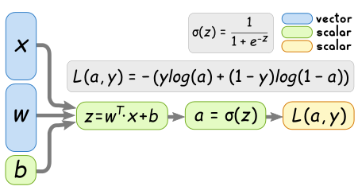

w and x are vectors, whose size depend on the number of input features. In order to keep things simple, we will consider the case where we only have two input features. We can therefore represent the computational graph more clearly as follows:

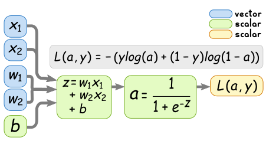
## Desired partial derivatives

The partial derivatives we are particularly interested are the following two:

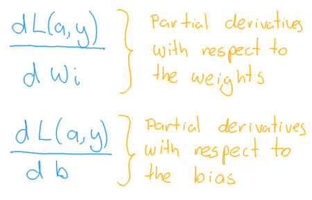

## Strategy for solving partial derivatives

In order to solve the partial derivatives, we can make use of the chain rule, which allows us to simplify the process by considering small components at a time.

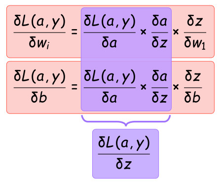

Which can be visualized on the computational graph as follows:

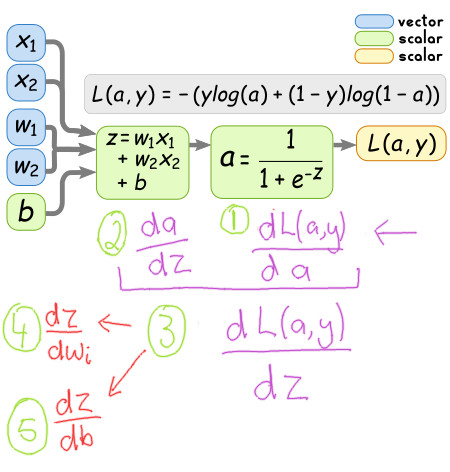

Once we calculate those five smaller components, we can solve the partial derivatives we want more easily. So lets start solving each compoment.

## Component 1

Be aware that the logs used in the loss function are natural logs, and not base 10 logs.

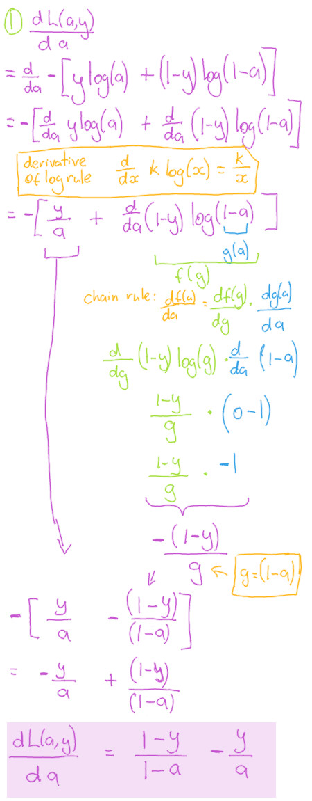

## Component 2

The full calculation of this component was explained in my previous blog post for calculating the derivative of the sigmoid function. Be sure to check out that post if you want to know how it was calculated.

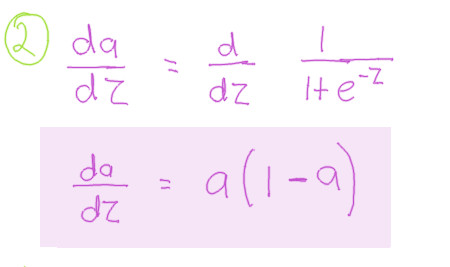

## Component 3

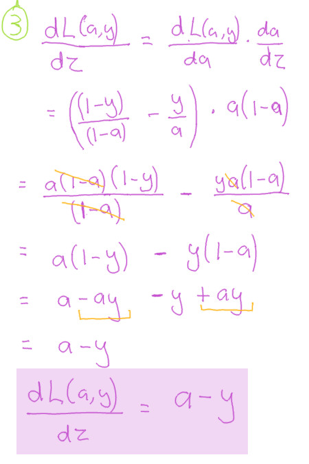

## Component 4

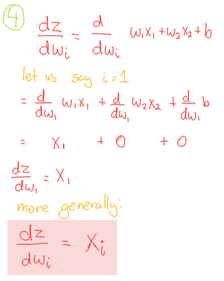

## Component 5

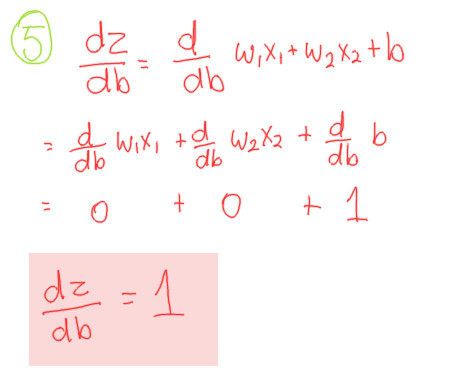

## Putting the components together

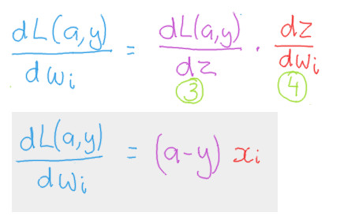

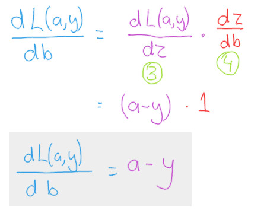

## The final product

To summarize, the derivatives we are interested have been summarized in the following two formulas.

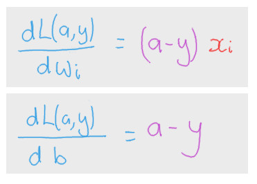