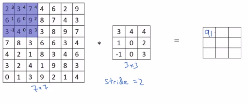
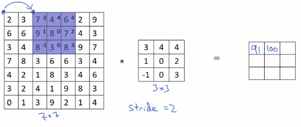
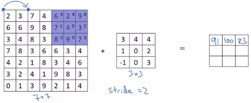
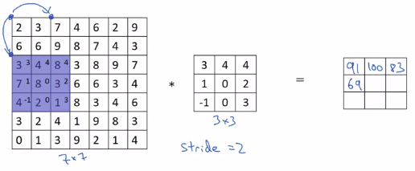
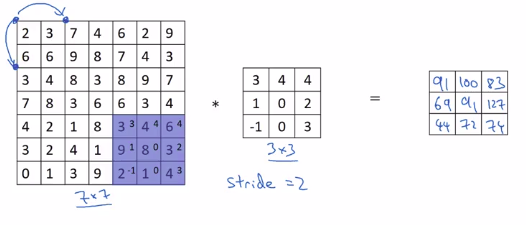
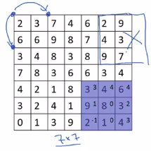
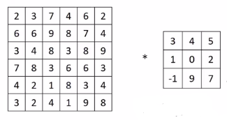
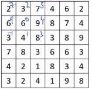

# Strided convolution

## Definition

Stride: enjambée/foulée en Français

Stride: The stride defines the step size of the filter (kernel) when traversing the image. While its default is usually 1, we can use a stride of 2 for downsampling an image similar to MaxPooling.
## Stride = 2 example

$2*3+6*1+3*-1+3*4+6*0+4*0+7*4+9*2+8*3=91$

$7*3+9*1+8*-1+4*4+8*0+3*0+6*4+7*2+8*3=100$

$\vdots$

$3*3+7*1+4*-1+4*4+8*0+2*0+8*4+3*2+1*3=69$

$\vdots$

----

- padding: p
- stride: s
- inputMatrix: (n,n)
- filter: (f,f)

Then:

$(n,n) * (f,f) = (\lfloor \frac{n+2p-f}{s}+1 \rfloor,\lfloor \frac{n+2p-f}{s}+1 \rfloor)$

$\lfloor \rfloor$ is the floor function. See explanation below.

$(n,n) * (f,f) = (\frac{7+2*0-3}{2}+1,\frac{7+2*0-3}{2}+1)=(3,3)$

----

|                                                                                           |
|-------------------------------------------------------------------------------------------|
| $(n,n) * (f,f) = (\lfloor \frac{n+2p-f}{s}+1 \rfloor,\lfloor \frac{n+2p-f}{s}+1 \rfloor)$ |

|                                                                                                        |
|--------------------------------------------------------------------------------------------------------|
| $\lfloor \space \rfloor$ is the floor function. The floor function rounds down to the nearest integer. |
| $\lfloor z \rfloor = floor(z)$ |
| $floor(3.8)=floor(3.2)=3$ |

floor is used to avoid the computation of outside part of the blue box when the size is not correct. See blue box below. 

## Technical note on cross-correlation vs convolution

### Convolution in math textbook

If you look at the typical math textbook, the way that the convolution is defined before doing the element Y's product and summing, there's actually one other step that you'll first take which is to convolve this six by six matrix with this three by three filter. 

You first take the three by three filter and slip it on the horizontal as well as the vertical axis:

So:

__Step 1__: Create the flipped matrix:

__Step 2__: Then you begin the calculus:

This is the real convolution in maths.

If you don't do **step 1** (you don't flip the matrix) but use directly the original matrix, this is called **cross-correlation** in math.

|                 |   |                                                                                                                                                        |
|-----------------|---|--------------------------------------------------------------------------------------------------------------------------------------------------------|
|  | **Deep learning** literature, by convention, use the term **convolutional operation** but what they are doing is called **cross-correlation in math.** |

It turns out that in signal processing or in certain branches of mathematics, doing the flipping in the definition of convolution causes convolution operator to enjoy this property that:

|                            |                                              |
|----------------------------|----------------------------------------------|
| (A * B) * C =  A * (B * C) | This is called associativity in mathematics. |

And by convention, most of Deep Learning workers just call this convolution or even though the mathematicians prefer to call this cross-correlation sometimes.