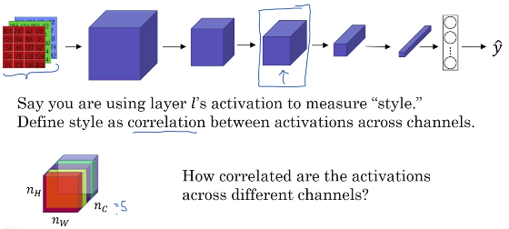
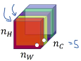
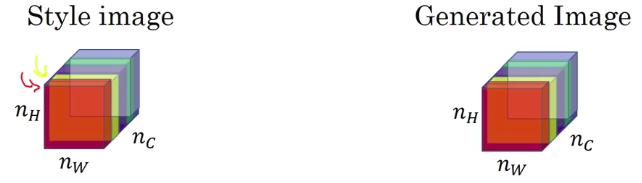
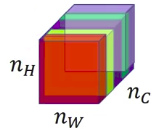
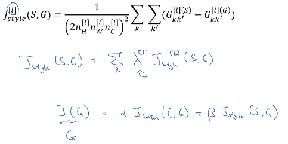

# Style Cost Function

## Meaning of the "style" of an image

Let's look at the first two channels (red channel and the yellow channel)... how correlated are activations in these first two channels?

Just look at those two pairs of numbers:

- One in the first channel (red channel)
- One in the second channel (yellow channel)
And see how correlated are these two numbers.

To see the whole correlation do that for all of these $n_H$ by $n_W$ positions,

## Intuition about style of an image

The red channel corresponds to the neuron: red square in the image.

|                                                |   |                                                                                                                     |
|------------------------------------------------|---|---------------------------------------------------------------------------------------------------------------------|
|  | This neuron is  trying to figure out if there's this little vertical texture in a particular position of the image. |
|  | This neuron is vaguely looking for orange colored patches. |

What does it mean for these two channels to be highly correlated or uncorrelated?

|            |                                                                                                          |
|------------|----------------------------------------------------------------------------------------------------------|
| Correlated | Whatever part of the image has this type of subtle vertical texture AND also have these orange-ish tint. |
| Uncorrelated | Whatever part of the image has this type of subtle vertical texture WILL NOT have these orange-ish tint. |

And so the correlation tells you which of these high level texture components tend to occur or not occur together in part of an image.

The degree of correlation gives you one way of measuring:

- How often these different high level features occur.
- And how often they occur together and don't occur together in different parts of an image.

## Style matrix

Let's say:

|                                                    |
|----------------------------------------------------|
| $a^{[l]}_{i,j,k}$ = activation at position (i,j,k) |

|     |            |                 |
|-----|------------|-----------------|
| $i$ | H position | Height position |
| $j$ | W position | Width position |
| $k$ | C position 1 | Channel position 1 (In previous example we had 5 channels) |
| $k'$ | C position 2 | Channel position 2 (In previous example we had 5 channels) |

----

You're going to compute a matrix:

| Matrix | Dimension | Linear algebra name |
|--------|-----------|---------------------|
| $G^{[l]}$ | $n_{c}\times{n_{c}}$ dimensional matrix | In linear algebra G is called **"Gran matrix"** |

We want to compare the activations between $k$ and $k'$, let's define it as: $G^{[l]}_{kk'}$
 
|                 |                                             |
|-----------------|---------------------------------------------|
| $G^{[l]}_{kk'}$ | With $k$ and $k'$ is from 1...$n^{[l]}_{c}$ |

Now let's use:

- $(S)$ to define that we are talking about the style image.
- $(G)$ to define that we are talking about the generated image.

| Compare the activations between $k$ and $k'$ for the style image (S) |
|----------------------------------------------------------------------|
| $G^{[l](S)}_{kk'}=\sum_{i=1}^{n_H^{[l](S)}} \sum_{j=1}^{n_W^{[l](S)}} a^{[l](S)}_{i,j,k} a^{[l](S)}_{i,j,k'}$ |

| Compare the activations between $k$ and $k'$ for the generated image (G) |
|--------------------------------------------------------------------------|
| $G^{[l](G)}_{kk'}=\sum_{i=1}^{n_H^{[l](G)}} \sum_{j=1}^{n_W^{[l](G)}} a^{[l](G)}_{i,j,k} a^{[l](G)}_{i,j,k'}$ |

## Cost function

- $(S)$: style image.
- $(G)$: generated image.

|                                                                            |
|----------------------------------------------------------------------------|
| $J_{Style}^{[l]}(S,G)=\left\lVert G^{[l](S)}-G^{[l](G)}  \right\rVert^2_F$ |

In the paper:

|                                                                                                                         |
|-------------------------------------------------------------------------------------------------------------------------|
| $J_{style}^{[l]}(S,G)=\frac{1}{(2n_H^{[l]}n_W^{[l]}n_C^{[l]} )^2}\sum_{k}\sum_{k'} (G_{kk'}^{[l](S)}-G_{kk'}^{[l](G)})$ |

So the overall style cost function, you can define it:

- As sum over all the different layers of the style cost function for that layer. 
- Weighted by some set of parameters, by some set of additional hyperparameters, which we'll denote as $\lambda^{[l]}$.

| Overall STYLE cost function |
|-----------------------------|
| $J_{style}^{[l]}(S,G)=\sum_l \lambda^{[l]} J_{style}^{[l]}(S,G)$ |

----

Same thing with image of the course (Just look above for better written stuff):

