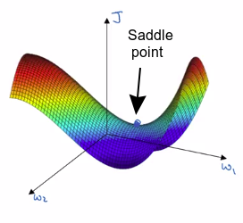

# The problem of local optima

In the early days of deep learning, people used to worry a lot about the optimization algorithm getting stuck in bad local optima.

Imagine you are trying to optimize some set of parameters, we call them W1 and W2, and the height in the surface is the cost function.

It'd be easy for grading the sense, or one of the other algorithms to get stuck in a local optimum (blue dots) rather than find its way to a global optimum (green dot).

 This is what we thought but this is incorrect!

----

Most points of zero gradients are not local optima like points like this. Instead most points of zero gradient in a cost function are saddle points. 

In a function of very high dimensional space, if the gradient is zero, then in each direction it can either be a convex light function or a concave light function. 
 

And if you are in, say, a 20,000 dimensional space, then for it to be a local optima, all 20,000 directions need to look like this. And so the chance of that happening is maybe very small, maybe $2^{-20 000}$.

Instead you're much more likely to get some directions where the curve bends up like this:

saddle = selle (pour les chevaux)

**If local optima is not a problem so what is the problem?**

The problem are plateaus.

## The problem of plateaus

Plateaus can really slow down learning and a plateau is a region where the derivative is close to zero for a long time. 

So if you're here, then gradient descents will move down the surface, and because the gradient is zero or near zero, the surface is quite flat. 

You can actually take a very long time to slowly find your way to maybe this point on the plateau (red point). And then because of a random perturbation of left or right, maybe then finally  your algorithm can then find its way off the plateau (red arrows steps). 

## Takeaways

So the takeaways are: 
  - First, you're actually **pretty unlikely to get stuck in bad local optima** so long as you're training a reasonably large neural network, save a lot of parameters, and the cost function J is defined over a relatively high dimensional space. 
  - Second, that plateaus are a problem and you can actually make learning pretty slow. **And this is where algorithms like momentum or RmsProp or Adam can really help your learning algorithm as well.** And these are scenarios where **more sophisticated observation algorithms, such as Adam, can actually speed up the rate at which you could move down the plateau and then get off the plateau.**

So because your network is solving optimizations problems over such high dimensional spaces, to be honest, I don't think anyone has great intuitions about what these spaces really look like, and our understanding of them is still evolving. 