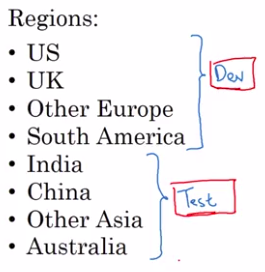

# Train/dev/test distributions

## Distribution problem example

Reminder of what are [Train/dev/test sets](./setting_up_your_machine_learning_application.md)

Cat app exemple:

|                             |                                               |
|-----------------------------|-----------------------------------------------|
| Example of bad defined sets |  |

|                                                               |                                  |
|---------------------------------------------------------------|----------------------------------|
| **Dev and test sets must come from the same distribution!!!** | **This is not the case here!!!** |

Maybe images are defined differently between regions, they take the pictures differently, cats are different etc.

Your team might spend months innovating to do well on the dev set only to realize that, when you finally go to test them on the test set, that data from these four countries or these four regions at the bottom, might be very different than the regions in your dev set. 

So, __you might have a nasty surprise and realize that, all the months of work you spent optimizing to the dev set, is not giving you good performance on the test set__.

## Solution: Shuffle the data

You randomly shuffled the data into the dev and test set. 

So that, both the **dev and test sets have data from all eight regions** and that the **dev and test sets really come from the same distribution**, which is the **distribution of all of your data mixed together**.

## Another example (real story)

"Given an input X about a loan application, can you predict why and which is, whether or not, they'll repay the loan?"

|                                     |                                             |
|-------------------------------------|---------------------------------------------|
| Dev set came from loan applications | **the set came from medium income zip codes |

But, after working on this for a few months, the team then, suddenly decided to test this on data from low income zip codes or low income postal codes.

|          |                                                     |
|----------|-----------------------------------------------------|
| Test set | **the application is tested on low income zip codes |

Because the distributional data is badly done: medium income $\neq$ low income it didn't perform well with the test set.

**The team spent time 3 months optimizing in the former case to realize it just didn't work well at all on the latter case.** 

## Recomandations

|                             |
|-----------------------------|
| Shuffle the data if needed. |
| Choose a dev set and test set to reflect data you expect to get in the future and consider important to do well on. |
| Dev set and test set must come from the same distribution |

