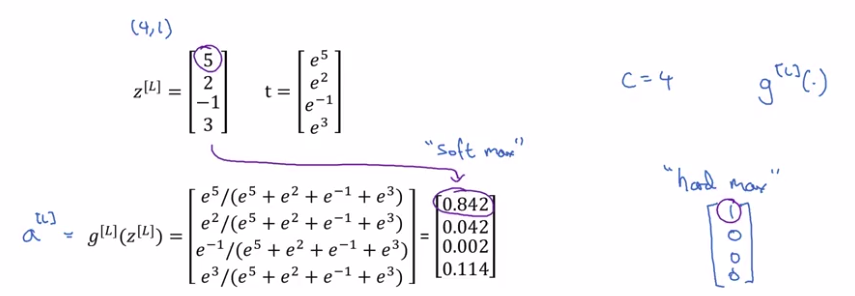

# Training a softmax classifier

There's an activation which is called hard max, which gets 1 for the maximum value and zeros for the others.

- If you are using NumPy, its `np.max` over the vertical axis.

- Softmax is a more gentle mapping from Z to some probabilities.
- The Softmax name came from softening the values and not harding them like hard max.

| Softmax definition |
|--------------------|
| Softmax is a generalization of logistic activation function to `C` classes. |
| If `C = 2` softmax reduces to logistic regression. |

## Loss function

| The loss function used with softmax |
|--------------------|
| $\mathcal{L}(\hat{y},y)= - \sum_{j=1}^{4} y_{j} \log{\hat{y}_j}$ |

| The cost function used with softmax |
|--------------------|
| $J(\hat{y},y)= \frac{1}{m} \sum_{i=1}^{m} \mathcal{L}(\hat{y},y)$ |

## Gradient descent with softmax

| Back propagation with softmax |
|--------------------|
| $dZ^{[L]} = \hat{y} - y$ |

| The derivative of softmax is |
|--------------------|
| $\hat{y} * (1-\hat{y})$ |

Example:

