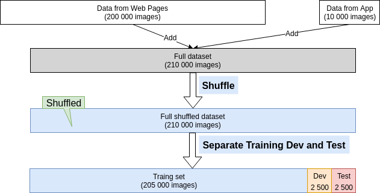
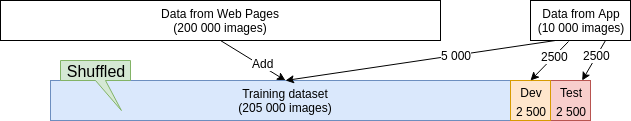

# Training and testing on different distributions

## Example 1
In the deep learning era, more and more teams are now training on data that comes from a different distribution than your dev and test sets.

- You have 200 000 images coming from Web Pages (you can crawl the web and just download a lot of, for the sake of this example, let's say you can download a lot of very professionally framed, high resolution, professionally taken images of cats.).
- You have 10 000 images coming from mobile app (ends to be less professionally shot, less well framed, maybe even blurrier because it's shot by amateur users).

## What can you do?

### Option 1 (not very good)

You add the 2 datasets and shuffle it to create a final dataset. You then divide the finale shuffled dataset into training, dev and test dataset.

Your dev set has: 2381 images coming from webpages and only 119 coming from mobile.

### Option 2 (Better)

Your dev and test set are made of images from the mobile app.

__Advantage:__

The advantage of this way is that you're now aiming the target where you want it to be. 

The dev set has data uploaded from the mobile app and **that's the distribution of images you really care about**, so let's try to build a machine learning **system that does really well on the mobile app** distribution of images.

__Disadvantage:__

Now your training distribution is different from your dev and test set distributions.

But it turns out that this split of your data into train, dev and test will get you better performance over the long term.

## Just another example

In a car, your can speak to your rear view mirror. (This is a new product in China).

