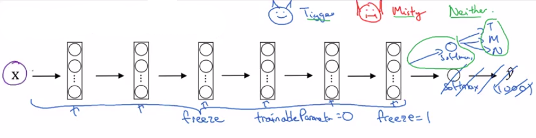

# Transfer learning

If you're building a computer vision application rather than training the ways from scratch (from random initialization), you often make much faster progress if you download weights  that someone else has already trained on the network architecture and use that as pre-training and transfer that to a new task that you might be interested in.

The computer vision research community has been pretty good at posting lots of data sets on the Internet so if you hear of things like:

- Image Net
- MS COCO
- Pascal types of data sets, 

these are the names of different data sets that people have post online and a lot of computer researchers have trained their algorithms on. 

Sometimes these training takes several weeks and might take many GP use and the fact that someone else has done this and gone through the painful high-performance search process, means that you can often download open source ways that took someone else many weeks or months to figure out and use that as a very good initialization for your own neural network.

**And use transfer learning to sort of transfer knowledge from some of these very large public data sets to your own problem.**

## You have a small training set example

According to the internet, Tigger is a common cat name and Misty is another common cat name.

Let's say your cats are called:

- Tiger
- Misty 
- neither 

You **probably don't have a lot of pictures of Tigger or Misty** so your **training set will be small**.

What can you do? I recommend:

- you go online and download some open source implementation of a neural network and **download not just the code but also the weights**.

There are a lot of networks you can download that have been trained on for example:

- the **ImageNet data sets** which has a thousand different clauses so the network might have a softmax unit that outputs one of a thousand possible clauses.

**What you can do is then:**

### Step 1: Recreate a softmax

- **Get rid of the softmax layer**
- **Create your own softmax unit** that outputs:
  - Tigger
  - Misty
  - Neither

### Step 2: Freeze all layers

**In terms of the network, I'd encourage you to think of all the layers (green) as frozen.**

**Depending on the framework** it might have things like:

- **trainableParameter = 0**.
- **freeze=1**.
- any parameter that says **don't train those weigths**.

On exception though, last layer will not be frozen (see below).

### Step 3: Retrain the last layer

**Last layer (violet) will not be frozen.**

**Train again the last layer (violet) with your training set and your new softmax.**

training=newLastLayer+newSoftmax

One step could help as you just pre-compute the last layers activation (violet) with all the examples in the training set is to save them to disk.

The advantage of the safety disk or the pre-compute method or the safety disk is that you don't need to recompute those activations everytime you take a epoch or take a pass through a training set. 

## You have a larger training set example

Whether you have a larger training set. One rule of thumb is if you have a larger label data set so maybe you just have a ton of pictures of:

- Tigger
- Misty 
- as well as pictures of neither of them

What you could do is then:

- freeze fewer layers.
- train more end layers.

Although if the output layer has different clauses then you need to have your own output unit (softmax Tigger, Misty or neither).

There are a couple of ways to do this.

__Solution 1:__

You retrain with gradient descent your: last layers + new softmax. 

__Solution 2:__

What you can also do is:

- You can also delete the last few layers
- Add your own new hidden units
- To put in your own final softmax outputs

### To summarize

But maybe one pattern is if you have more data

- the number of layers you've freeze could be smaller
- the number of layers you train on top could be greater.

Finally, if you have a lot of data, one thing you might do is:
- take open source network and weigths
- use the whole thing just as initialization and train the whole network.

That's transfer learning for the training of ConvNets. In practice, because the open data sets on the internet are so big and the weigths you can download that someone else has spent weeks training has learned from so much data, you find that for a lot of computer vision applications, you just do much better if you download someone else's open source weigths and use that as initialization for your problem. 

**In all the different disciplines, in all the different applications of deep learning, I think that computer vision is one where transfer learning is something that you should almost always do unless, you have an exceptionally large data set to train everything else from scratch yourself.**

**But transfer learning is just very worth seriously considering unless you have an exceptionally large data set and a very large computation budget to train everything from scratch by yourself.**
