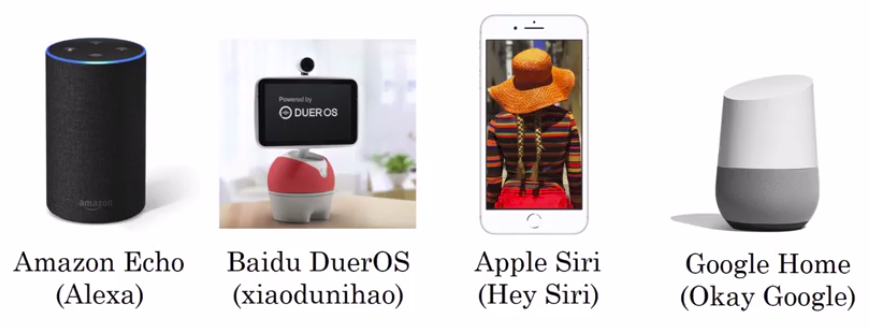
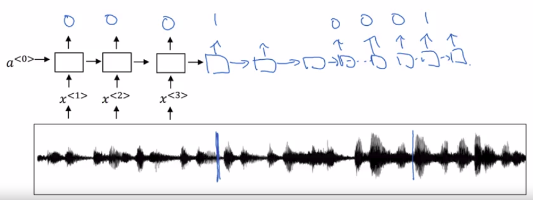

# Trigger word detection

Examples of trigger word systems:

We can actually describe a trigger word system quite simply.

With the rise of speech recognition, there have been more and more devices you can wake up with your voice, and those are sometimes called trigger word detection systems.

So trigger word detection, that if you have say an Amazon echo and just say, "Alexa, what time is it".

So, if you can build a trigger word detection system; maybe you can make your computer do something by telling your computer, "activate."

The literature on triggered detection algorithm is still evolving:

- there isn't wide consensus yet, on what's the best algorithm for trigger word detection.

But let's see one example of an algorithm you can use.

Now, you've seen RNNs like this, and what we really do, is to take an audio clip, maybe compute spectrogram features, and that generates audio features $x^{<1>},x^{<2>},x^{<3>}$, that you pass through an RNN.

So, all that remains to be done, is to define the target labels y.

So, this point in the audio clip, is when someone just finished saying the trigger word. Then, in the training set, you can set the target labels:

- to be zero for everything before that point
- and right after that, to set the target label of one.

Then, if a little bit later on, the trigger word was said again at this point, then you can again set the target label to be one, right after that.

Now, this type of labeling scheme for an RNN could work. Actually it just won't actually work reasonably well.

One slight disadvantage of this is, it creates a very imbalanced training set, so **we have a lot more zeros than we want.**

So, one other thing you could do (it's little bit of a hack) is to make the model a little bit easier to train:

- Instead of setting only a single time step to operate one, you could actually make it to operate a few ones for several times (for a fixed period of time), before reverting back to zero.

**So that slightly evens out the ratio of one's to zero's.**

But, if this is when in the audio clip, the trigger word was said, then right after that, you can set the target label to one, and if this is the trigger word said again, then right after that, is when you want the RNN to output one.
