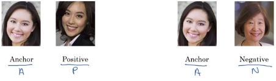
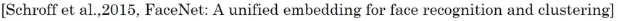

# Triplet loss

## Learning objective

You want:

|                                                                                  |
|----------------------------------------------------------------------------------|
| $\left\lVert f(A)-f(P) \right\rVert^2 \leq \left\lVert f(A)-f(N) \right\rVert^2$ |

So you want:

$d(A,P)=\left\lVert f(A)-f(P) \right\rVert^2$ to be small

$d(A,N)=\left\lVert f(A)-f(N) \right\rVert^2$ to be high

And you can think of d as a distance function, which is why we named it with the alphabet d.

|                                                                                      |
|--------------------------------------------------------------------------------------|
| $\left\lVert f(A)-f(P) \right\rVert^2 - \left\lVert f(A)-f(N) \right\rVert^2 \leq 0$ |

### Margin parameter

And by convention, usually, we add $+\alpha$ to the previous equation. 

|                                                                                               |
|-----------------------------------------------------------------------------------------------|
| $\left\lVert f(A)-f(P) \right\rVert^2 - \left\lVert f(A)-f(N) \right\rVert^2 + \alpha \leq 0$ |

$\alpha$ **is also called a margin**, which is terminology that you'd be familiar with if you've also seen the literature on support vector machines.

$\alpha$ is used to avoid the trivial solutions. Indeed **$\alpha$ is used:**

- **to make sure that the neural network doesn't just output zero for all the encoding.**
- **to make sure that it doesn't set all the encodings equal to each other. We don't want d(A,P) and d(A,N) to be too similar results.**

Now the equation doesn't need to be just less than or equal to zero but it needs to be quite a bit smaller than zero.

### Example with margin=0.2

So $\alpha=0.2$

$d(A,P)=\left\lVert f(A)-f(P) \right\rVert^2 = 0.5$

You won't be satisfied if $d(A,N)$ was a bit bigger, say 0.51.

Indeed:

|                                                                                               |
|-----------------------------------------------------------------------------------------------|
| $\left\lVert f(A)-f(P) \right\rVert^2 - \left\lVert f(A)-f(N) \right\rVert^2 + \alpha \leq 0$ |
| $0.5 - 0.51 + 0.2$ will be superior to 0 |

**You're saying, that's not good enough, we want a $d(A,N)$ to be much bigger than $d(A,P)$.**

**You want it to be 0.7 or higher to achieve this margin or this gap of at least 0.2 ($\alpha$).**

Indeed:

|                                                                                               |
|-----------------------------------------------------------------------------------------------|
| $\left\lVert f(A)-f(P) \right\rVert^2 - \left\lVert f(A)-f(N) \right\rVert^2 + \alpha \leq 0$ |
| $0.5 - 0.7 + 0.2 \leq 0$ |

## Loss function

Given three image: A,P,N

$\mathscr{L}(A,P,N)=max(\left\lVert f(A)-f(P) \right\rVert^2 - \left\lVert f(A)-f(N) \right\rVert^2 + \alpha, 0)$

So long as $\left\lVert f(A)-f(P) \right\rVert^2 - \left\lVert f(A)-f(N) \right\rVert^2 + \alpha < 0$ then the loss is 0.
Indeed max(negative, zero) is zero.

If $\left\lVert f(A)-f(P) \right\rVert^2 - \left\lVert f(A)-f(N) \right\rVert^2 + \alpha > 0$ then the loss is the result of:
$\left\lVert f(A)-f(P) \right\rVert^2 - \left\lVert f(A)-f(N) \right\rVert^2 + \alpha$

----

So trying to minimalize $\mathscr{L}(A,P,N)$ is equivalent to making:

|                                                                                                     |
|-----------------------------------------------------------------------------------------------------|
| $(\left\lVert f(A)-f(P) \right\rVert^2 - \left\lVert f(A)-f(N) \right\rVert^2 + \alpha)$ to be zero |

## Cost function

Training set m:

$J= \sum_{i=0}^m \mathscr{L}(A^{(i)},P^{(i)},N^{(i)})$

## Training set

Training set could be:

- 10k pictures
- of 1k persons

What you'd have to do is take your 10k pictures and use it to generate triplets: (A,P,N).

Then you can train your learning algorithm using gradient descent on the previous cost function.

|                 |                                                                                                                        |
|-----------------|------------------------------------------------------------------------------------------------------------------------|
|  | In order to define this dataset of triplets, you do need some pairs of A and P (Pairs of pictures of the same person). |

**You do need a dataset where you have multiple pictures of the same person.**

**So maybe having 10 pictures on average of each of your 1k persons to make up your entire dataset.**

That's why in this example, I said if you have 10k pictures of 1k different persons, so maybe have 10 pictures on average of each of your 1k persons to make up your entire dataset.

|                 |                                                                                        |
|-----------------|----------------------------------------------------------------------------------------|
|  | If you had just one picture of each person, then you can't actually train this system. |

**But of course __after having trained the system__, you can then apply it to your one shot learning problem where for your face recognition system, maybe you have only a single picture of someone you might be trying to recognize.**

## Choosing the triplets A,P,N

During training, if A,P,N are chosen randomly then you have a lot of chance to find two persons that are very different so:

$d(A,P)+\alpha \leq d(A,N)$ is easily satisfied.

__In this case the neural network won't learn much from it.__

**If you choose your triplets randomly, then too many triplets would be really easy, and so, gradient descent won't do anything because your neural network will just get them right, pretty much all the time.** 

### Choose P and N that are "hard" to train on

You should example that are difficult to train on.

If two persons are different but not that much it is very interesting.

|          |                             |
|----------|-----------------------------|
| Remember | $d(A,P)+\alpha \leq d(A,N)$ |
| The previous equation is "hard to train on" when | $d(A,P) \approx d(A,N)$ |

So in that case, the learning algorithm has to try extra hard:

- to take d(A,N) and try to push it up 
- or take d(A,P) and try to push it down

  so that there is at least a margin of $\alpha$ between  d(A,P) and d(A,N).
  
And the effect of choosing these triplets is that it increases the computational efficiency of your learning algorithm. 

And it's only by using hard triplets that the gradient descent procedure has to do some work.

If you're interested, the details are presented in this paper by Florian Schroff, Dmitry Kalinichenko, and James Philbin, where they have a system called FaceNet.

If you want to learn some of these other details for speeding up your algorithm by choosing the most useful triplets to train on, it is a nice paper.

## To summarize

what you do having defined this training sets of anchor positive and negative triples is use gradient descent to try to minimize the cost function J we defined and that will have the effect of that propagating to all of the parameters of the neural network in order to learn an encoding so that d of two images will be small when these two images are of the same person, and they'll be large when these are two images of different persons. 

Now, it turns out that commercial face recognition systems are trained on fairly large datasets at this point:

- Often, north of the million images
- Sometimes north of 10 million images.
- And there are some commercial companies talking about using over 100 million images.

So these are very large datasets even by modern standards.

Fortunately, some of these companies have trained these large networks and posted parameters online.

So, rather than trying to train one of these networks from scratch, this is one domain where because of the share data volume sizes, often it might be useful for you to download someone else's pre-train model, rather than do everything from scratch yourself.
