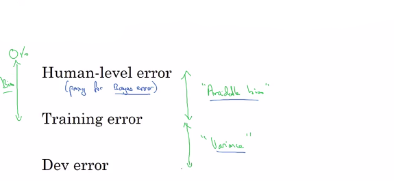

# Understanding human-level performance

## Defining the bayes error

|                         |                                                      |
|-------------------------|------------------------------------------------------|
| Bayes error $\leq$ 0.5% | We know the optimal error cannot be higher than 0.5% |

Use 0.5% as your Bayes error.

## It depends of your objective

So maybe the takeaway from this is to be clear about what your purpose is in defining the term human-level error.

And if it is to show that **you can surpass the performance of a typical doctor** and therefore argue for deploying your system in some context then **Bayes Error would be 1%**.

But if your goal is the proxy for Bayes error then Bayes Error = 0.5%

## Summary of bias/variance with human level performance

When your Avoidable bias is going near 0, it becomes very hard to perform better.

So to recap, having an estimate of human-level performance gives you an estimate of Bayes error.

And this allows you to more quickly make decisions as to whether you should focus on trying to reduce a bias or trying to reduce the variance of your algorithm.

These techniques will tend to work well until you surpass human-level performance, whereupon you might no longer have a good estimate of Bayes error that still helps you make this decision really clearly.
