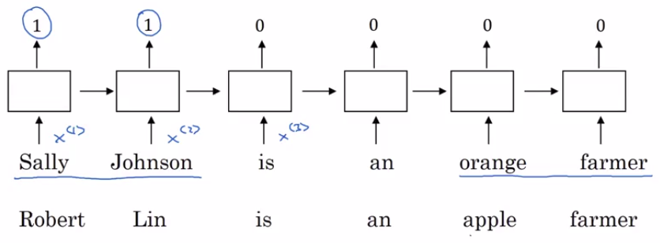
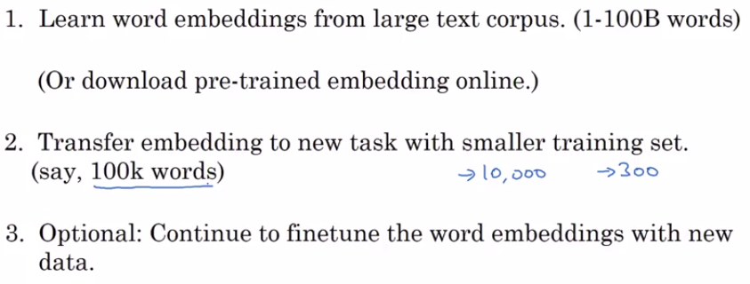
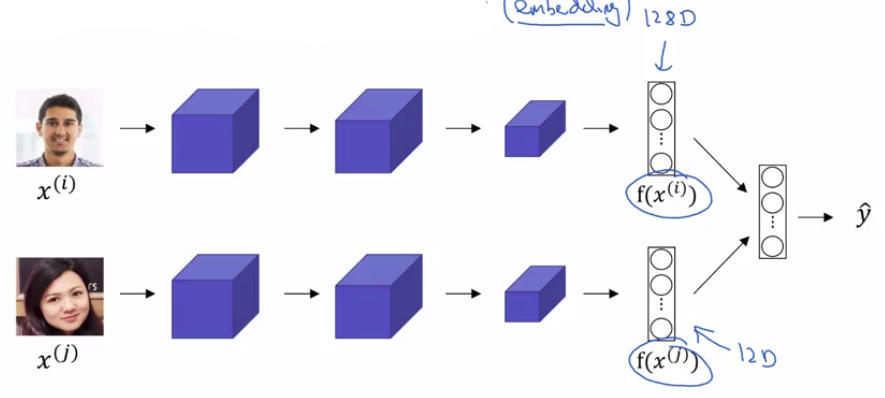

# Using word embeddings

Let's start with an example:

Continuing with the named entity recognition example, if you're trying to detect people's names.

Uou'll figure out that Sally Johnson is a person's name, hence, the output is 1.

And one way to be sure that Sally Johnson has to be a person, rather than say the name of the corporation is that you know:

- Orange farmer is for a person.

Then after having trained a model that uses word embeddings as the inputs:

- If you now see a new input, "Robert Lin is an apple farmer".
  - Knowing that orange and apple are very similar will make it easier for your learning algorithm to generalize
    - And to figure out that Robert Lin is also a person's name.

Another case with less common words:

"Robert Lin is a **durian cultivator**."

A durian is a rare type of fruit, popular in Singapore.

## Large data sets

If you had a small label training set:

- You might not even have seen the word durian or seen the word cultivator in your training set.
  - But if you have learned a word embedding that tells you that durian is a fruit, so it's like an orange, and a cultivator, someone that cultivates is like a farmer, then you might still be generalize from having seen an orange farmer in your training set to knowing that a durian cultivator is also probably a person Name.

So one of the reasons that word embeddings will be able to do this is the **algorithms to learning word embeddings can examine very large text corpuses**.

So you can examine very large data sets:

- maybe a billion words
- maybe even up to 100 billion words would be quite reasonable.

And by examining tons of unlabeled text, which you can download more or less for free, you can figure out that:

- orange and durian are similar.
- farmer and cultivator are similar.

And therefore, learn embeddings, that groups them together.

## Apply to your name entity recognition task with transfer learning

**Now having discovered that orange and durian are both fruits by reading massive amounts of Internet text, what you can do is then:**

- **take this word embedding and apply it to your name entity recognition task**
  - for which you might have a much smaller training set:
    - maybe just 100,000 words in your training set, or even much smaller.

And so this allows you to carry out transfer learning:

1. You take information you've learned from huge amounts of unlabeled text:
   - That you can suck down essentially for free off the Internet to figure out that orange, apple, and durian are fruits.
2. Transfer that knowledge to a task, such as named entity recognition:
   - for which you may have a relatively small labeled training set.

| Warning | Bidirectional RNN |
|---------|----------|
|  | Of course, for simplicity, l drew this for it only as a unidirectional RNN. |
|  | If you actually want to carry out the **named entity recognition task, you should, of course, use a bidirectional RNN** rather than a simpler one I've drawn here. |

To summarize, this is how you can carry out transfer learning using word embeddings.

Step2: You can then take these word embeddings and transfer the embedding to new task, where you have a much smaller labeled training sets. And use this, let's say, 300 dimensional embedding, to represent your words.

One nice thing also about this is you can now use relatively lower dimensional feature vectors.

So rather than using a 10,000 dimensional one-hot vector, you can now instead use maybe a 300 dimensional dense vector.

Although the one-hot vector is fast and the 300 dimensional vector that you might learn for your embedding will be a dense vector.

Step 3: And then, finally, as you train your model on your new task, on your named entity recognition task with a smaller label data set, one thing you can optionally do is to continue to fine tune, continue to adjust the word embeddings with the new data. 

| Warning | Step 2 |
|---------|-------------------|
|  | In practice, you would do this only if this task 2 has a pretty big data set. **If your label data set for step 2 is quite small, then usually, I would not bother to continue to fine tune the word embeddings.** |

| Important | When word embeddings worth it |
|---------|-------------------|
|  | **Word embeddings tend to make the biggest difference when the task you're trying to carry out has a relatively smaller training set.** |

## In which task is used word embedding

Word embedding has been useful for many NLP tasks

- Pretty standard NLP tasks like:
  - named entity recognition
  - text summarization
  - co-reference resolution
  - parsing
- language modeling
- machine translation (especially if you're accessing a language modeling or machine translation task for which you have a lot of data just dedicated to that task)

So as seen in other transfer learning settings, if you're trying to transfer from some task A (Step 1) to some task B (Step 2):

- The process of transfer learning is just most useful when you happen to have a ton of data for A and a relatively smaller data set for B.

| Important | When word embeddings worth it |
|---------|-------------------|
|  | And so that's true for a lot of NLP tasks, and just less true for some language modeling and machine translation settings. |

### Word embeddings and face encoding ideas (convolutional neural networks course)

Finally, word embeddings has a interesting relationship to the face encoding ideas that you learned about in the previous course (convolutional neural networks course).

- For face recognition, we train this Siamese network architecture that would learn, say, a 128 dimensional representation for different faces.

- And then you can compare these encodings in order to figure out if these two pictures are of the same face. 

- The words encoding and embedding mean fairly similar things. So in the face recognition literature, people also use the term encoding to refer to these vectors, $f(x^{(i)})$ and $f(x^{(j)})$.

One difference between the face recognition literature and what we do in word embeddings is that:

| Face recognition | Difference between face recognition and word embeddings |
|---------|-------------------|
| For face recognition, you wanted to train a neural network that can take as input any face picture, even a picture you've never seen before, and have a neural network compute an encoding for that new picture. | Whereas what we'll do for learning word embeddings is that we'll have a fixed vocabulary of, say, 10,000 words. And we'll learn a vector e1 through, say, e10,000 that just learns a fixed encoding or learns a fixed embedding for each of the words in our vocabulary. |

But the terms encoding and embedding are used somewhat interchangeably.

So the difference I just described is not represented by the difference in terminologies.

It's just a difference in how we need to use these algorithms in face recognition:

| Face recognition | Word embeddings |
|---------|-------------------|
| There's unlimited sea of pictures you could see in the future | Natural language processing, where there might be just a fixed vocabulary, and everything else like that we'll just declare as an unknown word. |

