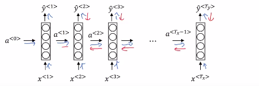

# Vanishing gradients with RNNs

Imagine the 2 following examples:

- "The **cat** which already ate ... **was** full."
- "The **cats** which already ate ... **were** full."

So to be consistent, it should be:

- cat + was.
- or cats + were.

And this is one example of when language can have very long-term dependencies.

A word much earlier can affect what needs to come much later in the sentence.

But it turns out the basic RNN we've seen so far it's not very good at capturing very long-term dependencies.

## Vanishing gradients problems

- Blue line: Forward propagation
- Red line: Backward propagation

As seen before: Training very deep neural networks gives vanishing gradients problem.

So in a very, very deep neural network (100 layers or more) you would carry out forward prop, from left to right and then back prop from right to left.

If this is a very deep neural network, then the gradient from just output y, would have a very hard time propagating back to affect the weights of these earlier layers.

RNN have a similar problem, you have forward prop came from left to right, and then back prop, going from right to left.

Because of the same vanishing gradients problem: It is difficult for the  outputs of the errors associated with the later time steps to affect the computations that are earlier.

### What it means in practice

And so in practice, what this means is:

- It might be difficult to get a neural network to realize that it needs to memorize the just see a singular noun or a plural noun.
- So that later on in the sequence that can generate either was or were, depending on whether it was singular or plural.

And notice that in English, this stuff in the middle could be arbitrarily long?

So you might need to memorize the singular/plural for a very long time before you get to use that bit of information.

And it's difficult for the output of a late $y^{<t>}$ to be strongly influenced by an input that was very early in the sequence.

And this is because whatever the output is, whether this got it right, this got it wrong, it's just very difficult for the area to backpropagate all the way to the beginning of the sequence, and therefore to modify how the neural network is doing computations earlier in the sequence.

So this is a weakness of the basic RNN algorithm.

you will remember when we talked about very deep neural networks, that we also talked about exploding gradients. We're doing back prop, the gradients should not just decrease exponentially, they may also increase exponentially with the number of layers you go through.

It turns out that **vanishing gradients tends to be the bigger problem with training RNNs**.

Vanishing gradients is much harder to solve and it will be the subject of the next lesson.

## Exploding gradient descent

| Warning |           |
|-----------|-----------|
|  | When exploding gradients happens, it can be catastrophic because the exponentially large gradients can cause your parameters to become so large that your neural network parameters get really messed up. You might often see **NaNs, or not a numbers,** meaning results of a numerical overflow in your neural network computation. |

If you see exploding gradients, if your derivatives do explode or you see NaNs, just apply gradient clipping which is a relatively robust solution that will take care of exploding gradients.

Gradient clipping:

- Look at your gradient vectors:
- If it is bigger than some threshold, re-scale some of your gradient vector so that is not too big.
- There are clips according to some maximum value.
