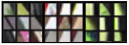

# What are deep ConvNets learning

Paper by [Mathew Zeiler and Rob Fergus, Visualizing and understanding convolutional networks](https://arxiv.org/abs/1311.2901).

|                               |                                     |
|-------------------------------|-------------------------------------|
| Remember how conv layers work | [convolutional_layer_by_stanford](./convolutional_layer_by_stanford.md) |

|                 |                                        |
|-----------------|----------------------------------------|
|  | **Hidden unit is not a hidden layer.** |

draw.io: <a href="../img/patch_hidden_unit_max.zip">patch_hidden_unit_max.zip</a>

For all images in your training set. Steps to follow:

- Pick a unit in layer 1.
- Input one image into the NN.
- Watch if it is maximally activating that hidden unit.
- If it is, identify the patch which is responsible.
- Input another image and repeat, until you have found nine patches which cause maximal activation of the same hidden unit.

|                 |                                                                           |
|-----------------|---------------------------------------------------------------------------|
|  | **The 9 patches for a hidden unit are from nine different input images.** |

So in other words pass your training set through your neural network, and figure out what is the image that maximizes that particular unit's activation.

Now, notice that a hidden unit in layer 1, will see only a relatively small portion of the neural network.

And so if you visualize, if you plot what activated unit's activation, it makes makes sense to plot just a small image patches, because all of the image that that particular unit sees.

 [Other example of top 9 activated images](./other_example_of_top_9_activated_images.md)

So if you pick one hidden unit and find the nine input images that maximizes that unit's activation, you might find nine image patches like above. 

So looks like that in the lower region of an image that this particular hidden unit sees, it's looking for an egde or a line that looks like that for example: 

So those 9 images patches are the ones that maximally activate one hidden unit's activation.

|                                         |
|-----------------------------------------|
| Repeat the same process for other units |

Now, you can then pick a different hidden unit in layer 1 and do the same thing:

It looks like this hidden unit above is looking for a line sort of in that portion of its input region, we'll also call this receptive field.

This one above seems to have a preference for a vertical light edge, but with a preference that the left side of it be green. 

This one above really prefers orange colors, and this is an interesting image patch. This red and green together will make a brownish or a brownish-orangish color, but the neuron is still happy to activate with that.

And so on...

 All 9 layer 1 patches

So this is nine different representative neurons and for each of them the nine image patches that they maximally activate on. So this gives you a sense that, units, train hidden units in layer 1, they're often looking for relatively simple features such as edge or a particular shade of color.

And all of the examples used here come from this paper by [Mathew Zeiler and Rob Fergus, titled visualizing and understanding convolutional networks](https://arxiv.org/abs/1311.2901). 

## Visualizing deep layers

This is a different set of nine image patches that cause one hidden unit to be activated. So this visualization shows nine hidden units in layer 2, and for each of them shows nine image patches that causes that hidden unit to have a very large output, a very large activation.

And you can repeat these for deeper layers as well. Now, on this slide, I know it's kind of hard to see these tiny little image patches, so let me zoom in for some of them. For layer 1, this is what you saw. So for example, this is that first unit we saw which was highly activated, if in the region of the input image, you can see there's an edge maybe at that angle. Now let's zoom in for layer 2 as well, to that visualization. So this is interesting, layer 2 looks it's detecting more complex shapes and patterns. So for example, this hidden unit looks like it's looking for a vertical texture with lots of vertical lines. This hidden unit looks like its highly activated when there's a rounder shape to the left part of the image. Here's one that is looking for very thin vertical lines and so on. And so the features the second layer is detecting are getting more complicated. How about layer 3? Let's zoom into that, in fact let me zoom in even bigger, so you can see this better, these are the things that maximally activate layer 3. But let's zoom in even bigger, and so this is pretty interesting again. It looks like there is a hidden unit that seems to respond highly to a rounder shape in the lower left hand portion of the image, maybe. So that ends up detecting a lot of cars, dogs and wonders is even starting to detect people. And this one look like it is detecting certain textures like honeycomb shapes, or square shapes, this irregular texture. And some of these it's difficult to look at and manually figure out what is it detecting, but it is clearly starting to detect more complex patterns. How about the next layer? Well, here is layer 4, and you'll see that the features or the patterns is detecting or even more complex. It looks like this has learned almost a dog detector, but all these dogs likewise similar, right? Is this, I don't know what dog species or dog breed this is. But now all those are dogs, but they look relatively similar as dogs go. Looks like this hidden unit and therefore it is detecting water.
6:53
This looks like it is actually detecting the legs of a bird and so on. And then layer 5 is detecting even more sophisticated things. So you'll notice there's also a neuron that seems to be a dog detector, but set of dogs detecting here seems to be more varied. And then this seems to be detecting keyboards and things with a keyboard like texture, although maybe lots of dots against background. I think this neuron here may be detecting text, it's always hard to be sure. And then this one here is detecting flowers. So we've gone a long way from detecting relatively simple things such as edges in layer 1 to textures in layer 2, up to detecting very complex objects in the deeper layers. So I hope this gives you some better intuition about what the shallow and deeper layers of a neural network are computing. Next, let's use this intuition to start building a neural-style transfer algorithm.

