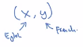

# What is end-to-end deep learning

## Speech recognition example

----

There have been some data processing systems, or learning systems that require multiple stages of processing: Full traditional pipeline.

__Full traditional pipeline:__

----

Nowadays we try to use end-to-end Deep Learning:

__End-to-end deep learning:__

----

One of the challenges of **end-to-end deep learning** is that you might **need a lot of data** before it works well.

Full traditional pipeline: On 3,000 hours of data to build a speech recognition system the full traditional pipeline works really well.

End-to-end deep learning: Say 10,000 hours of data, anything going up to maybe 100,000 hours of data that the end-to end-approach then suddenly starts to work really well. 

## Face recognition example

Today it is very difficult to apply end-to-end deep learning to face recognition.

 You could try to learn a function mapping directly from the image X to the identity of the person Y with the end to end approach.

But it turns out **this is not a good approach**.

### Multi-step approach is better

 

One of the problems is that the person approaching the turnstile: 

- Can approach from lots of different directions. So they could be green positions, they could be in blue position. 
- Sometimes they're closer to the camera, so they appear bigger in the image. 
- And sometimes they're already closer to the camera, so that face appears much bigger.

Indeed you would need a lot of data of faces from different positions, angles, size to train your end-to-end NN. This doesn't seem practical.

Instead, the best approach to date, seems to be a multi-step 
approach:

1. You run one piece of software to detect the person's face. You then zoom in to that part of the image and crop that image so that the person's face is centered.
1.  Then this picture is fed to the neural network, to then try to learn, or estimate the person's identity. 

|                                                                                                                                                                                      |
|--------------------------------------------------------------------------------------------------------------------------------------------------------------------------------------|
| What researchers have found, is that instead of trying to learn everything on one step, by breaking this problem down into two simpler steps results in overall better performance.  |

## Why Multi-step approach is working better

There are actually two reasons for that. 

1. Each of the two problems you're solving is actually much simpler.
1. You have a lot of data for each of the two sub-tasks.

Task 1 (Where is the person's face?): There is a lot of label data X, comma Y where X is a picture and y shows the position of the person's face. So you can build a NN.

Task 2 (Compare faces): Today, leading companies have hundreds of millions of pictures of people's faces. Today leading face recognition teams have at least hundreds of millions of images that they could use to look at two images and try to figure out the identity or to figure out if it's the same person or not.

In contrast if you use end-to-end there is much less data where X is image like this taken from the turnstile, and Y is the identity of the person.

### Face recognition second step explained more in detail

The way the second step is actually trained, as you train in your network, that takes as input two images, and what then your network does is it takes this input two images and it tells you if these two are the same person or not. 

1. So if you then have say 10,000 employees IDs on file.
1. You can then take this image in red, and quickly compare it against maybe all 10,000 employee IDs on file.

## Machine translation

----

__Full traditional pipeline:__

----

__End-to-end deep learning:__

**Lot of data:**

Because, for machine translation, you do have a lot of pairs of English comma French sentences. Because today, it is possible to gather large data sets of X-Y pairs where that's the English sentence and that's the corresponding French translation. 

**End-to-end deep learning works quite well for machine translation.**

## Estimating child's age

----

__Full traditional pipeline:__

Try to figure out where is that bone segment? Where is that bone segment? Where is that bone segment? And so on. And then. Knowing the lengths of the different bones, you can sort of go to a look up table showing the average bone lengths in a child's hand and then use that to estimate the child's age. 

**And so this approach actually works pretty well.**

Multi-step approach is the best:

- Step one is a relatively simple problem. Maybe you don't need that much data. Maybe you don't need that many X-ray images to segment out the bones.
- Step two, by collecting statistics of a number of children's hands, you can also get decent estimates of that without too much data.

----

__End-to-end deep learning:__

If you were to go straight from the image to the child's age, then you would need a lot of data.

**This approach does not work as well today just because there isn't enough data to train this task in an end-to-end fashion.**