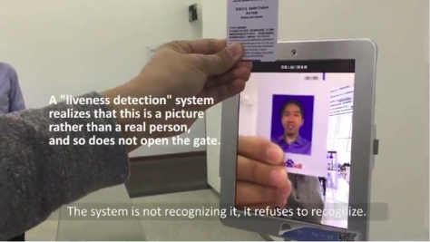

# What is face recognition?

The latter meaning making sure that you are a live human. It turns out liveness detection can be implemented using supervised learning as well to predict live human versus not live human.

## Terminology

- Verification (1 to 1 problem)
  - Input image/ID
  - Output whether the input image is that of the claimed person

- Recognition (1 to K problem)
  - Has a database of K persons
  - Get an input image
  - Get an Output ID if the image is any of the K persons (or "not recognized")

Let's say, you have a:

- Verification system that's 99% accurate.
- K = 100 in a recognition system.

If you apply the verification system to a recognition task with a 100 people in your database, you now have a hundred times of chance of making a mistake and if the chance of making mistakes on each person is just one percent. 

So to have a recognition system of 1% error you need something like a 99.99% accuracy rate verification system.