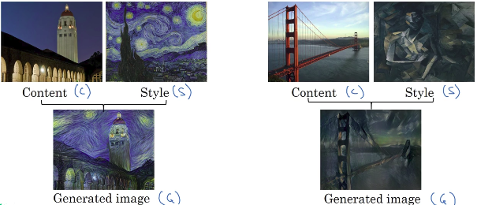

# Neural Style Transfer

- C: Content
- S: Style
- G: Generated image

In order to implement Neural Style Transfer, **you need to look at the features extracted by a ConvNet at various layers, the shallow and the deeper layers of a ConvNet.**
