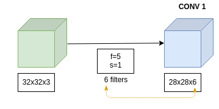
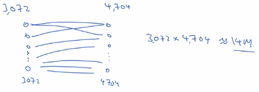
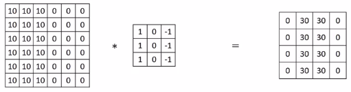
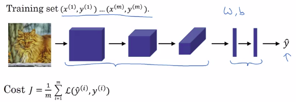
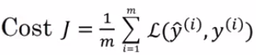

# Why Convolutions?

- 32x32x3=3072
- 28x28x6=4704

If you were to create a neural network with **3 072 units** in one layer, and with **4 704 units** in the next layer, and if **you were to connect every one of these neurons**, then the **weight matrix, the number of parameters in a weight matrix would be 3,072 times 4,704 which is about 14 million.**

3072x4704=14 million

32x32x3 is a small image. Imagin with a 1000x1000x3 image ... it would really become too large.

But if you look at the filter, the number of parameters in this convolutional layer is quite small:

numberOfParameters=(Wparameters +bias)xnumberOfFilters=(5x5 + 1)x6=156 parameters

## Reason why ConvNets have small Parameters

The reason why ConvNets have small Parameters is:

- **Parameter sharing**: A feature detector (such as vertical edge detector) that's useful in on part of the image is probably useful in another part of the image. The same small filter is used multiple times on the input.

- **Sparsity of connections**: In each layer, each output value depends only on a small number of inputs.

Because of this **ConvNets are less prone to be overfitting**.

Sometimes you also hear about **convNets being very good at capturing translation invariance**:

 - That's the observation that a picture of a cat shifted a couple of pixels to the right, is still pretty clearly a cat.

## Putting it together

Want to build a cat detector:

The conv layers and the fully connected layers will have:

- Various parameters W. 
- Various bias b. 

And so, any setting of the parameters, therefore, lets you define a cost function.

So, to train this neural network, **all you need to do is then use gradient descents or some of the algorithm like, gradient descent momentum, or RMSProp or Adam, or something else, in order to optimize all the parameters** of the neural network to try to reduce the cost function J.

If you do this you can build a very effective cat detector  or some other detector.