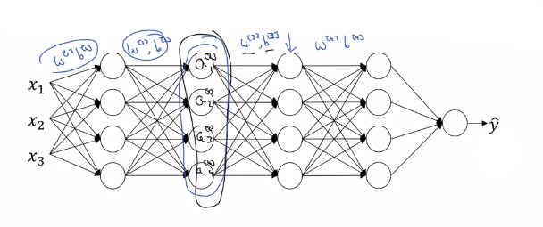

# Why does Batch Norm work?

## First reason

Having some features that range from zero to one, and some from one to a 1,000 can slow learning. **By normalizing all the features** to take **on a similar range of values can speed up learning**.

Batch norm works is this not just for the input X, but also for further values in your hidden units.

## Second reason

Batch norm works because it makes **weights deeper in the neural network more robust to changes to weights in earlier layers** of the neural network, say, in layer one for example.

### Covariate shift

Let's say that you've trained your **data sets** on all images of **black cats**. 

If you now try to **apply this network to data with colored cats** then it might not do very well.

So, this idea of your data distribution changing goes by the somewhat fancy name, __**covariate shift**__. And the idea is that, if you've learned some X to Y mapping, **if the distribution of X changes**, then you might need to **retrain your learning algorithm**. 

|                              |                                                                                                                                           |
|------------------------------|-------------------------------------------------------------------------------------------------------------------------------------------|
| **Internal covariate shift** | Is just a fancy term for the fact that the input (“data”) distributions of intermediate layers of neural networks change during training. |

Indeed they were all black cats in the already trained NN and suddenly they are color cats and your are still training...

|                       |                                                                 |                                               |
|-----------------------|-----------------------------------------------------------------|-----------------------------------------------|
| **Reminder variance** |As explained here: [Setting up your Machine Learning Application](./setting_up_your_machine_learning_application.md) |
| The **variance** is an error from sensitivity to small fluctuations in the training set. High variance can cause an algorithm to model the random noise in the training data, rather than the intended outputs (overfitting). ||

If the value $W^{[1]},b^{[1]}$ and $W^{[2]},b^{[2]}$ change because X changed, then of course $a^{[3]}$ change etc.

### How does batch norm helps?

Let's plot $Z_{1}^{[2]}$ with $Z_{2}^{[2]}$:

But what batch norm ensures is that no matter how it changes, the **mean and variance** of $Z_{1}^{[2]}$ and $Z_{2}^{[2]}$ **will remain the same**. 

So even if the exact values of $Z_{1}^{[2]}$ and $Z_{2}^{[2]}$ change, their mean and variance will at least stay mean=0 
and variance= 1

|                                                                                                                      |
|----------------------------------------------------------------------------------------------------------------------|
| Or, not necessarily mean zero and variance one, but whatever value is governed by: $\beta^{[2]}$ and $\gamma^{[2]}$. |
| Which, if the neural networks chooses, can force it to be mean=0 and variance=1. |

|                                        |
|----------------------------------------|
| So batch norm **limits the amount to which updating the parameters** in the earlier layers can affect the distribution of values that the third layer now sees and therefore has to learn on. |
| And so, **batch norm reduces the problem of the input values changing**, it really causes these **values to become more stable**, so that the later layers of the neural network has more firm ground to stand on. |

## Batch norm as regularization

1. Each mini-batch is scaled by the mean/variance computed on just that mini-batch.

2. Because the mean and variance computed on just that mini-batch as opposed to computed on the entire data set, that mean and variance has a little bit of noise in it. This adds some noise to the values $Z^{[l]}$ within that minibatch. So similar to dropout, it adds some noise to each hidden layer's activations.

3. This has a slight regularization effect. Similar to dropout, it adds noise to the hidden layers and therefore has a very slight regularization effect. Because the noise added is quite small, this is not a huge regularization effect.

You might use batch norm together with dropouts if you want the more powerful regularization effect of dropout. 

|                                                                                                     |
|-----------------------------------------------------------------------------------------------------|
| If you use a bigger minibatch size it reduces the noise and also reduces the regularization effect. |

|                |                                 |
|----------------|---------------------------------|
| Having said this, I would **not use batch norm as a [regularizer](./regularizing_your_neural_network.md)**. That's really not the intent of batch norm, but sometimes it has this extra intended or unintended effect on your learning algorithm. |