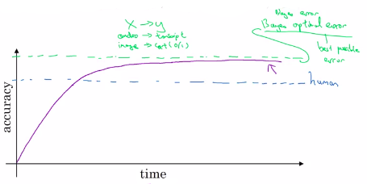

# Why human-level performance?

- First is that because of advances in deep learning, machine learning algorithms are suddenly working much better and so it has become much more feasible in a lot of application areas for machine learning algorithms to actually **become competitive with human-level performance**.
- Second, it turns out that the workflow of designing and building a machine learning system, the **workflow is much more efficient when you're trying to do something that humans can also do**. So in those settings, it becomes natural to talk about comparing, or trying to mimic human-level performance. 

As you work on a problem over time, so the x-axis, time, progress tends to be relatively rapid as you approach human level performance. But then after a while, the algorithm surpasses human-level performance and then progress and accuracy actually slows down.

**And over time, as you keep training the algorithm**, maybe bigger and bigger models on more and more data, the performance approaches but **never surpasses some theoretical limit** (green line), which is called the **Bayes optimal error**.

|                     |                                                                                                             |
|---------------------|-------------------------------------------------------------------------------------------------------------|
| Bayes optimal error | Best optimal error. The very best theoretical function for mapping from x to y that can never be surpassed. |

----

For example, for **speech recognition**, if x is audio clips, **some audio is just so noisy it is impossible** to tell what is in the correct transcription.

**So the perfect error may not be 100%.**

Same with cat images, some are so blurry that it is imposible to recognize a cat.

## Why progress slows down?

Humans are quite good at at lot of tasks. So long as ML is worse than humans, you can:
- Get labeled data from humans.
- Gain insight from manual error analysis: Why did a person get this right?
- Better analysis of bias/variance.

