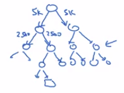

# Word2Vec

Most of the ideas comes from: [Efficient Estimation of Word Representations in Vector Space
Tomas Mikolov, Kai Chen, Greg Corrado, Jeffrey Dean](https://arxiv.org/abs/1301.3781)

Let's say you're given this sentence in your training set.

| Sentence |
|------------------------------------------------------------|
| I want a glass of orange juice to go along with my cereal. |

In the skip-gram model, what we're going to do is come up with a few context

- to target errors
  - to create our supervised learning problem.

1. Randomly pick a word to be the context word. For example the word: orange
2. Randomly pick another word within some window.
   - The window can be 5 or 10 words before or after the target word.
   - With a 10 word windows: You might come up with:
     - maybe: juice
     - or maybe: glass
     - or maybe: my

## Skip-gram model

This is called the skip-gram model because it is taking as input one word like orange:

- and then try to predict some words skipping a few words from the left or the right side.
- to predict what comes little bit before little bit after the context words.

So here are the details of the model:

Vocab size = 10 000 words

The basic supervised learning problem we're going to solve is that:

- We want to learn the mapping from some Context c (For example the word: orange)
- to some target, which we will call t (For example the word: juice).

In our vocabulary of 10,000 words:

- orange is word 6257
- juice is the word: 4834

To represent the input such as the word orange, you can start out with some one hot vector: $O_{c}$

As preivously to have the embeddings for the word c:

$e_{c} = E \cdot O_{c}$

We then send it to a softmax to predict $\hat{y}$.

So here is the [softmax](softmax_regression.md) model:

$p(t|c) = \frac{e^{\theta_{t}^T e_c}}{\displaystyle{\sum_{j=1}^{10000}{e^{\theta_{j}^T e_c}}}}$

- Probability of different target words t
- Given the input context word c
- $e^{\theta_{t}}$ parameter associated with output t
- embeddings $e_c$
- Divided by some over all words $\sum_{j=1}^{10000}$

So I've left off the biased term to solve mass but we could include that too if we wish.

Parameters:

- The matrix E has a lot of parameters corresponding to all of these embedding vectors: $e_c$.
- And then the softmax unit also has parameters that gives the theta T parameters 

### Loss function of the skip-gram

And then finally the loss function for softmax will be the usual.

| The loss function used with softmax |
|--------------------|
| $\mathcal{L}(\hat{y},y)= - \sum_{j=1}^{10000} y_{j} \log{\hat{y}_j}$ |

So this would be a one hot vector with just 1 and the rest zeros.
And if the target word is juice, then:

Similarly $\hat{y}$ will be a 10 000 vector output by the softmax.

### Problems with softmax classification

There are a couple problems with using the Skip-gram model. 

And the primary problem is computational speed.

$p(t|c) = \frac{e^{\theta_{t}^T e_c}}{\sum_{j=1}^{10000}{e^{\theta_{j}^T e_c}}}$

- For the softmax model, every time you want to evaluate the previous probability, you need to carry out a sum over all 10,000 words in your vocabulary.

And maybe 10,000 is actually quite slow, but if you're using a vocabulary of size 100,000 or a 1,000,000, it gets really slow to sum up over this denominator every single time.

So there are a few solutions to this, one which you see in the literature is to use a **hierarchical softmax classifier**.

#### Hierarchical softmax classifier

And what that means is:

- Instead of trying to categorize something into all 10,000 carries on one go.

Imagine if you have one classifier, it tells you is the target word in the first 5,000 words in the vocabulary?
Or is in the second 5,000 words in the vocabulary?
And lets say this binary cost that it tells you this is in the first 5,000 words, think of second class to tell you that this in the first 2,500 words of vocab or in the second 2,500 words vocab and so on.

Until eventually you get down to classify exactly what word it is, so that the leaf of this tree, and so having a tree of classifiers like this, means that each of the retriever nodes of the tree can be just a binding classifier. **And so you don't need to sum over all 10,000 words or else it will capsize in order to make a single classification.**

In fact, the computational classifying tree like this scales like log(vocab size) rather than linear in vocab size.

| Hierarchical softmax classifier                         |
|---------------------------------------------------------|
| The vocabulary is represented as a Huffman binary tree  |

In practice, the hierarchical softmax classifier **doesn't use a perfectly balanced tree** (with equal numbers of words on the left and right sides of each branch).

In practice, the hierarchical software classifier can be developed so that:

- The common words tend to be on top.
- Whereas the less common words like durian can be buried much deeper in the tree.

Because you see the more common words more often, and so you might need only a few traversals to get to common words like the and of.

Whereas you see less frequent words like durian much less often, so it says okay that are buried deep in the tree because you don't need to go that deep.

So there are various heuristics for building the tree how you used to build the hierarchical software spire.

So this is one idea you see in the literature, the speeding up the softmax classification.

You can read more details in the paper: [Efficient Estimation of Word Representations in Vector Space
Tomas Mikolov, Kai Chen, Greg Corrado, Jeffrey Dean](https://arxiv.org/abs/1301.3781)

## How to sample the context c

One thing you could do is just sample uniformly, at random, from your training corpus.

When we do that, you find that there are some words like "the", "of", "a", "and", "to" and so on that appear extremely frequently.

And so, if you do that, you find that in your context to target mapping pairs:

- You just get these these types of words ("the", "of", "a", "and", "to") extremely frequently.
- Whereas there are other words like orange, apple, and also durian that don't appear that often.
- And maybe you don't want your training site to be dominated by these extremely frequently or current words, because then you spend almost all the effort updating $e_c$, for those frequently occurring words. But you want to make sure that you spend some time updating the embedding, even for these less common words like durian.

So in practice the distribution of words P(c) isn't taken just entirely uniformly at random for the training set purpose, but instead there are different heuristics that you could use in order to balance out something from the common words together with the less common words.
