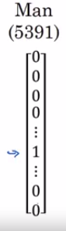
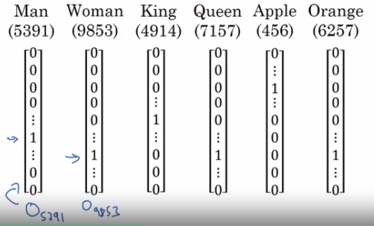
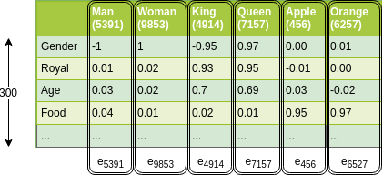
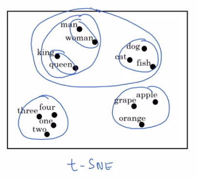

# Word representation

So far, we've been representing words using a vocabulary of words, and a vocabulary from the previous week might be:

- |v|=10 000 words.
  
And we've been representing words using a one-hot vector like this:

V= [a, aaron,...,zulu,<UNK>]

If man is word number 5391 in this dictionary, then you represent him with a vector 1 in position 5391.

## Hot representation

| Notation |
|-------|
| $O_{5391}$ will represent this factor (O here stands for one-hot) |

Queen is $O_{7157}$

Here are some examples:

One of the weaknesses of this representation is that it treats each word as a thing in itself, and it doesn't allow an algorithm to easily generalize features from each other.

Example:

- I want a glass of orange \______.
- I want a glass of apple \______.

And so, it's not easy for the learning algorithm to generalize:

- from knowing that orange juice is a popular thing
- to recognizing that apple juice might also be a popular thing or a popular phrase.

**And this is because there is no relation between any two different one-hot vector.**

And you couldn't distance between any pair of these vectors is also the same.

So it just doesn't know that somehow apple and orange are much more similar than king and orange or queen and orange.

## Featurized representation

Instead of a one-hot presentation we can instead learn a featurized representation with each of these words:

Learn a set of features and values for each of them.

So for example, each of these words, we want to know what is the gender associated with each of these things.

So, if gender goes from -1 for male to +1 for female then the gender associated with:

- man might be -1
- woman might be +1
- king you get -0.95
- queen +0.97
- for apple and orange sort of genderless (around 0).

Then you have:

- How royal are these things? And so the terms, man and woman are not really royal, so they might have feature values close to zero. Whereas king and queen are highly royal. And apple and orange are not really loyal.
- How about age? Well, man and woman doesn't connotes much about age. Maybe men and woman implies that they're adults, but maybe neither necessarily young nor old. So maybe values close to zero. Whereas kings and queens are always almost always adults.

etc. And so on.

Then wen now have 300 dimensional vector for representing the word man:

We will now use the notation:

| Notation: Word embeddings |
|----------|
| $e_{5391}$ to denote the vector of this word. |

Now, if you use this representation to represent the words orange and apple, then notice that:

- $e_{456}$ (apple) and $e_{6257}$ (orange) are now quite similar. Indeed both are fruits.

So over the next few videos, we'll find a way to learn words embeddings.

The featurized representations we will learn, will allow an algorithm to quickly figure out that apple and orange are more similar than say, king and orange or queen and orange.

## T-SNE Algorithm

One of the popular things to do is also to take this 300 dimensional data and embed it say, in a two dimensional space so that you can visualize them. And so, one common algorithm for doing this is the t-SNE algorithm due to Laurens van der Maaten and Geoff Hinton.

And if you look at one of these embeddings, one of these representations you find that words like:

- man and woman tend to get grouped together,
- king and queen tend to get grouped together,
- animals who can get grouped together.
- fruits will tend to be close to each other.
- etc.

But you see plots like these sometimes on the internet to visualize some of these 300 or higher dimensional embeddings.

To end: Word embeddings has been one of the most important ideas in NLP, in Natural Language Processing.
