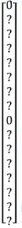
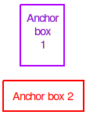
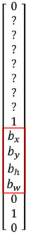
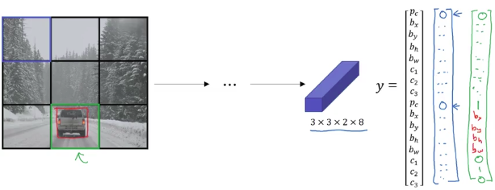
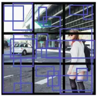
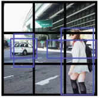

# YOLO Algorithm

$$c_{1} = pedestrian\\
c_{2} = car\\
c_{3} = motorcycle$$

$$y=\begin{bmatrix}
p_{c} \\
b_{x} \\
b_{y} \\
b_{h} \\
b_{w} \\
c_{1} \\
c_{2} \\
c_{3} \\
\\
p_{c} \\
b_{x} \\
b_{y} \\
b_{h} \\
b_{w} \\
c_{1} \\
c_{2} \\
c_{3} \\
\end{bmatrix}$$ 

## Training

### Case: There is no object in the cell

| Cell in the grid | y |
|------------------|---|
|  |  |

### Case: There is an object in the cell

Remember how are your anchor boxes:

| Anchors | Cell in the grid | y |
|---------|------------------|---|
|  |  |  | 

Explanation:

There is an object in the green cell. Your training set has a bounding box for the car (red bounding box in the green cell):

- It's just a little bit wider than it is tall.
- **The red box has just slightly higher IoU with anchor box 2**.
- So the part of the vector to fill is the one corresponding to lower portion of the vector (anchor box 2 portion).
- **bx,by,bh,bw should specify the position of the red bounding box.**

Notice then that Pc associate **anchor box 1** is **zero**. So don't care about this portion.

### Output size

| | definition | example above | final result |
|-|------------|---------------|--------------|
| Input | is the number of cells of the input image | 3x3 ||
| Output | $3\times{3}\times{\#anchors}\times{(sizeof([p_{c},b_{x},b_{y},b_{h},b_{w}])+\#classes)}$ | 3x3x2x(5+3)=3x3x2x8 | 3x3x16 |

With anchors and classes as:

| definition | example above |
|------------|---------------|
| $\#anchors$ = number of anchors boxes | 2 |
| $\#classes = sizeof([c_{1},c_{2},c_{3}])$ | 3 |

### Example vs practice reality

Here we have a 3x3x16 (3x3x2x8) output.

In practice it might be more like: 19x19x40 (19x19x16x8) output.

## Predictions

### On example

### Outputting the non-max suppressed outputs

So just to make it interesting. Let's look at the new test set image. Here's how you would run non-max suppression.

If you're using two anchor boxes, then for each of the non-grid cells, you get 2 predicted bounding boxes.

Get rid of low probability predictions.

For each class (pedestrian, car, motorcycle) use non-max suppression to generate final predictions.

What you do is, for each of the three classes, independently run non-max suppression for the objects that were predicted to come from that class. But use non-max suppression for the predictions of the pedestrians class, run non-max suppression for the car class, and non-max suppression for the motorcycle class. But run that basically three times to generate the final predictions. And so the output of this is hopefully that you will have detected all the cars and all the pedestrians in this image.