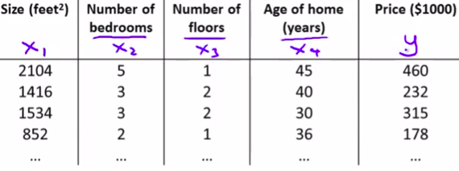

# Linear regression with gradient descent

## Hypothesis with multiple features (multivariate)

We have:
- n: number of features
- m: number of trainning examples
- $X_{j}$: The feature X selected
- $x^{(i)}$: input feature of the $i^{th}$ trainning example.
- $x_{j}^{(i)}$: value of feature $j$ of the $i^{th}$ trainning example
- $x_{n}^{(m)}$: last feature of the last training example

### Hypothesis

$h_{\theta}(x) = \theta^{T}x  = \theta_{0}x_{0} + \theta_{1}x_{1}+\theta_{2}x_{2}+\cdots \theta_{n}x_{n}$

$J(\theta)= J(\theta_{0},\theta_{1},\cdots,\theta_{n})=\frac{1}{2m}\sum_{i=1}^{m}(h_{\theta}(x^{(i)})-y^{(i)})^2$

We need to minimize the cost function.

Now we're faced with a classical optimization problem: we have some parameters $\theta$ we can tweak, and some cost function $J(\theta)$ we want to minimize.

The topic of mathematical optimization is vast, but what ends up working very well for machine learning is a fairly simple algorithm called gradient descent.

### Gradient descent

Gradient descent:

----

Repeat until number_of_iterations is reached {

$$\theta_{j}:=\theta_{j}-\alpha \frac{1}{m}\sum_{i=1}^{m}(h_{\theta}(x^{(i)})-y^{(i)})x_{j}^{(i)}$$

}

> Note: We update simultaneously update $\theta_{j}$ for j=0,...,n

----

Repeat until number_of_iterations is reached {

$$\theta_{j}:=\theta_{j}-\alpha \frac{1}{m}\sum_{i=1}^{m}(\theta^{T}x^{(i)})-y^{(i)})x_{j}^{(i)}$$

}

-----

With:

- $\theta = \begin{bmatrix}
  \theta_{0} & \theta_{1} & \cdots & \theta_{n} \\
 \end{bmatrix}$

Repeat until number_of_iterations is reached {
$\begin{bmatrix}
 \theta_{0} & \theta_{1} & \cdots & \theta_{n} \\
 \end{bmatrix}:= \begin{bmatrix}
  \theta_{0} & \theta_{1} & \cdots & \theta_{n} \\
 \end{bmatrix}-\alpha \frac{1}{m}\sum_{i=1}^{m}\left(\left(
 \begin{bmatrix}
  1 & x^{(0)}_{1} & \cdots & x^{(0)}_{n}\\
  1 & x^{(1)}_{1} & \cdots & x^{(1)}_{n}\\
  1 & x^{(2)}_{1} & \cdots & x^{(2)}_{n}\\
  \vdots  & \vdots & \vdots & \vdots\\
  1 & x^{(m)}_{1} & \cdots & x^{(m)}_{n}\\
 \end{bmatrix} dot \begin{bmatrix}
  \theta_{0} &  \theta_{1} & \cdots & \theta_{n} 
 \end{bmatrix}-\begin{bmatrix}
  y^{(0)} \\
  y^{(1)} \\
  y^{(2)} \\
  \vdots \\
  y^{(m)}\\
 \end{bmatrix}\right)*\begin{bmatrix}
  1 & x^{(0)}_{1} & \cdots & x^{(0)}_{n}\\
  1 & x^{(1)}_{1} & \cdots & x^{(1)}_{n}\\
  1 & x^{(2)}_{1} & \cdots & x^{(2)}_{n}\\
  \vdots  & \vdots & \vdots & \vdots\\
  1 & x^{(m)}_{1} & \cdots & x^{(m)}_{n}\\
 \end{bmatrix}\right)$

}

----

Repeat until number_of_iterations is reached {

$\begin{bmatrix}
 \theta_{0} & \theta_{1} & \cdots & \theta_{n} \\
 \end{bmatrix}:= \begin{bmatrix}
  \theta_{0} & \theta_{1} & \cdots & \theta_{n} \\
 \end{bmatrix}-\frac{\alpha}{m}\sum_{i=1}^{m}\left(\left(
 \begin{bmatrix}
  \theta_{0} + \theta_{1}x^{(0)}_{1} + \cdots & \theta_{n}x^{(0)}_{n}\\
  \theta_{0} + \theta_{1}x^{(1)}_{1} + \cdots & \theta_{n}x^{(1)}_{n}\\
  \theta_{0} + \theta_{1}x^{(2)}_{1} + \cdots & \theta_{n}x^{(2)}_{n}\\  \vdots \\
  \theta_{0} + \theta_{1}x^{(m)}_{1} + \cdots & \theta_{n}x^{(m)}_{n}\\ \end{bmatrix}-\begin{bmatrix}
  y^{(0)} \\
  y^{(1)} \\
  y^{(2)} \\
  \vdots \\
  y^{(m)}\\
 \end{bmatrix}\right)*\begin{bmatrix}
  1 & x^{(0)}_{1} & \cdots & x^{(0)}_{n}\\
  1 & x^{(1)}_{1} & \cdots & x^{(1)}_{n}\\
  1 & x^{(2)}_{1} & \cdots & x^{(2)}_{n}\\
  \vdots  & \vdots & \vdots & \vdots\\
  1 & x^{(m)}_{1} & \cdots & x^{(m)}_{n}\\
 \end{bmatrix}\right)$

}

----

Repeat until number_of_iterations is reached {

$\begin{bmatrix}
 \theta_{0} & \theta_{1} & \cdots & \theta_{n} \\
 \end{bmatrix}:= \begin{bmatrix}
  \theta_{0} & \theta_{1} & \cdots & \theta_{n} \\
 \end{bmatrix}-\frac{\alpha}{m}\sum_{i=1}^{m}\left(
\begin{bmatrix}
  yDiff^{(0)} \\
  yDiff^{(1)} \\
  yDiff^{(2)} \\
  \vdots \\
  yDiff^{(m)}\\
 \end{bmatrix}*\begin{bmatrix}
  1 & x^{(0)}_{1} & \cdots & x^{(0)}_{n}\\
  1 & x^{(1)}_{1} & \cdots & x^{(1)}_{n}\\
  1 & x^{(2)}_{1} & \cdots & x^{(2)}_{n}\\
  \vdots  & \vdots & \vdots & \vdots\\
  1 & x^{(m)}_{1} & \cdots & x^{(m)}_{n}\\
 \end{bmatrix}\right)$

}

----

Repeat until number_of_iterations is reached {

$\begin{bmatrix}
 \theta_{0} & \theta_{1} & \cdots & \theta_{n} \\
 \end{bmatrix}:= \begin{bmatrix}
  \theta_{0} & \theta_{1} & \cdots & \theta_{n} \\
 \end{bmatrix}-\frac{\alpha}{m}\sum_{i=1}^{m}\left(
\begin{bmatrix}
  yDiff^{(0)}*1 & yDiff^{(0)}*x^{(0)}_{1} & yDiff^{(0)}*x^{(0)}_{n}\\
  yDiff^{(1)}*1 & yDiff^{(0)}*x^{(1)}_{1} & yDiff^{(0)}*x^{(1)}_{n}\\
  yDiff^{(2)}*1 & yDiff^{(0)}*x^{(2)}_{1} & yDiff^{(0)}*x^{(2)}_{n}\\
  \vdots & \vdots & \vdots \\
  yDiff^{(m)}*1 & yDiff^{(0)}*x^{(m)}_{1} & yDiff^{(0)}*x^{(m)}_{n}\\
 \end{bmatrix}\right)$

}

----

Repeat until number_of_iterations is reached {

$\begin{bmatrix}
 \theta_{0} & \theta_{1} & \cdots & \theta_{n} \\
 \end{bmatrix}:= \begin{bmatrix}
  \theta_{0} & \theta_{1} & \cdots & \theta_{n} \\
 \end{bmatrix}-\frac{\alpha}{m}\sum_{i=1}^{m}\left(
\begin{bmatrix}
  yDiff^{(0)}*1 & yDiff^{(0)}*x^{(0)}_{1} & yDiff^{(0)}*x^{(0)}_{n}\\
  yDiff^{(1)}*1 & yDiff^{(0)}*x^{(1)}_{1} & yDiff^{(0)}*x^{(1)}_{n}\\
  yDiff^{(2)}*1 & yDiff^{(0)}*x^{(2)}_{1} & yDiff^{(0)}*x^{(2)}_{n}\\
  \vdots & \vdots & \vdots \\
  yDiff^{(m)}*1 & yDiff^{(0)}*x^{(m)}_{1} & yDiff^{(0)}*x^{(m)}_{n}\\
 \end{bmatrix}\right)$

}

----

Repeat until number_of_iterations is reached {

$\begin{bmatrix}
 \theta_{0} & \theta_{1} & \cdots & \theta_{n} \\
 \end{bmatrix}:= \begin{bmatrix}
  \theta_{0} & \theta_{1} & \cdots & \theta_{n} \\
 \end{bmatrix}- \frac{\alpha}{m}
\begin{bmatrix}
  yDiff^{(0)} + yDiff^{(1)} +yDiff^{(2)}+\cdots+yDiff^{(m)}&
  yDiff^{(0)}*x^{(0)}_{1}+yDiff^{(0)}*x^{(1)}_{1}+yDiff^{(0)}*x^{(2)}_{1}+\cdots+yDiff^{(0)}*x^{(m)}_{1} &
  yDiff^{(0)}*x^{(0)}_{n}+yDiff^{(0)}*x^{(1)}_{n}+yDiff^{(0)}*x^{(2)}_{n}+\cdots+yDiff^{(0)}*x^{(m)}_{n}
 \end{bmatrix}$

}

----

Repeat until number_of_iterations is reached {

$\begin{bmatrix}
 \theta_{0} & \theta_{1} & \theta_{2} & \cdots & \theta_{n} \\
 \end{bmatrix}:= \begin{bmatrix}
  \theta_{0} & \theta_{1} & \theta_{2} & \cdots & \theta_{n} \\
 \end{bmatrix}-
 \begin{bmatrix}
  \frac{\alpha}{m}*yDiffs &
  \frac{\alpha}{m}*yDiffsOfx_{1} &
  \frac{\alpha}{m}*yDiffsOfx_{2} &
  \cdots &
  \frac{\alpha}{m}*yDiffsOfx_{n}
 \end{bmatrix}$
}

----

To conclude:

Convention: $x_{0}=1$

Repeat until number_of_iterations is reached {

$\begin{bmatrix}
 \theta_{0} \\ \theta_{1} \\ \theta_{2} \\ \vdots \\ \theta_{n}
 \end{bmatrix}:= \begin{bmatrix}
 \theta_{0} - \frac{\alpha}{m}*yDiffsOfx_{0}\\ \theta_{1} - \frac{\alpha}{m}*yDiffsOfx_{1} \\ \theta_{2} - \frac{\alpha}{m}*yDiffsOfx_{2} \\ \vdots \\ \theta_{n} - \frac{\alpha}{m}*yDiffsOfx_{n}
 \end{bmatrix}$
}
