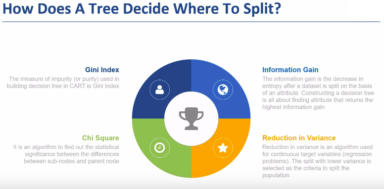

# Trees

The term Classification And Regression Tree (CART) analysis is an umbrella term. It refers to the following:

Decision trees used in data mining are of two main types:

- **Classification tree** analysis is when the predicted outcome is the class (discrete) to which the data belongs.
- **Regression tree** analysis is when the predicted outcome can be considered a real number (e.g. the price of a house, or a patient's length of stay in a hospital).

Trees used for regression and trees used for classification have some similarities - but also some differences, such as the **procedure used to determine where to split**.

Some techniques, often called ensemble methods, **construct more than one decision tree**:

- Boosted trees Incrementally building an ensemble by training each new instance to emphasize the training instances previously mis-modeled. A typical example is AdaBoost. These can be used for regression-type and classification-type problems.
- Bootstrap aggregated (or bagged) decision trees, an early ensemble method, builds multiple decision trees by repeatedly resampling training data with replacement, and voting the trees for a consensus prediction.
  - A random forest classifier is a specific type of bootstrap aggregating
Rotation forest – in which every decision tree is trained by first applying principal component analysis (PCA) on a random subset of the input features.

There are many specific decision-tree algorithms. Notable ones include:

- ID3 (Iterative Dichotomiser 3)
- C4.5 (successor of ID3)
- CART (Classification And Regression Tree)
- CHAID (CHi-squared Automatic Interaction Detector). Performs multi-level splits when computing classification trees.
- MARS: extends decision trees to handle numerical data better.
- Conditional Inference Trees. Statistics-based approach that uses non-parametric tests as splitting criteria, corrected for multiple testing to avoid overfitting. This approach results in unbiased predictor selection and does not require pruning.

ID3 and CART were invented independently at around the same time (between 1970 and 1980), yet follow a similar approach for learning a decision tree from training tuples.

- Gini Split / Gini Index: Favors larger partitions. Very simple to implement. Tree type: CART
- Information Gain / Entropy: Favors partitions that have small counts but many distinct values.	Tree type: ID3 / C4.5

## Classification Trees

from: [https://medium.com/machine-learning-101/chapter-3-decision-trees-theory-e7398adac567](https://medium.com/machine-learning-101/chapter-3-decision-trees-theory-e7398adac567)

Decision Tree Classifier, repetitively divides the working area(plot) into sub part by identifying lines. (repetitively because there may be two distant regions of same class divided by other as shown in image below).

So when does it terminate?

- Either it has divided into classes that are pure (only containing members of single class )
- Some criteria of classifier attributes are met.

### Gini impurity

Impurity is when we have a traces of one class division into other. This can arise due to following reason:

- We run out of available features to divide the class upon.
- We tolerate some percentage of impurity (we stop further division) for faster performance. (There is always trade off between accuracy and performance).

For example in second case we may stop our division when we have x number of fewer number of elements left. This is also known as **gini impurity**.

Gini impurity is a measure of how often a randomly chosen element from the set would be incorrectly labeled if it was randomly labeled according to the distribution of labels in the subset. 

The Gini impurity can be computed by summing the probability $p_{i}$ of an item with label $i$ being chosen times the probability $\sum _{k\neq i}p_{k}=1-p_{i}$ of a mistake in categorizing that item. It reaches its minimum (zero) when all cases in the node fall into a single target category.

To compute Gini impurity for a set of items with **J classes**, suppose $i\in \{1,2,...,J\}$, and let $p_{i}$ be the fraction of items labeled with class $i$ in the set.

${I} _{G}(p)=\sum _{i=1}^{J}p_{i}\sum _{k\neq i}p_{k}=\sum _{i=1}^{J}p_{i}(1-p_{i})=\sum _{i=1}^{J}(p_{i}-{p_{i}}^{2})=\sum _{i=1}^{J}p_{i}-\sum _{i=1}^{J}{p_{i}}^{2}=1-\sum _{i=1}^{J}{p_{i}}^{2}$

### Information Gain

Used by the ID3, C4.5 and C5.0 tree-generation algorithms. Information gain is based on the concept of entropy and information content from information theory.

#### Entropy

**Entropy is a measure of disorder. Entropy is an indicator of how messy your data is.**

Entropy is degree of randomness of elements or in other words it is measure of impurity.

The entropy is an absolute measure which provides a number between 0 and 1, independently of the size of the set.

Mathematically, it can be calculated with the help of probability of the items as:
$E(S)=-\sum_{i=1}^{c} p_{i} log_{2} p_{i}$

Where $p_{i}$ is simply the frequentist probability of an element/class 'i' in our data.

For simplicity's sake let's say we only have two classes:
- a positive class
- and a negative class.

Therefore 'i' here could be either + or (-).

So if we had a total of 100 data points in our dataset with:
- 30 belonging to the positive class
- and 70 belonging to the negative class

then 'P+' would be 3/10 and 'P-' would be 7/10.

If I was to calculate the entropy of my classes in this example using the formula above. Here’s what I would get.

$E(S)=-\frac{3}{10}log_{2} \frac{3}{10} - \frac{7}{10}log_{2} \frac{7}{10}=0.88$

> Note: Sometimes entropy E(S) is called H. 

This is considered a high entropy, a high level of disorder ( meaning low level of purity). Entropy is measured between 0 and 1.(Depending on the number of classes in your dataset, entropy can be greater than 1 but it means the same thing, a very high level of disorder.

### Information Gain

Suppose we have multiple features to divide the current working set. What feature should we select for division? Perhaps one that gives us less impurity.

Suppose we divide the classes into multiple branches as follows, the information gain at any node is defined as:

$\overbrace {IG(T,a)} ^{\text{Information Gain}}=\overbrace {\mathrm {H} (T)} ^{\text{Entropy (parent)}}-\overbrace {\mathrm {H} (T|a)} ^{\text{Weighted Sum of Entropy (Children)}}$

Information Gain (n) =  Entropy(x) — ([weighted average] * entropy(children for feature))
