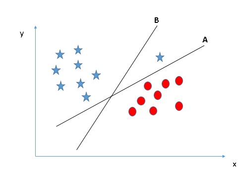
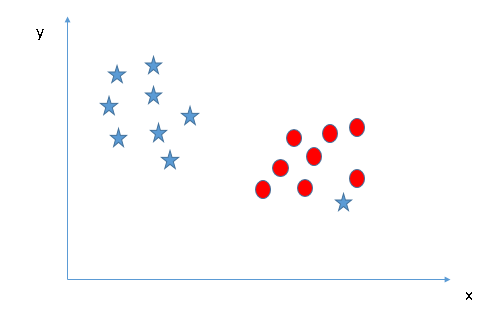

# SVM simply explained

“Support Vector Machine” (SVM) is a supervised machine learning algorithm which can be used for both classification or regression challenges.

**However, it is mostly used in classification problems.**

In this algorithm, we plot each data item as a point in n-dimensional space (where n is number of features you have) with the value of each feature being the value of a particular coordinate.

Then, we perform classification by finding the hyper-plane that differentiate the two classes very well (look at the below snapshot).

Support Vectors are simply the co-ordinates of individual observation. Support Vector Machine is a frontier which best segregates the two classes (hyper-plane  / line).

You can look at support vector machines and a few examples of its working here.

## How does it work?

Above, we got accustomed to the process of segregating the two classes with a hyper-plane. Now the burning question is “How can we identify the right hyper-plane?”. Don’t worry, it’s not as hard as you think!

Let’s understand:

### Identify the right hyper-plane (Scenario-1)

Here, we have three hyper-planes (A, B and C). Now, identify the right hyper-plane to classify star and circle.

You need to remember a thumb rule to identify the right hyper-plane: “Select the hyper-plane which segregates the two classes better”. In this scenario, hyper-plane “B” has excellently performed this job.

### Identify the right hyper-plane (Scenario-2)

Here, we have three hyper-planes (A, B and C) and all are segregating the classes well. Now, How can we identify the right hyper-plane?

Here, maximizing the distances between nearest data point (either class) and hyper-plane will help us to decide the right hyper-plane. This distance is called as Margin. Let’s look at the below snapshot:

Above, you can see that the margin for hyper-plane C is high as compared to both A and B. Hence, we name the right hyper-plane as C. Another lightning reason for selecting the hyper-plane with higher margin is robustness. If we select a hyper-plane having low margin then there is high chance of miss-classification.

### Identify the right hyper-plane (Scenario-3)

Hint: Use the rules as discussed in previous section to identify the right hyper-plane.

 
 Some of you may have selected the hyper-plane **B** as it has higher margin compared to **A**. But, here is the catch, SVM selects the hyper-plane which classifies the classes accurately prior to maximizing margin. Here, hyper-plane B has a classification error and A has classified all correctly. Therefore, the right hyper-plane is A.

### Can we classify two classes (Scenario-4)?

Below, I am unable to segregate the two classes using a straight line, as one of star lies in the territory of other(circle) class as an outlier. 

As I have already mentioned, one star at other end is like an outlier for star class. SVM has a feature to ignore outliers and find the hyper-plane that has maximum margin. Hence, we can say, SVM is robust to outliers.

### Find the hyper-plane to segregate to classes (Scenario-5)

In the scenario below, we can’t have linear hyper-plane between the two classes, so how does SVM classify these two classes? Till now, we have only looked at the linear hyper-plane.

 

can solve this problem. Easily! It solves this problem by introducing additional feature. Here, we will add a new feature z=x^2+y^2. Now, let’s plot the data points on axis x and z:

In above plot, points to consider are:
All values for z would be positive always because z is the squared sum of both x and y.

In the original plot, red circles appear close to the origin of x and y axes, leading to lower value of z and star relatively away from the origin result to higher value of z.

In SVM, it is easy to have a linear hyper-plane between these two classes. But, another burning question which arises is, should we need to add this feature manually to have a hyper-plane. 

No, SVM has a technique called **the kernel trick**.

### kernel trick

These are functions which takes low dimensional input space and transform it to a higher dimensional space i.e. it converts not separable problem to separable problem, these functions are called kernels.

It is mostly useful in non-linear separation problem. Simply put, it does some extremely complex data transformations, then find out the process to separate the data based on the labels or outputs you’ve defined.

When we look at the hyper-plane in original input space it looks like a circle:

 

